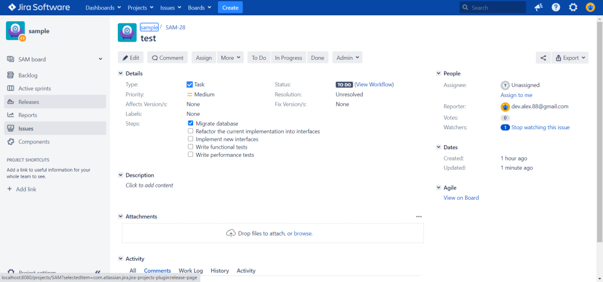

# Overview

**Checklist for Jira Server** provides checklist custom fields for Jira Server.

You can install the app by following the instructions at [Atlassian Marketplace](https://marketplace.atlassian.com/apps/1224147/checklist-custom-field-for-jira?hosting=server\&tab=overview).

## Features

This app allows users to create custom fields of type **Checklist**.

Items of a checklist can be editable and varied between issues. They can also be reordered, checked, unchecked, added, and removed at any time.
