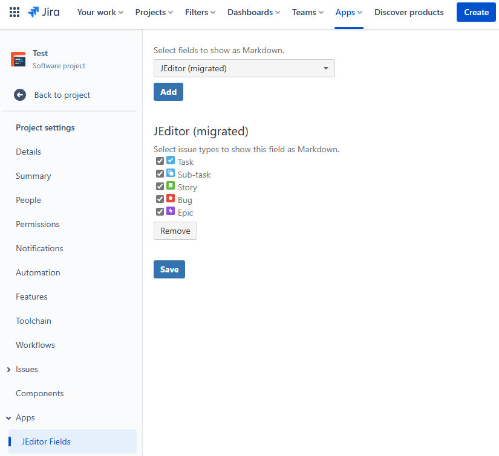
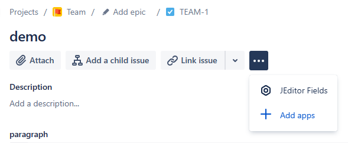
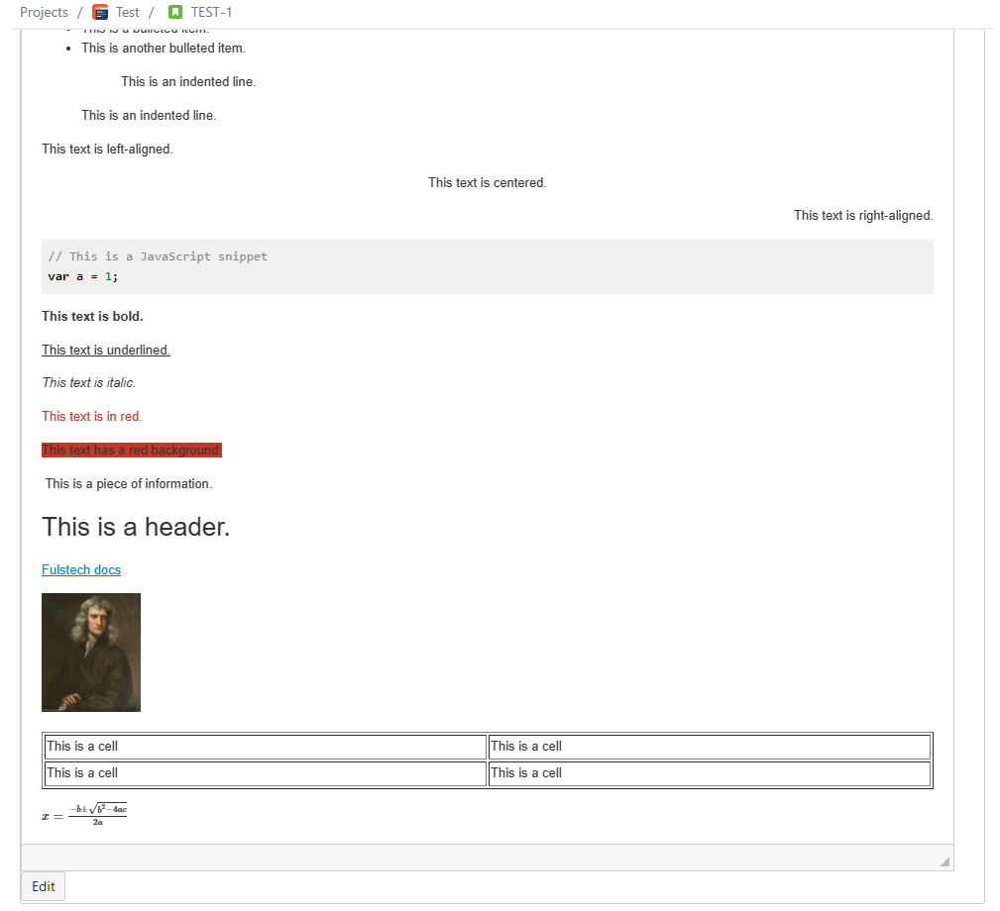
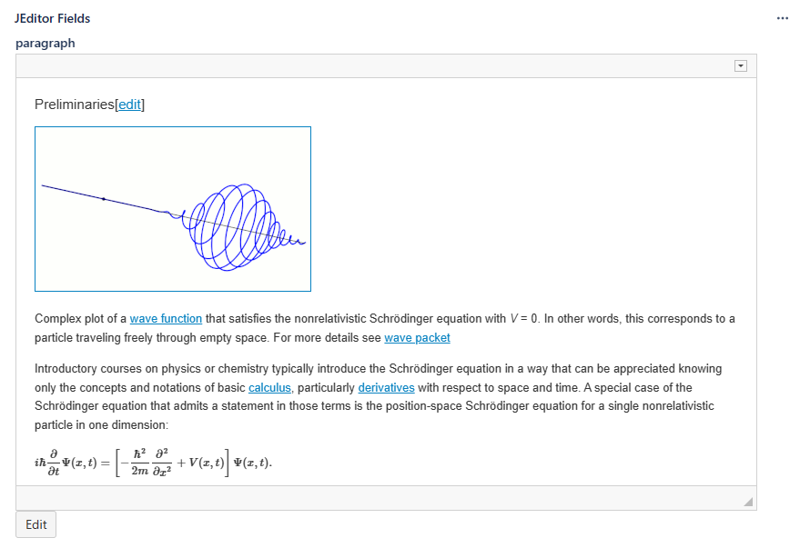
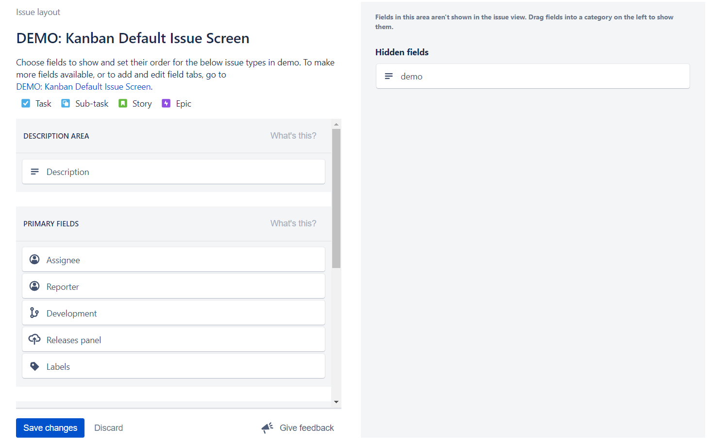
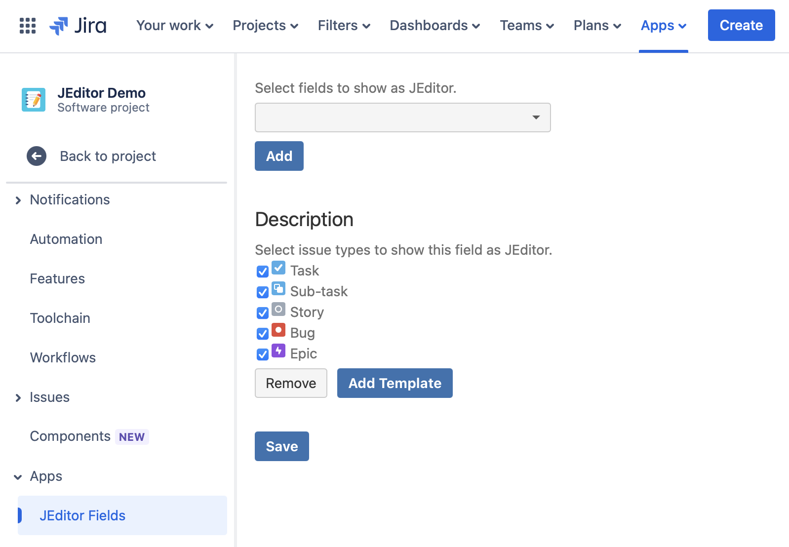
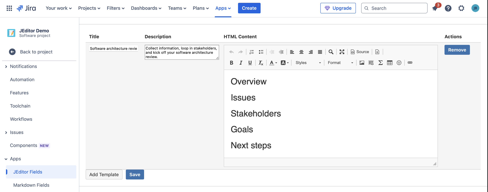

# Create a JEditor-compatible Custom Field

Since it is impossible for a Jira Cloud's app to create its own custom field type, this app provides JEditor-compatible Editor for fields of Jira Cloud’s built-in types. This gives you important benefits:

* All JEditor-compatible data is stored securely in your Jira Cloud the same way other Jira data is stored. **Your data will never be stored on our site.**
* Search, JQL, export, API, email notifications, and other field-related utilities will work the same way other fields work.

Please follow the instructions below to create a JEditor-compatible custom field.

## Migrate JEditor custom fields from Jira Data Center or Jira Server to Jira Cloud

> **info**
>
JEditor custom fields only Jira Data Center or Jira Server must be created by the [JEditor - Rich Text Editor For Jira](https://marketplace.atlassian.com/apps/1210768/jeditor-rich-text-editor-for-jira?tab=overview) plugin.

Please see [this article](migrate-to-jira-cloud.md).

## Configure JEditor custom fields on Jira Cloud

Go to the **Project Settings** page of the project that contains JEditor custom fields. Select **JEditor-compatible Fields** under the **Apps** menu. In the configuration page, select the JEditor custom fields that have been migrated along with all issue types containing the fields.

Open an issue that contains the field. Click on the **More Options (three-dots)** button. You should see the **JEditor-compatbile Fields** section.

Edit the field *in the **JEditor Fields** section* by clicking **Edit** under the edito&#x72;*.*

> **danger**
>
Do not use the normal editor provided by Jira

## Hide the original field editor

**If your project is company-managed (formerly classic),** you can also hide the original field editor. Please see the instructions here <https://support.atlassian.com/jira-software-cloud/docs/configure-field-layout-in-the-issue-view/#Configurefieldlayoutintheissueview-Hiddenfields>.

## Templates

Templates can be used to reduce the efforts composing repetitive content.

To create a template, navigate to the **JEditor Fields** setting and click **Add Template**.

In the template management screen, input the content and click **Save**.

