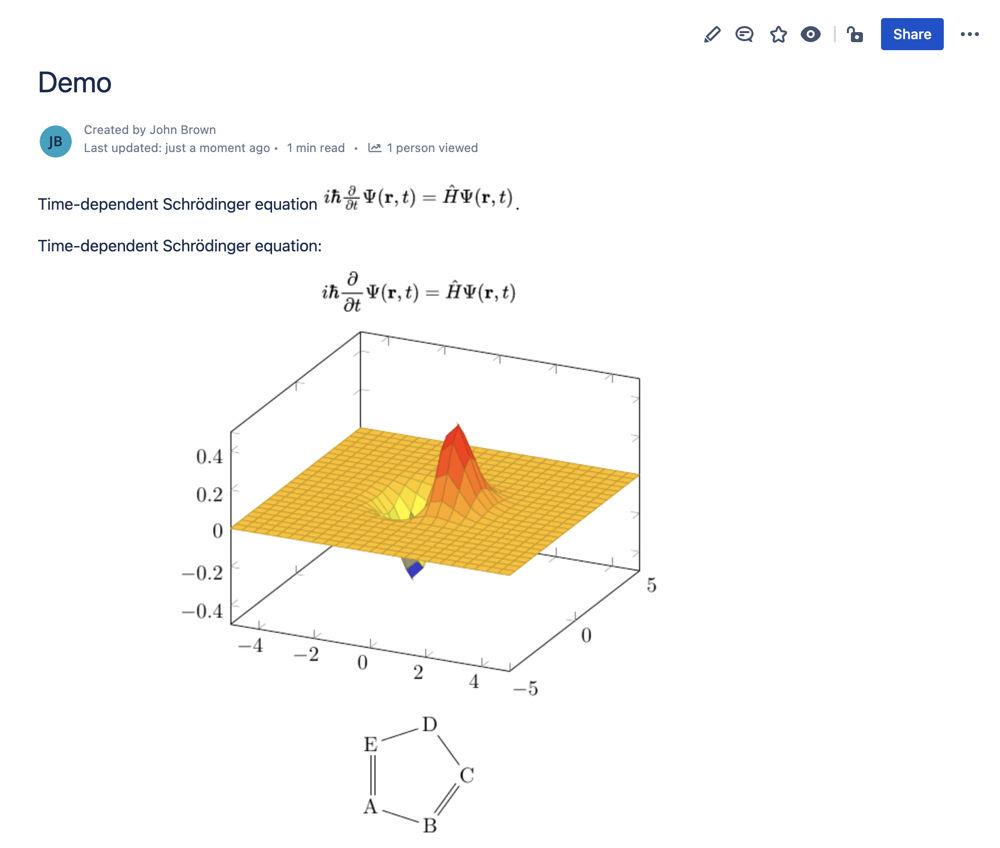
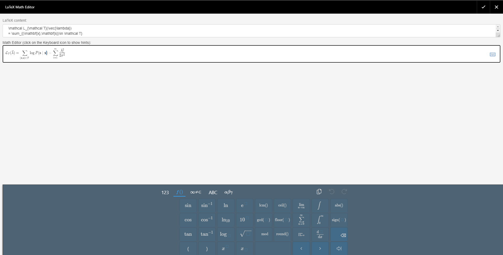

# Overview

> **If you are using Confluence Data Center or Confluence Server, please see** [**this page**](../confluence-data-center-and-confluence-server/overview.md)**.**

LaTeX for Confluence is the only app that can render LaTeX everywhere inside Confluence Cloud. You can install the app by following the instructions at [Atlassian Marketplace](https://marketplace.atlassian.com/apps/1216800/latex-beautiful-math-for-confluence?hosting=cloud\&tab=installation).

