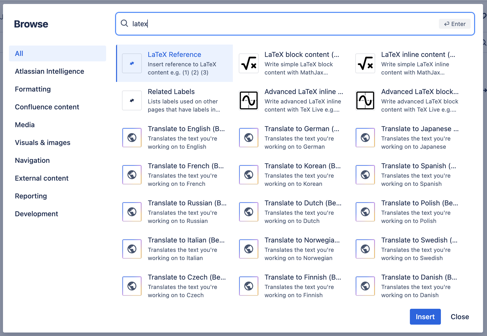
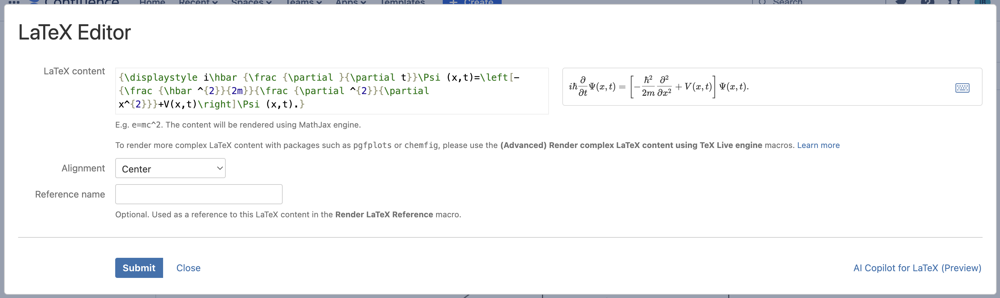
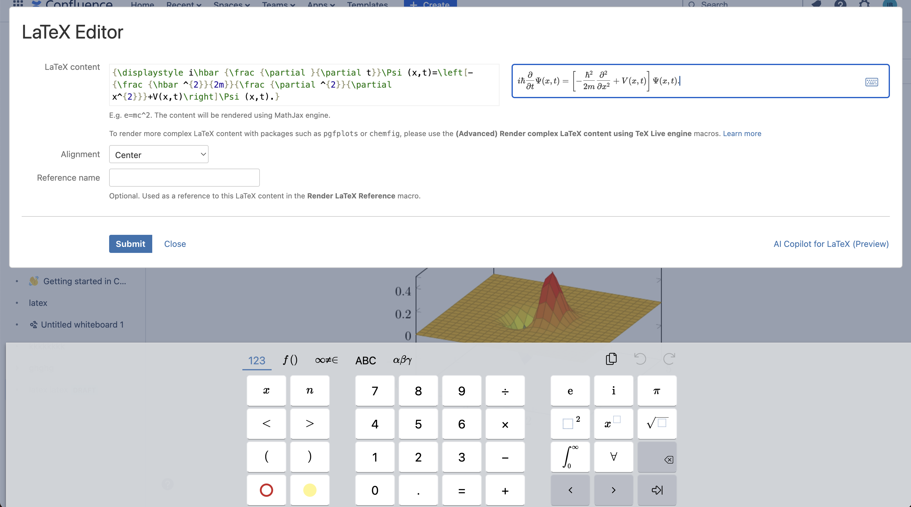
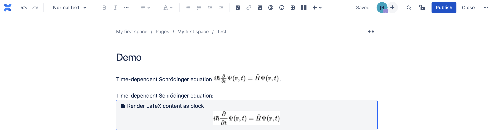
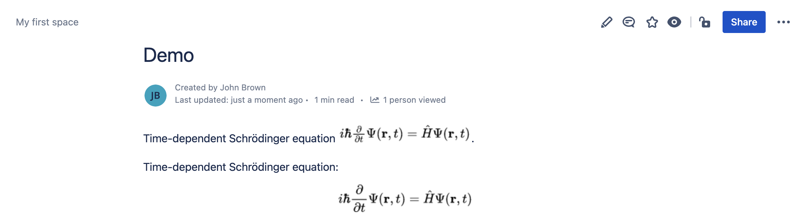
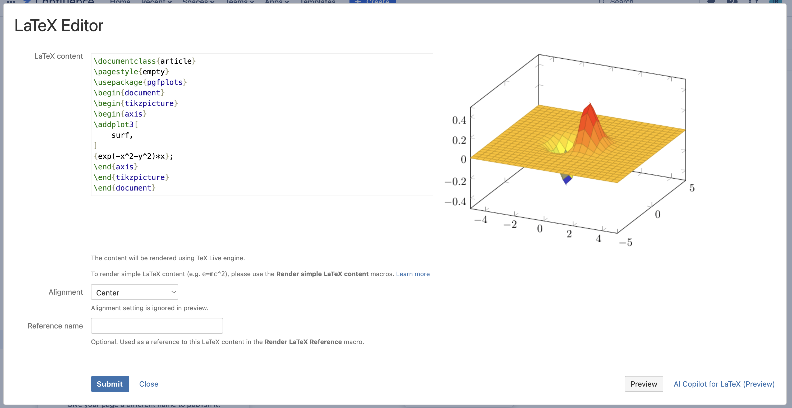
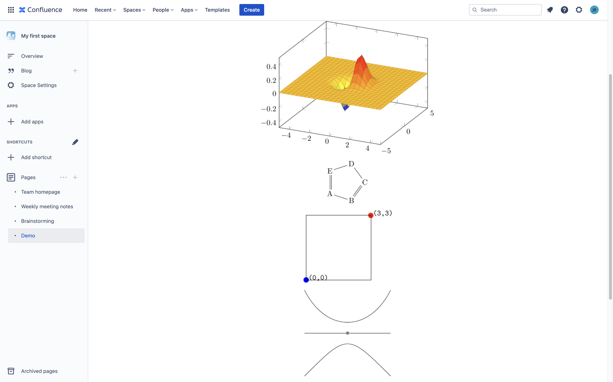
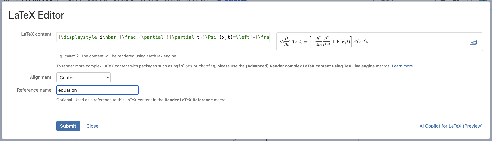
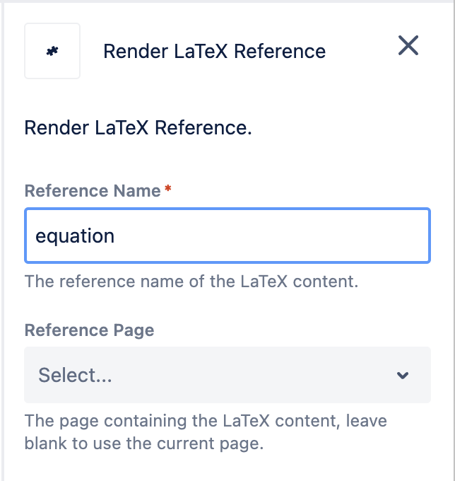
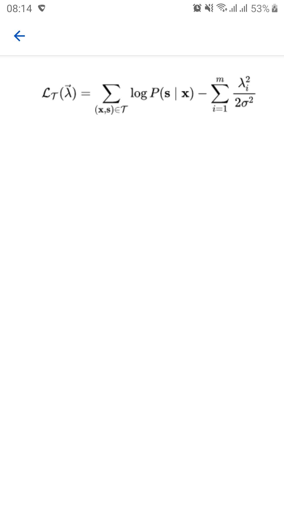

# Usage

Two types of LaTeX content

This app supports two types of LaTeX content. Simple content such as `e = mc^2` will be rendered by MathJax engine, and more complex content that uses packages such as `tikz` or `chemfig` will be rendered by TeX Live engine.

## Insert macros

In the article editor, click the **Insert** button, and select **View more** from the list.


In the **Select macro** dialog, search for "**latex"**.



Alternatively, type **/ (slash)** and select the LaTeX macros.


## Insert simple LaTeX content (MathJax engine)

To insert simple LaTeX content please use the following macros:

* **Render LaTeX content inline**
* **Render LaTeX content as block**

These macros use MathJax engine to render content. The content is as simple as `e=mc2` and does not require LaTeX preambles.

The editor dialog allow users to type the LaTeX content and preview the result instantly. Errors will be highlighted in red color.



You can open the **Math Keyboard** by clicking on the keyboard icon in the right-hand corner of the Math Editor preview area. For block content, you can also specify the alignment as left, right, center. To close the editor, click **Apply** or **Cancel** button in the top right corner.



Click **Save** to apply the macro. Then click **Publish** to save the article.



The article with LaTeX content will then be rendered.



## Insert complex LaTeX content (TeX Live engine)

Sometimes you need to render complex LaTeX content such as the following one

```latex
\documentclass{article}
\pagestyle{empty}
\usepackage{pgfplots}
\begin{document}
\begin{tikzpicture}
\begin{axis}
\addplot3[
    surf,
]
{exp(-x^2-y^2)*x};
\end{axis}
\end{tikzpicture}
\end{document}
```

which will be rendered as


In this case, please make use of the following macros:

* **(Advanced) Render complex LaTeX content inline using TeX Live engine**
* **(Advanced) Render complex LaTeX content as block using TeX Live engine**

The editor dialog allow users to type the LaTeX content and preview the result instantly. Errors will be highlighted in red color. For block content, you can also specify the alignment as left, right, center.



Please make sure that the following preample is used since it will exclude page headers, footers, and numbers from the output:

```latex
\documentclass{article}
\pagestyle{empty}
...
\begin{document}
...
\end{document}
```

The following sections will show you some examples.



### 3d plots

```latex
\documentclass{article}
\pagestyle{empty}
\usepackage{pgfplots}
\begin{document}
\begin{tikzpicture}
\begin{axis}
\addplot3[
    surf,
]
{exp(-x^2-y^2)*x};
\end{axis}
\end{tikzpicture}
\end{document}
```

### Chemistry formulae

```latex
\documentclass{article}
\pagestyle{empty}
\usepackage{chemfig}
\begin{document}
\chemfig{A*5(-B=C-D-E=)}
\end{document}
```

### Figures

```latex
\documentclass{article}
\pagestyle{empty}
\usepackage[pdftex]{pict2e}
\usepackage[dvipsnames]{xcolor}
\begin{document}
\setlength{\unitlength}{1cm}
\setlength{\fboxsep}{0pt}
\fbox{%
\begin{picture}(3,3)
\put(0,0){{\color{blue}\circle*{0.25}}\hbox{\kern3pt \texttt{(0,0)}}}
\put(3,3){{\color{red}\circle*{0.25}}\hbox{\kern3pt \texttt{(3,3)}}}
\end{picture}}
\end{document}
```

```latex
\documentclass{article}
\pagestyle{empty}
\usepackage{tikz}
\begin{document}
\begin{tikzpicture}
\draw (-2,0) -- (2,0);
\filldraw [gray] (0,0) circle (2pt);
\draw (-2,-2) .. controls (0,0) .. (2,-2);
\draw (-2,2) .. controls (-1,0) and (1,0) .. (2,2);
\end{tikzpicture}
\end{document}
```

## Refer to a LaTeX content

You can refer to existing LaTeX content. Below are the instructions.

Provide a reference name for the LaTeX content.



In edit mode, the number will be shown as **(TBD)**.


Insert the **Render LaTeX Reference** macro.




Publish the page.


## Mobile support

LaTeX content can also be viewed on mobile phones via Atlassian's Confluence Cloud apps.


