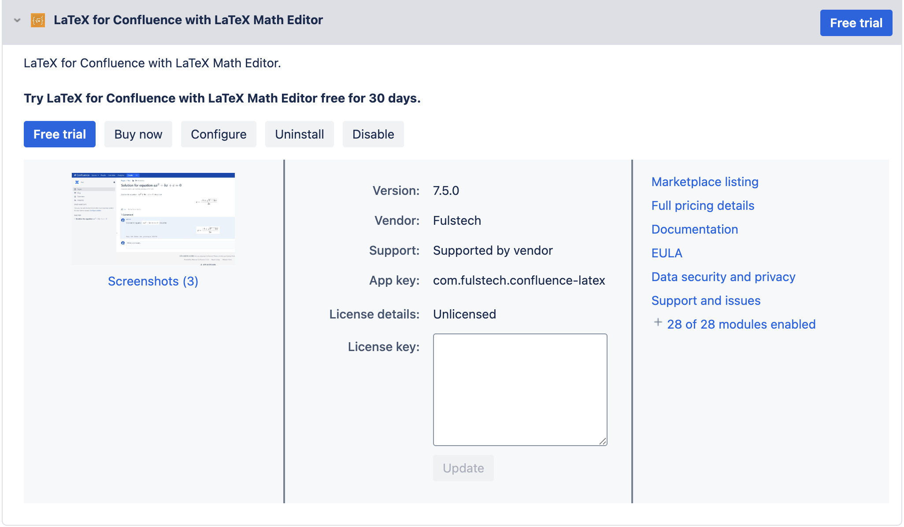
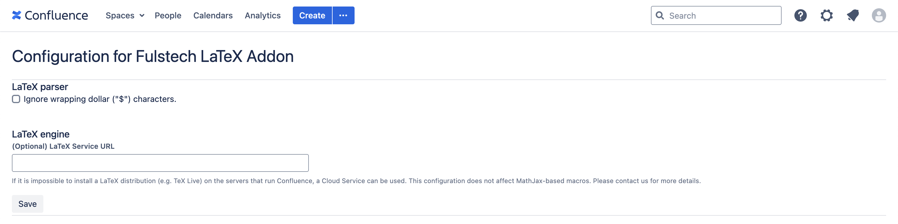

# How to install TeX Live

The advanced macros require `pdflatex` and Poppler (<https://poppler.freedesktop.org>) to be installed and accessible by Confluence.

Several distributions of LaTeX provide `pdflatex`. One of the most popular ones is TeX Live (<https://tug.org/texlive/>).

Following is how to install TeX Live and Poppler on Windows, Ubuntu, and Docker. The exact steps may vary due to differences in server configuration.

## Windows

### Install TeX Live

Please see <https://tug.org/texlive/windows.html> for more details. In general, the installation involves downloading and executing the installer file.

> When installing from the internet, we recommend downloading and running [install-tl-windows.exe](https://mirror.ctan.org/systems/texlive/tlnet/install-tl-windows.exe).
>
> This installer first unpacks itself and then starts the installer proper, which is the same as for other platforms. An ‘Advanced’ button gives you many additional customization options.
>
> When successful, the installer tries to do the post-install things that are considered appropriate on Windows:
>
> * Adds a TeX Live submenu of Windows’ Start menu. Entries include a GUI for TeX Live Manager and the TeXworks editor if was installed.
> * Optionally adds some filetypes and file associations.
> * Adds the directory of TeX Live Windows binaries to the search path.
>
> The TeX Live Manager GUI mentioned above can be used to add or remove packages, and to keep the installation up to date.

### Install Poppler

Poppler is already included in TeX Live for Windows. Please see <https://www.tug.org/texlive/doc/texlive-en/texlive-en.html> for more details.

> A number of Windows ports of common Unix command-line programs are installed along with the usual TeX Live binaries. These include gzip, zip, unzip, and the utilities from the poppler suite (pdfinfo, pdffonts, …).

## Ubuntu

### Install TeX Live

The `apt` package `texlive-full` provides TeX Live and all of the LaTeX packages.

`apt install -y texlive-full`

### Install Poppler

The `apt` package `poppler-utils` provides Poppler.

## Docker

Atlassian's Confluence Docker image is used as the base image.

```docker
FROM atlassian/confluence-server:8.5.0

ARG DEBIAN_FRONTEND=noninteractive

RUN apt update \
  && apt install -y texlive-full \
  && apt install -y poppler-utils \
  && rm -rf /var/lib/apt/lists/*
```

## TeX Live alternative

If TeX Live cannot be installed on the server that run Confluence, the remote LaTeX web service can be used for rendering LaTeX. LaTeX content will be submitted and rendered by the web service.

> **warning**
>
We don't store or log any LaTeX content sent to the backend.

To enable this feature, please follow these steps:

In the **Manage Apps** page, expand the row that displays this app. Click the **Configure** button.



Provide the endpoint of the web service. The recommended value is  <https://fulstech-latex-service-lam-ll3likebca-uc.a.run.app> .

> **info**
>
Contact us if you need a dedicated service that serves you exclusively and not share with other customers.


