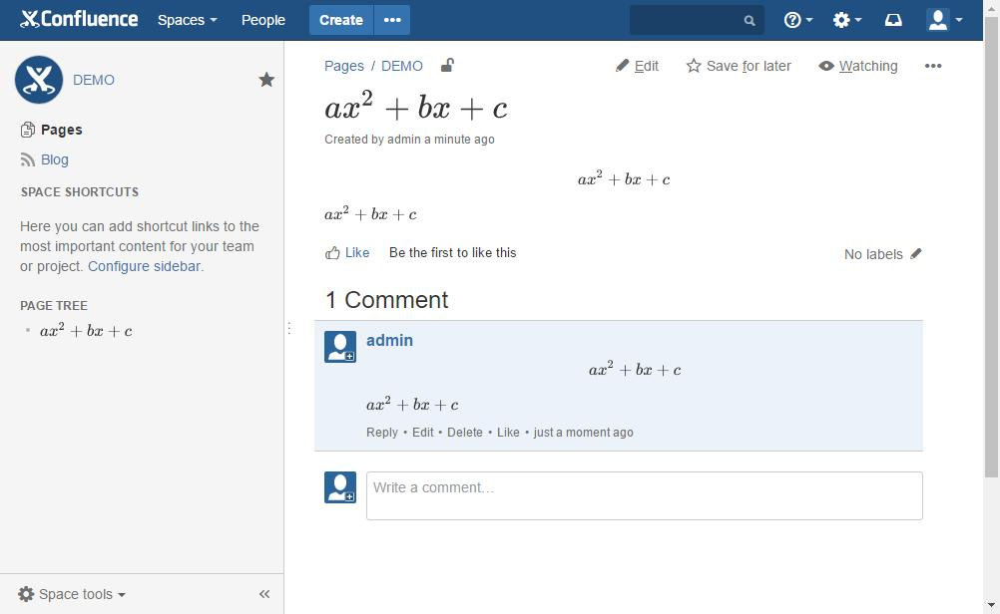

# Overview

> **If you are using Confluence Cloud, please see** [**this page**](../confluence-cloud/overview.md)**.**

LaTeX for Confluence is the only app that can render LaTeX everywhere inside Confluence Data Center and Confluence Server. You can install the app by following the instructions at [Atlassian Marketplace](https://marketplace.atlassian.com/plugins/com.fulstech.confluence-latex).

