# Usage (from version 4.0.0)

## Two types of LaTeX content

This app supports two types of LaTeX content. Simple content such as `e = mc^2` will be rendered by MathJax engine, and more complex content that uses packages such as `tikz` or `chemfig` will be rendered by TeX Live engine.

## Insert macros

In the article editor, click the **Insert** button, and select **Other macros** from the list.

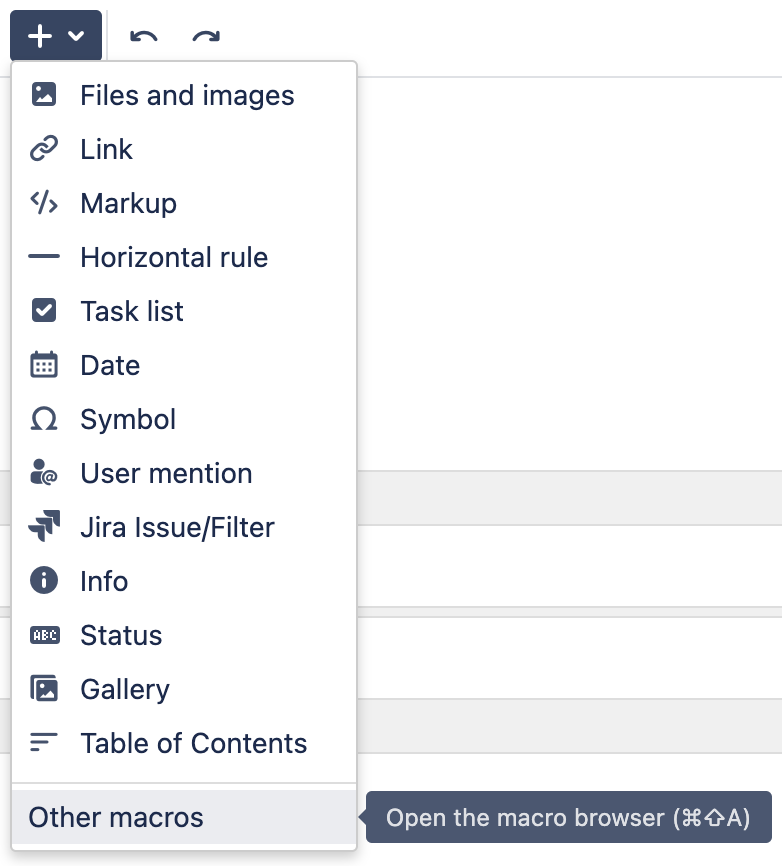

In the **Select macro** dialog, search for "**latex"**.

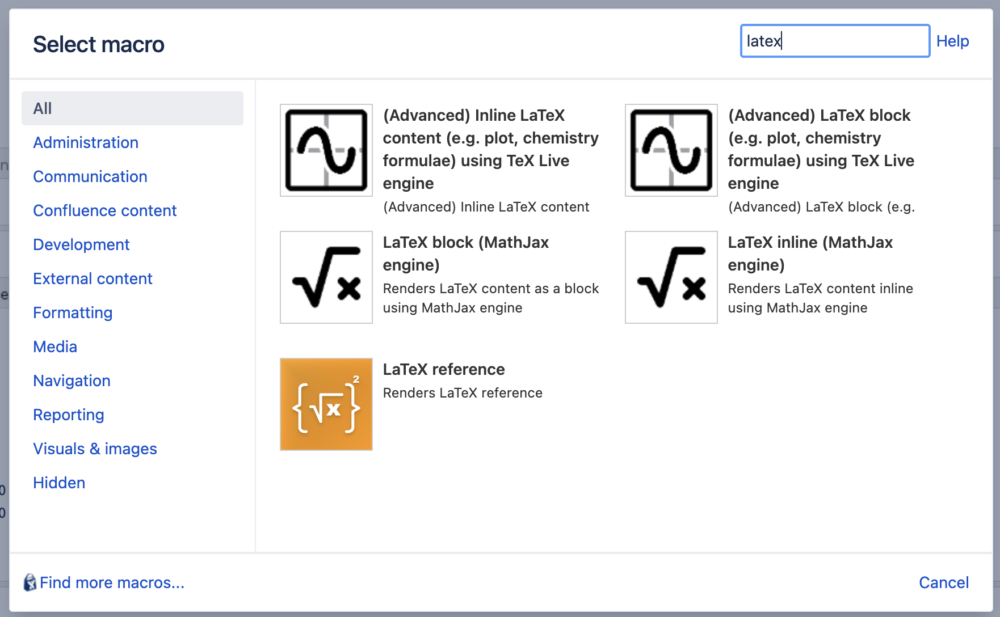

Alternatively, type **{** and select the LaTeX macros.

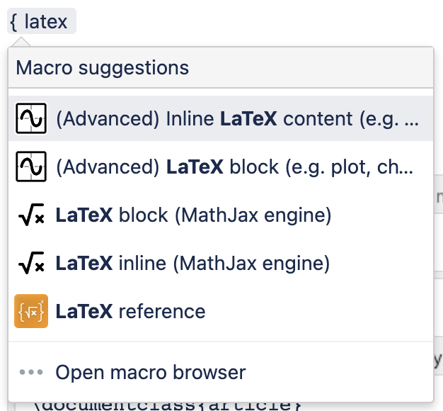

## Insert simple LaTeX content (MathJax engine)

To insert simple LaTeX content please use the following macros:

* **LaTeX inline (MathJax engine)**
* **LaTeX block (MathJax engine)**

These macros use the MathJax engine to render content. The content is as simple as `e=mc2` and does not require LaTeX preambles.

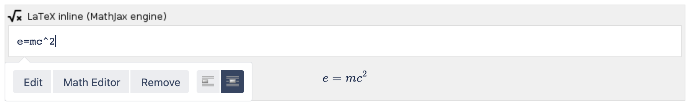

While editing a formula, you can click on the **Math Editor** button to open the **LaTeX Math Editor**. This editor will help you write LaTeX content easily with many visual hints. You can open the **Math Keyboard** by clicking on the keyboard icon in the right-hand corner of the Math Editor preview area. The content you write here will be filled to the Macro editor. To close the editor, click **Save** or **Cancel** button.


Click **Publish** to save the article. The article with LaTeX content will then be rendered.


## Insert complex LaTeX content (TeX Live engine)

> **info**
>
This feature was introduced in version 5.0.0.

Sometimes you need to render complex LaTeX content such as the following one

```latex
\documentclass{article}
\pagestyle{empty}
\usepackage{pgfplots}
\begin{document}
\begin{tikzpicture}
\begin{axis}
\addplot3[
    surf,
]
{exp(-x^2-y^2)*x};
\end{axis}
\end{tikzpicture}
\end{document}
```

which will be rendered as

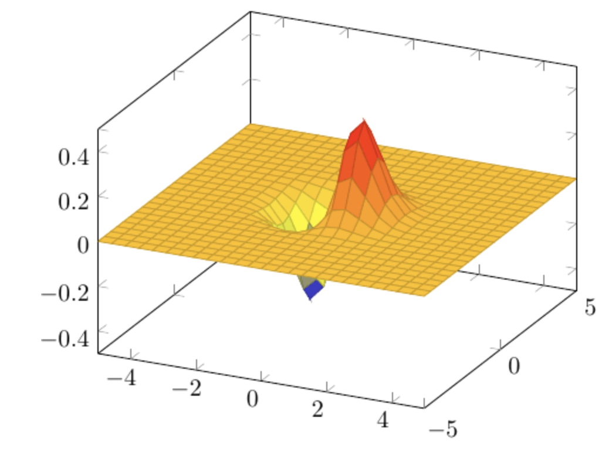

In this case, please make use of the following macros:

* **(Advanced) LaTeX block (e.g. plot, chemistry formulae) using pdflatex engine**
* **(Advanced) Inline LaTeX content (e.g. plot, chemistry formulae) using pdflatex engine**

### System requirements

The `pdflatex` and Poppler (<https://poppler.freedesktop.org>) must be installed and added to the PATH environment variable. The Operating System user that the Confluence server is running in must be able to use the `pdflatex` without specifying its location.

We recommend installing `pdflatex` using TeX Live <https://www.tug.org/texlive/> (preferably) or MikTeX <https://miktex.org/>. All LaTeX packages should be installed to maximize the renderability.

To ensure the security of the Confluence server, this app does not allow the execution of bash commands in LaTeX content.

For a general instructions to install TeX Live and Poppler please see <https://fulstech.gitbook.io/docs/latex-beautiful-math-for-confluence/confluence-data-center-and-confluence-server/how-to-install-tex-live>.

### Verify if pdflatex has been installed correctly

To verify if `pdflatex` has been installed correctly, please following these steps:

Switch to the same OS user that is running Confluence.

Create a file `test.tex` with the following content.

```latex
\documentclass{article}
\begin{document}
Hello, world!
\end{document}
```

Execute this command: `pdflatex test.tex`. An PDF file with name `test.pdf` should be created.

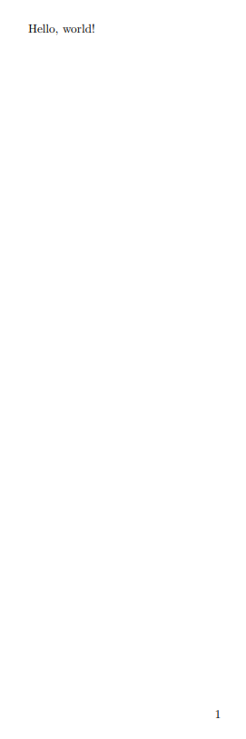

### Syntax

Please make sure that the following preample is used since it will exclude page headers, footers, and numbers from the output:

```latex
\documentclass{article}
\pagestyle{empty}
```

The following sections will show you some examples.

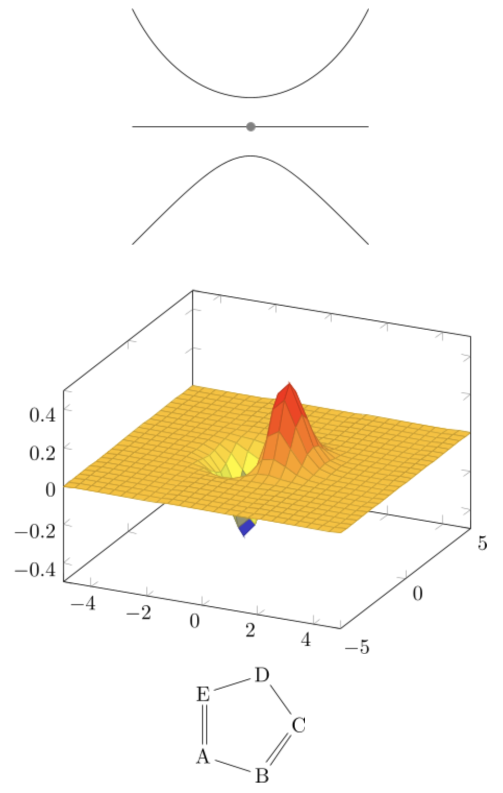

### 3d plots

```latex
\documentclass{article}
\pagestyle{empty}
\usepackage{pgfplots}
\begin{document}
\begin{tikzpicture}
\begin{axis}
\addplot3[
    surf,
]
{exp(-x^2-y^2)*x};
\end{axis}
\end{tikzpicture}
\end{document}
```

### Chemistry formulae

```latex
\documentclass{article}
\pagestyle{empty}
\usepackage{chemfig}
\begin{document}
\chemfig{A*5(-B=C-D-E=)}
\end{document}
```

### Figures

```latex
\documentclass{article}
\pagestyle{empty}
\usepackage[pdftex]{pict2e}
\usepackage[dvipsnames]{xcolor}
\begin{document}
\setlength{\unitlength}{1cm}
\setlength{\fboxsep}{0pt}
\fbox{%
\begin{picture}(3,3)
\put(0,0){{\color{blue}\circle*{0.25}}\hbox{\kern3pt \texttt{(0,0)}}}
\put(3,3){{\color{red}\circle*{0.25}}\hbox{\kern3pt \texttt{(3,3)}}}
\end{picture}}
\end{document}
```

```latex
\documentclass{article}
\pagestyle{empty}
\usepackage{tikz}
\begin{document}
\begin{tikzpicture}
\draw (-2,0) -- (2,0);
\filldraw [gray] (0,0) circle (2pt);
\draw (-2,-2) .. controls (0,0) .. (2,-2);
\draw (-2,2) .. controls (-1,0) and (1,0) .. (2,2);
\end{tikzpicture}
\end{document}
```

## Refer to a LaTeX content

You can refer to existing LaTeX content. Below are the instructions.

Click on the **Edit** button, and provide a reference name for the LaTeX content.

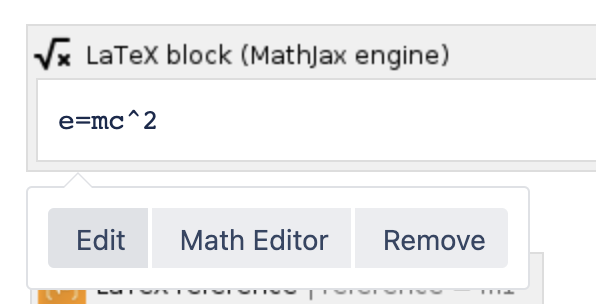

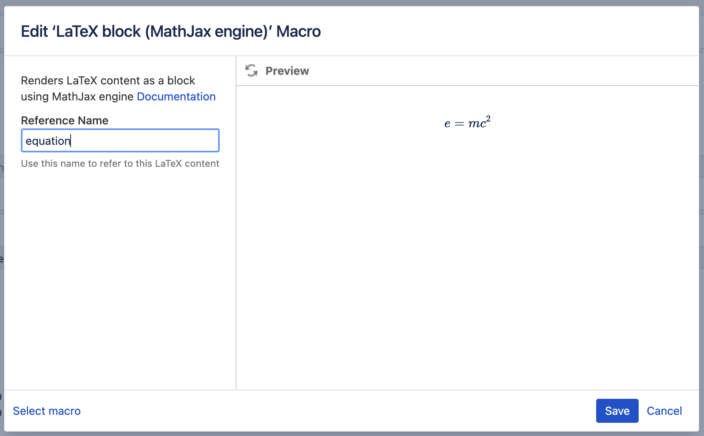

Insert the **Render LaTeX Reference** macro.

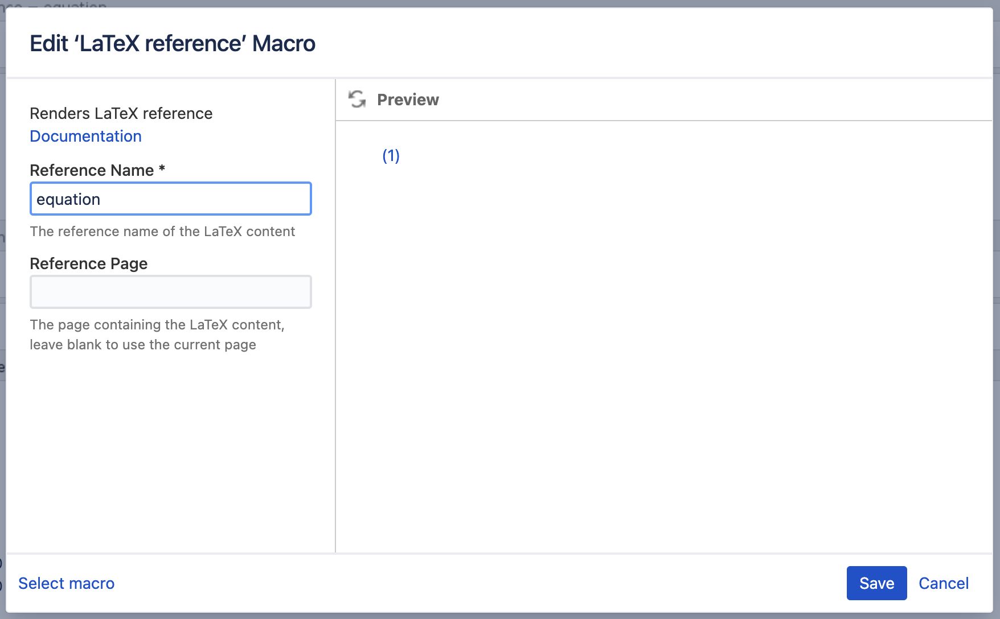

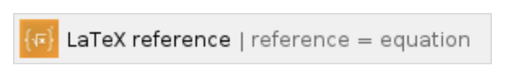

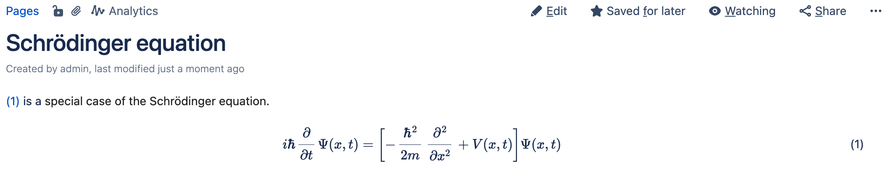

## Write Math in Page Title

For Page Title, inline LaTex must be wrapped inside `//(...//)`  and LaTex block must be wrapped inside `//[...//]`.

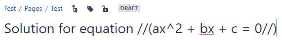

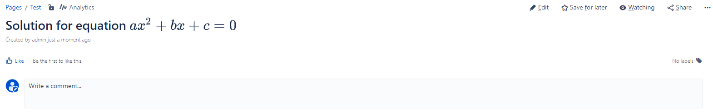

## Mobile support


