# Usage (with browser extension)

If your companies are using Chrome and Edge (Chromium) to access Jira Cloud, you can make use of our **LaTeX for Jira** Chrome extension to write and view LaTeX content inside Issue Summary, Description, and Comments.

> **The** [**Jira app**](https://marketplace.atlassian.com/apps/1223629/latex-beautiful-math-for-jira-cloud?hosting=cloud\&tab=installation) **is still required to be in trial or subscribed mode, as the browser extension will verify the license of the Jira app.**

## Install the browser extension

This section will be updated after the browser extension is approved.

### Chrome

Visit Chrome Web Store and install the Chrome extension at <https://chrome.google.com/webstore/detail/latex-for-jira-cloud-math/hhamhpelagjbpokfnbhbbgidekkmpbgf>.

### Edge (Chromium)

Please follow the instructions here to install the extension from Chrome Web Store <https://support.microsoft.com/en-us/microsoft-edge/add-turn-off-or-remove-extensions-in-microsoft-edge-9c0ec68c-2fbc-2f2c-9ff0-bdc76f46b026>.

1. Open Microsoft Edge and go to the [Chrome Web Store](https://chrome.google.com/webstore/category/extensions).
2. Select **Allow extensions from other stores** in the banner at the top of the page.
3. Select **Allow** to confirm.
4. Select the extension you want to add and select **Add to Chrome**.
5. At the prompt showing permissions required by the extension, carefully review the permissions, and select the **Add extension** button.
6. You'll see a final prompt confirming the extension has been added.

### Firefox

Visit Mozilla Add-ons website and install the Firefox add-ons at <https://addons.mozilla.org/en-US/firefox/addon/latex-for-jira-cloud/>.

## Atlassian Wiki fields

Since Atlassian Wiki fields automatically convert some content to formatted blocks, such as `**bold**` becomes **bold**, the practice to insert LaTeX content is as below.

### Inline LaTeX content

Type the backtick.

Type the pair **//(//)**.

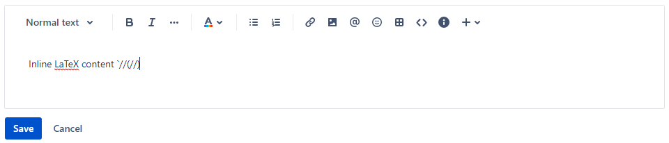

Type the backtick, again. Atlassian Wiki editor will convert the content to a code block.

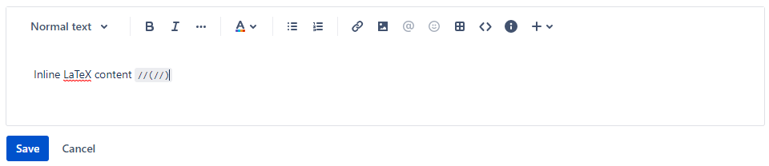

Type the LaTeX content between the pair **//(//)**.

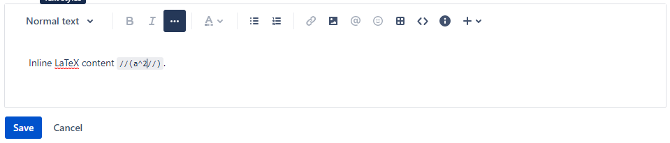

Click **Save** and see the result.

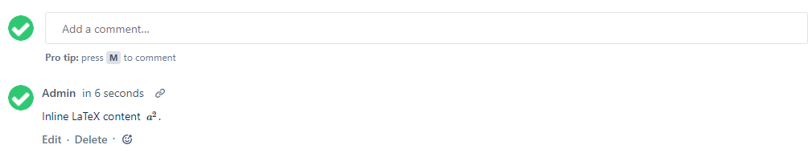

### LaTeX block

Type the backtick.

Type the pair **//\[//]**.

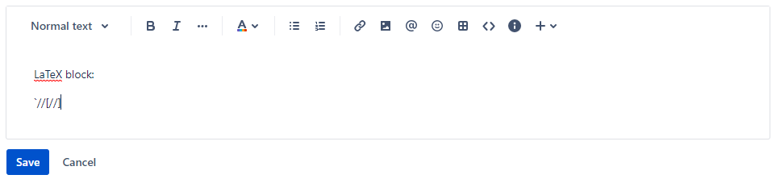

Type the backtick, again. Atlassian Wiki editor will convert the content to a code block.

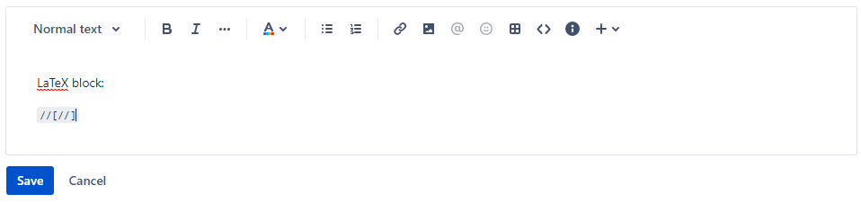

Type the LaTeX content between the pair **//\[//]**.

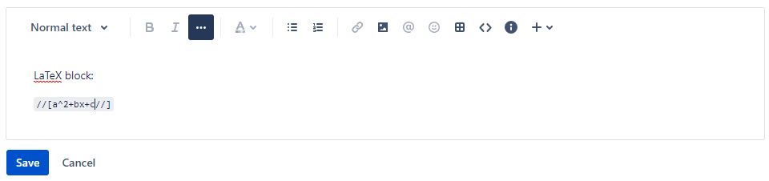

Click **Save** and see the result.

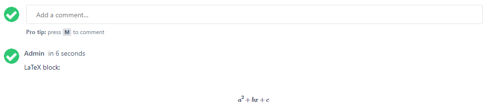

## Plain text fields

For plain text fields like Summary, inline LaTeX must be wrapped inside `//(...//)` and LaTeX block must be wrapped inside `//[...//]`.

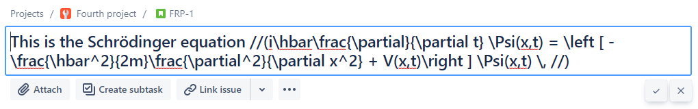

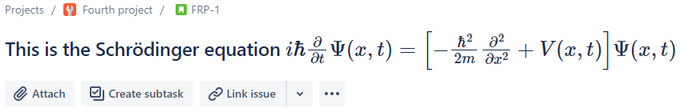

## Examples

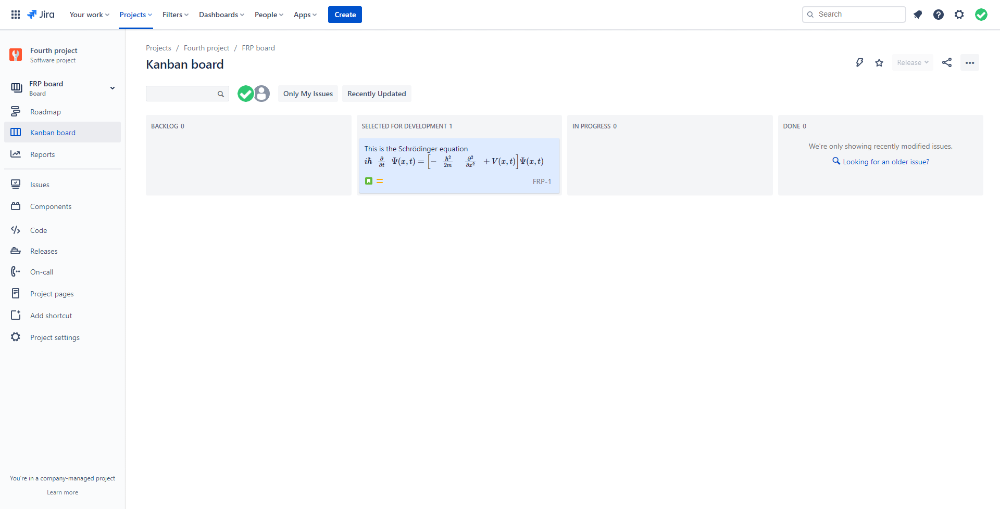

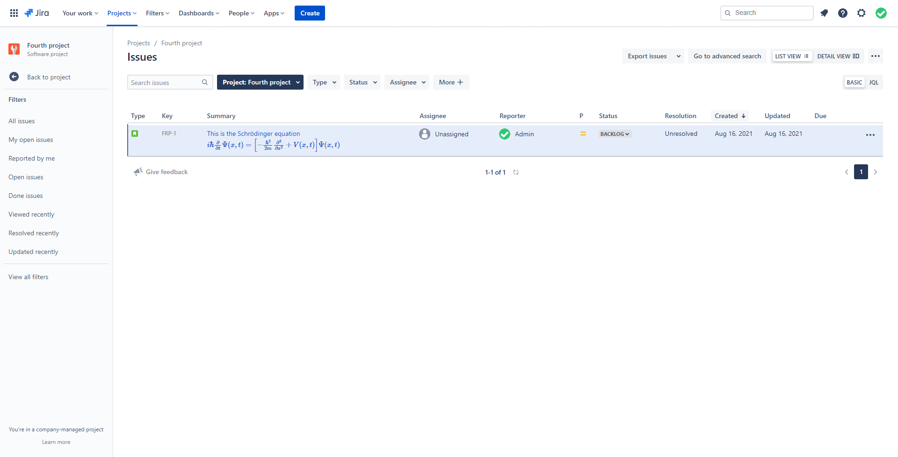
