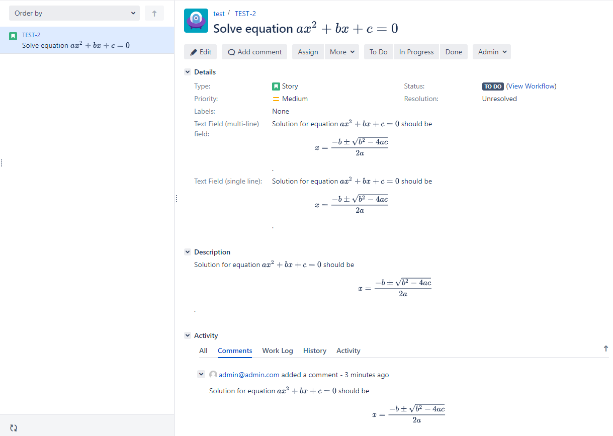
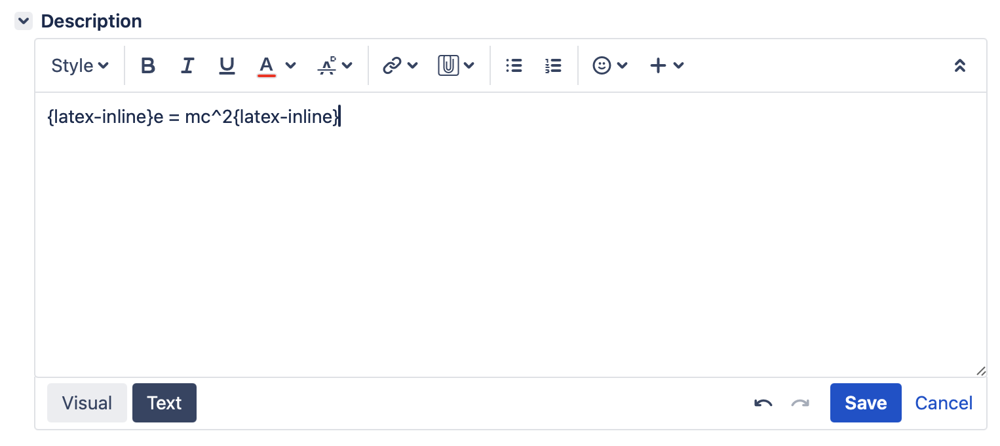
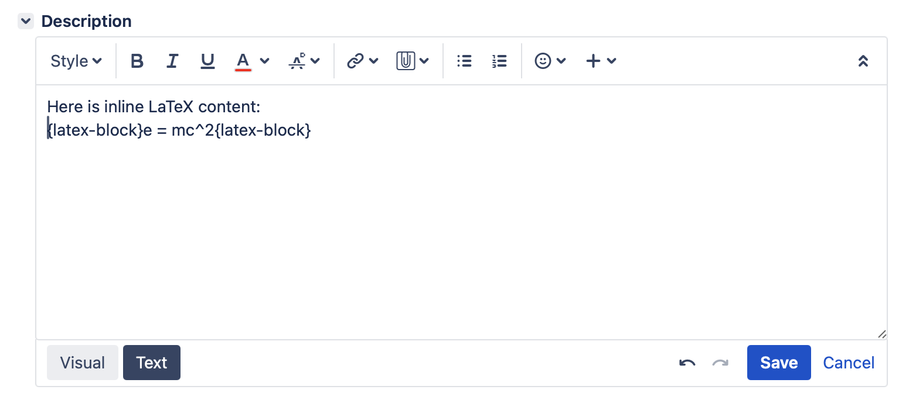
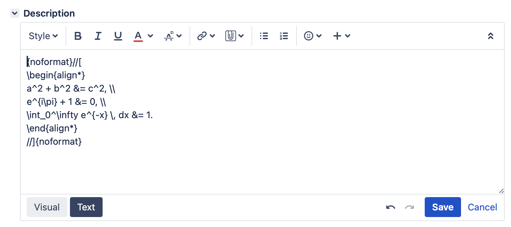
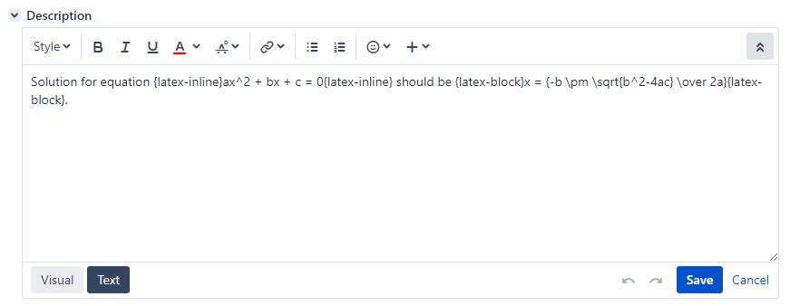
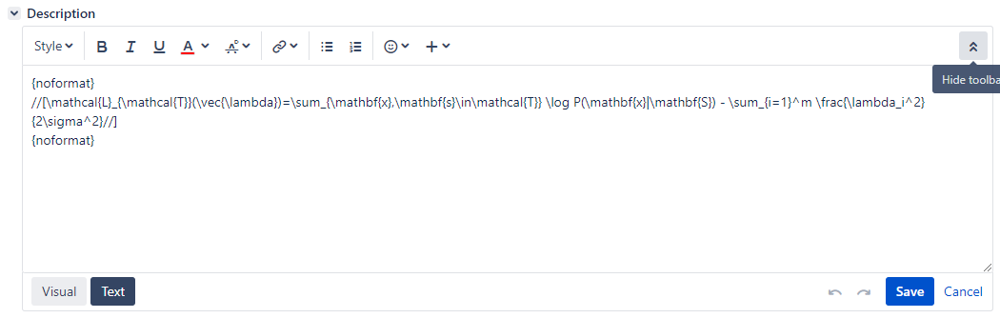
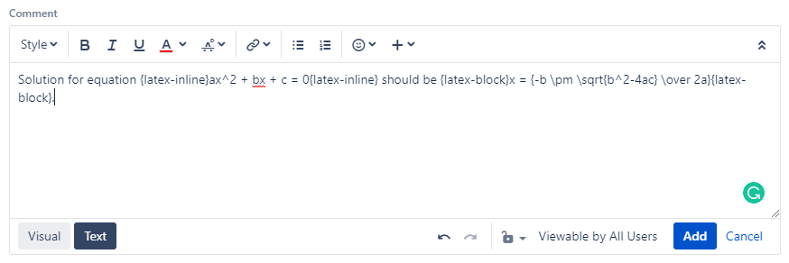
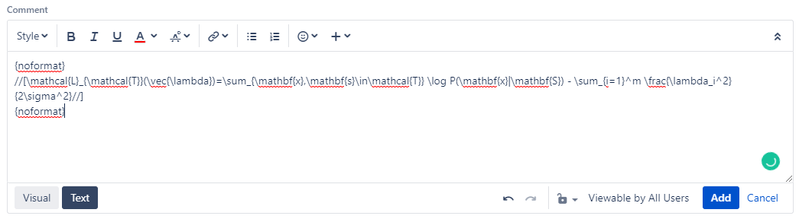

# Usage

This app renders LaTeX anywhere inside Jira– even in Issue Summary. The syntax is very simple.



## Activate the app

The app only works after the license has been activated. If a license has not been purchased, please activate the trial mode <https://confluence.atlassian.com/jirakb/how-to-generate-evaluation-licenses-for-jira-apps-1021233084.html>.

## Syntax in Atlassian Wiki fields

### Inline LaTeX content

To insert LaTeX content into Atlassian Wiki editors such as Description or Comment in inline mode:

* Select the **Text** mode (you must make sure ithe editor is not in **Visual** mode.
* Wrap the content inside the `{latex-inline}...{latex-inline}` macro.
* You can go back to **Visual** mode to type other content after that.

```
{latex-inline}e = mc^2{latex-inline}
```




### Block LaTeX content

To insert LaTeX content into Atlassian Wiki editors such as Description or Comment in block mode:

* Select the **Text** mode (you must make sure ithe editor is not in **Visual** mode.
* Wrap the content inside the `{latex-block}...{latex-block}` macro.
* You can go back to **Visual** mode to type other content after that.

```
{latex-block}e = mc^2{latex-block}
```




### Complex LaTeX content

Sometimes the symbols in complex LaTeX content can be misinterpreted by Atlassian Wiki as formatting syntax. To type such complex LaTeX content:

* You can go back to **Visual** mode to type other content after that.
* Wrap the content inside the `{noformat}//[...//]{noformat}` macro.
* Select the **Text** mode (you must make sure ithe editor is not in **Visual** mode.

```
{noformat}//[
\begin{align*}
a^2 + b^2 &= c^2, \\
e^{i\pi} + 1 &= 0, \\
\int_0^\infty e^{-x} \, dx &= 1.
\end{align*}
//]{noformat}
```




### Examples

#### Description







#### Comment







## Syntax in plain-text fields

For plain-text fields like Summary, inline LaTeX must be wrapped inside `//(...//)` and LaTeX block must be wrapped inside `//[...//]`.

### Examples

#### Summary


#### Text Field (multi-line)


#### Text Field (single line)


