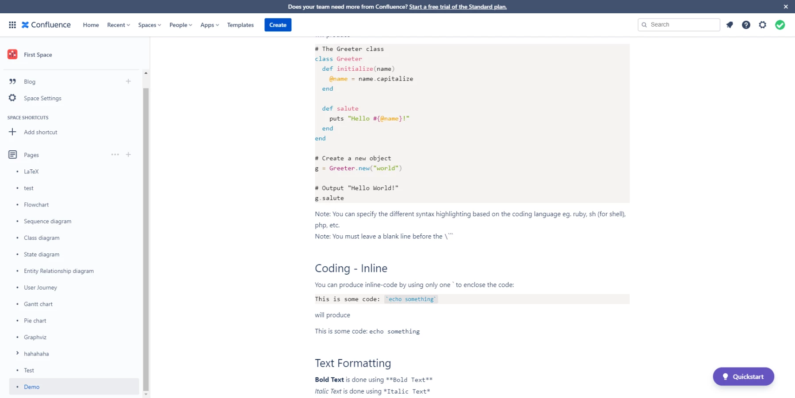

# Overview

**Markdown for Confluence** helps you write Github Flavored Markdown and LaTeX in Confluence Cloud.

You can install the app by following the instructions at [Atlassian Marketplace](https://marketplace.atlassian.com/apps/1226896/markdown-for-confluence-latex-github-flavored-markdown?tab=installation\&hosting=cloud).

