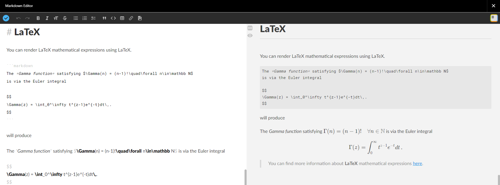
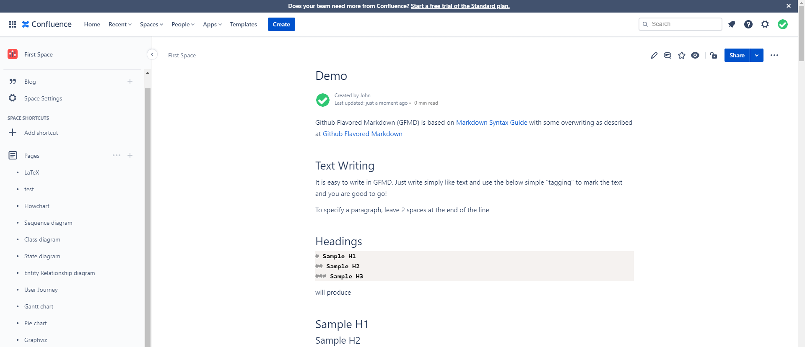

# Usage

## Macro

Insert the Markdown macro.


Type the Markdown content, and click the **Check icon** at the top left corner.



Publish the Confluence article.



## Syntax

### KaTeX

You can render LaTeX mathematical expressions using [KaTeX](https://khan.github.io/KaTeX/):

```markdown
$$
\Gamma(z) = \int_0^\infty t^{z-1}e^{-t}dt\,.
$$
```

$$
\Gamma(z) = \int\_0^\infty t^{z-1}e^{-t}dt,.
$$

> You can find more information about **LaTeX** mathematical expressions [here](http://meta.math.stackexchange.com/questions/5020/mathjax-basic-tutorial-and-quick-reference).
