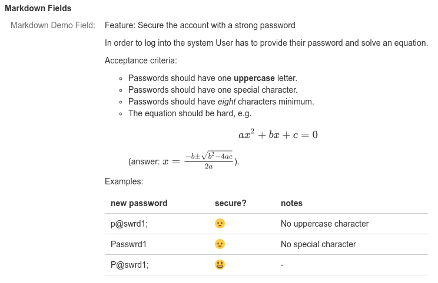

# Overview

> **If you are using Jira Data Center or Jira Server, please see** [**this page**](../jira-data-center-and-jira-server/overview.md)**.**

Markin is the best Markdown editor for Jira Cloud. Markin provides **Markdown Editor** for composing and rendering Markdown content. Markin offers the following features:

* Github Flavored Markdown:
  * Basic syntax: <https://help.github.com/articles/basic-writing-and-formatting-syntax>.
  * Table: <https://help.github.com/articles/organizing-information-with-tables>.
* Gherkin syntax for behavior description: <http://docs.behat.org/en/v2.5/guides/1.gherkin.html>.
* LaTeX for Math formulas.
* DOT (Graphviz) for diagram: [http://www.graphviz.org](http://www.graphviz.org/).
* JavaScript sequence diagram: <https://bramp.github.io/js-sequence-diagrams>.
* Mermaid UML diagram: <https://mermaid-js.github.io/mermaid/#/>.
* Preview mode.
* Syntax highlighting & autocompletion.

You can install the app by following the instructions at [Atlassian Marketplace](https://marketplace.atlassian.com/apps/1214558/markin-markdown-in-jira-with-latex-uml?hosting=cloud\&tab=installation).

