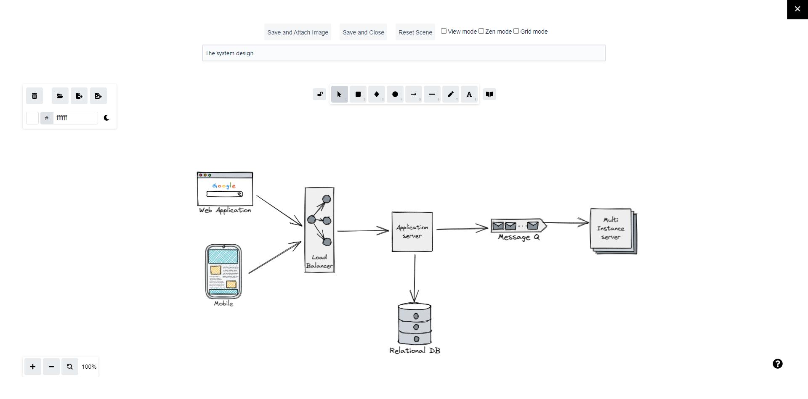

# Overview

**Excalidraw for Jira** helps you brainstorm and express ideas, draw UML diagrams, design GUI wireframes, document software architecture design, and many things else inside Jira.

You can install the app by following the instructions at [Atlassian Marketplace](https://marketplace.atlassian.com/apps/1226791/excalidraw-for-jira?tab=installation\&hosting=cloud).

