# Usage

## Mermaid UML Diagrams Macro

The **Render Mermaid UML Diagrams** macro (<https://mermaid-js.github.io/mermaid/#/>) uses Mermaid to render UML diagrams. It allows you to define UML diagrams in plain-text format just like Markdown.

For a live editor to draft your diagrams, please try <https://mermaidjs.github.io/mermaid-live-editor>.

In the Confluence editor, open the **Select macro** dialog. The macro name is **Render Mermaid UML Diagrams**.

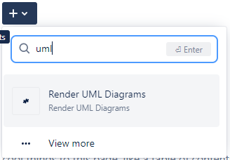

Alternatively, type / (**slash**) and select the macro.


A dialog will appear. Type the content of the UML diagram into the macro editor. Here is an example:

```
sequenceDiagram
    participant Alice
    participant Bob
    Alice->>John: Hello John, how are you?
    loop Healthcheck
        John->>John: Fight against hypochondria
    end
    Note right of John: Rational thoughts <br/>prevail!
    John-->>Alice: Great!
    John->>Bob: How about you?
    Bob-->>John: Jolly good!
```


While editing, you can click **Show preview** to see the result. You can also click **Full Screen Editor** to open the Mermaid editor that will help you design new diagrams easily.


Save the page, and the UML diagram will be rendered.


## PlantUML Diagrams Macro

The **Render PlantUML Diagrams** macro (<https://plantuml.com/>) uses PlantUML to render UML diagrams. It allows you to define UML diagrams in plain-text format just like Markdown.

For a live editor to draft your diagrams, please try <http://www.plantuml.com/plantuml>.

In the Confluence editor, open the **Select macro** dialog. The macro name is **Render PlantUML Diagrams**.

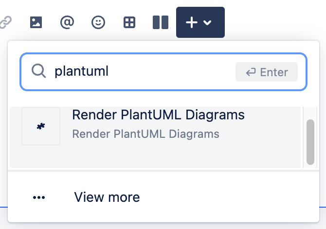

A dialog will appear. Type the content of the UML diagram into the macro editor. Here is an example:

```plant-uml
@startuml C4_Elements
!include https://raw.githubusercontent.com/plantuml-stdlib/C4-PlantUML/master/C4_Container.puml

Person(personAlias, "Label", "Optional Description")
Container(containerAlias, "Label", "Technology", "Optional Description")
System(systemAlias, "Label", "Optional Description")

Rel(personAlias, containerAlias, "Label", "Optional Technology")
@enduml
```

You can find more examples here <https://plantuml.com/>. The PDF guideline can be downloaded here <https://plantuml.com/guide>.

Save the macro, and the UML diagram will be rendered.


## Graphviz Diagrams Macro

The Graphviz layout programs (<https://www.graphviz.org/>) take descriptions of graphs in a simple text language, and make diagrams in useful formats, such as images and SVG for web pages; PDF or Postscript for inclusion in other documents; or display in an interactive graph browser. Graphviz has many useful features for concrete diagrams, such as options for colors, fonts, tabular node layouts, line styles, hyperlinks, and custom shapes.

You can find more Graphviz examples [here](https://graphs.grevian.org/example).

In the Confluence editor, open the **Select macro** dialog. The macro name is **Render Graphviz Diagrams**.

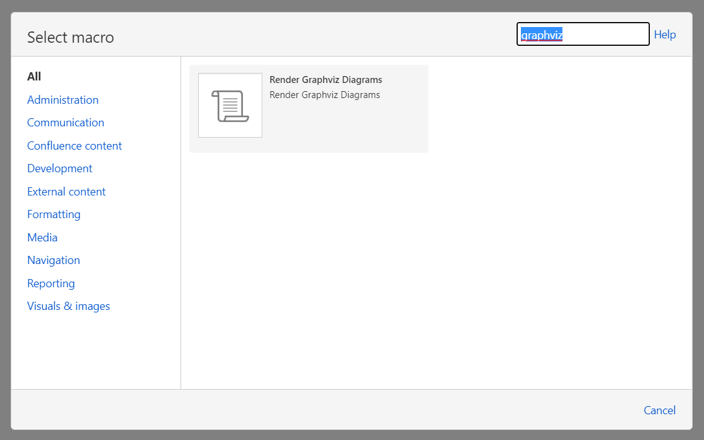

Select the macro, then click **Insert**.


Type the content of the Graphviz diagram into the macro editor. Here is an example:

```
graph {
  a -- b;
  b -- c;
  a -- c;
  d -- c;
  e -- c;
  e -- a;
}
```

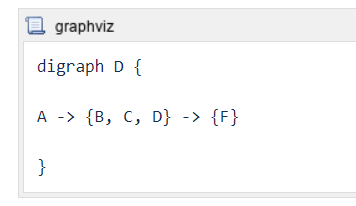

Save the page, and the Graphviz diagram will be rendered.


## Examples

### Flowchart

Flowcharts can be rendered with Mermaid. See more <https://mermaid-js.github.io/mermaid/#/flowchart>.

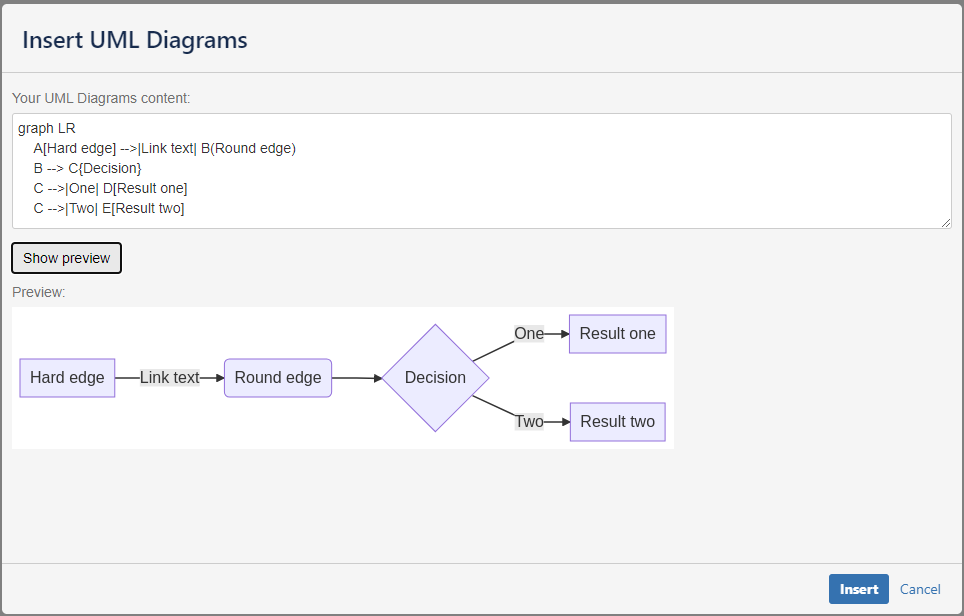

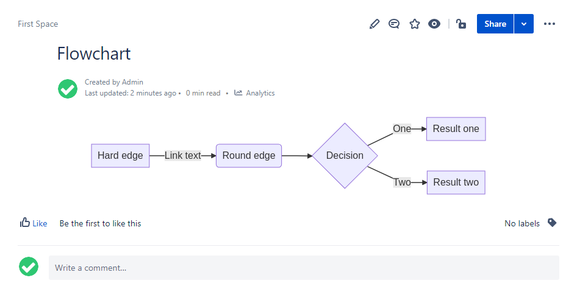

### Sequence diagram

Sequence diagrams can be rendered with Mermaid. See more <https://mermaid-js.github.io/mermaid/#/sequenceDiagram>.

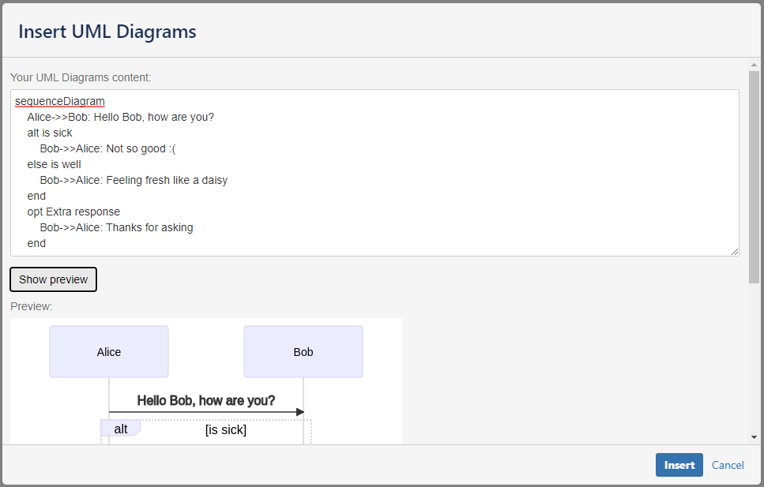


### Class diagram

Class diagrams can be rendered with Mermaid. See more <https://mermaid-js.github.io/mermaid/#/classDiagram>.


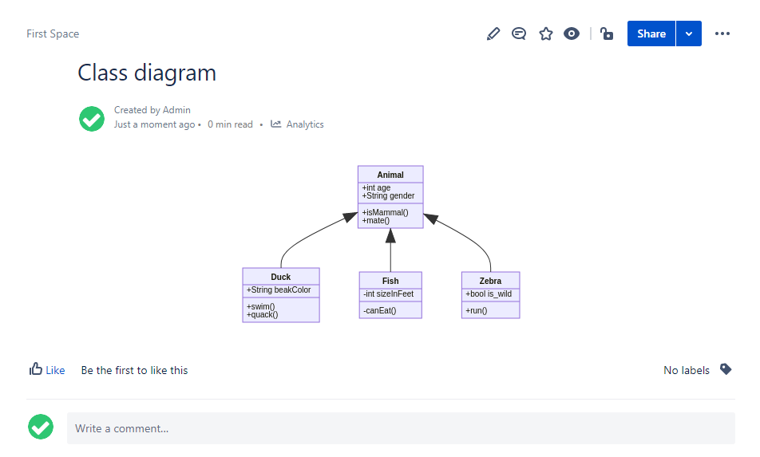

### State diagram

State diagrams can be rendered with Mermaid. See more <https://mermaid-js.github.io/mermaid/#/stateDiagram>.


### Entity Relationship diagram

Entity Relationship diagrams can be rendered with Mermaid. See more <https://mermaid-js.github.io/mermaid/#/entityRelationshipDiagram>.


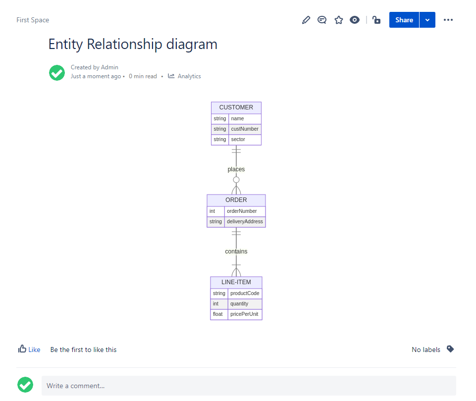

### User Journey

User Journey can be rendered with Mermaid. See more <https://mermaid-js.github.io/mermaid/#/user-journey>.

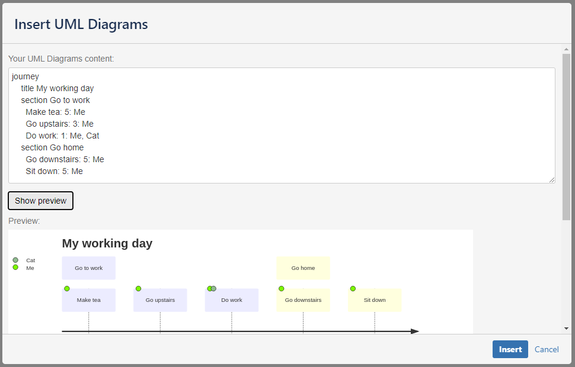


### Gantt chart

Gantt charts can be rendered with Mermaid. See more <https://mermaid-js.github.io/mermaid/#/gantt>.

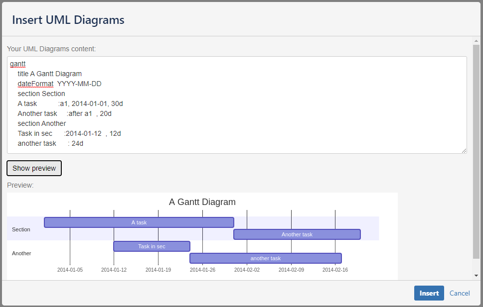

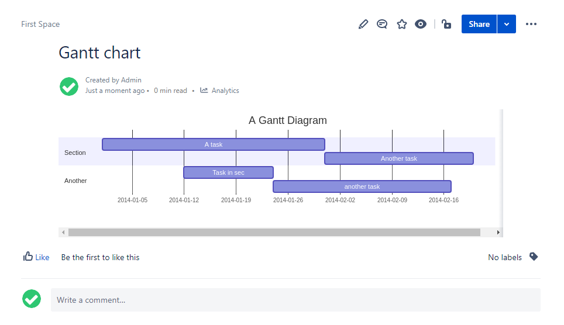

### Pie chart

Pie charts can be rendered with Mermaid. See more <https://mermaid-js.github.io/mermaid/#/pie>.


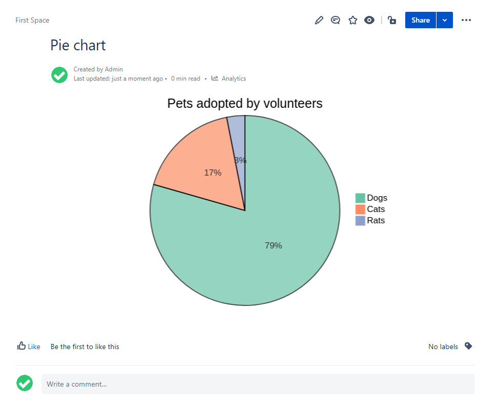

### Graphviz

This diagram is rendered with Graphviz.

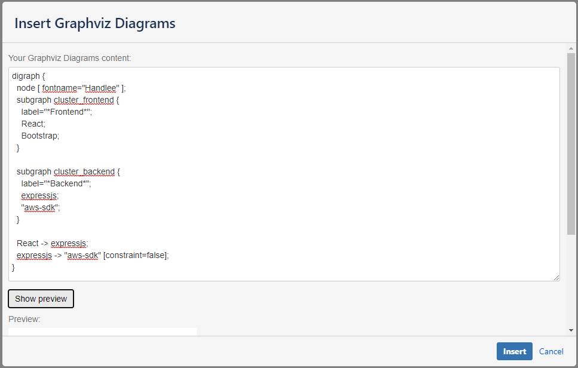


