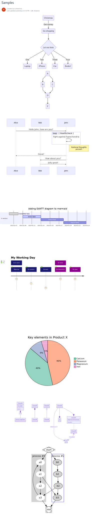

# Overview

> If you are using **Confluence Cloud**, please see [this page](../confluence-cloud/overview.md).
>
> The Server and Data Center edition does not support PlantUML macro.

**Mermaid UML Diagrams and Graphviz Diagrams for Confluence Server** is the app that renders UML diagrams and Graphviz diagrams inside Confluence Server.

You can install the app by following the instructions at [Atlassian Marketplace](https://marketplace.atlassian.com/apps/1222120/uml-diagrams-and-graphviz-for-confluence?hosting=server\&tab=overview).

Using [Mermaid ](https://mermaid-js.github.io/mermaid/#/)and [Graphviz ](https://graphviz.org/)syntax, you can draw various diagrams, such as Flowchart, Sequence Diagram, Class Diagram, State Diagram, User Journey.

The text-based format minimizes the effort required to maintain diagrams and increase the reusability of content.

