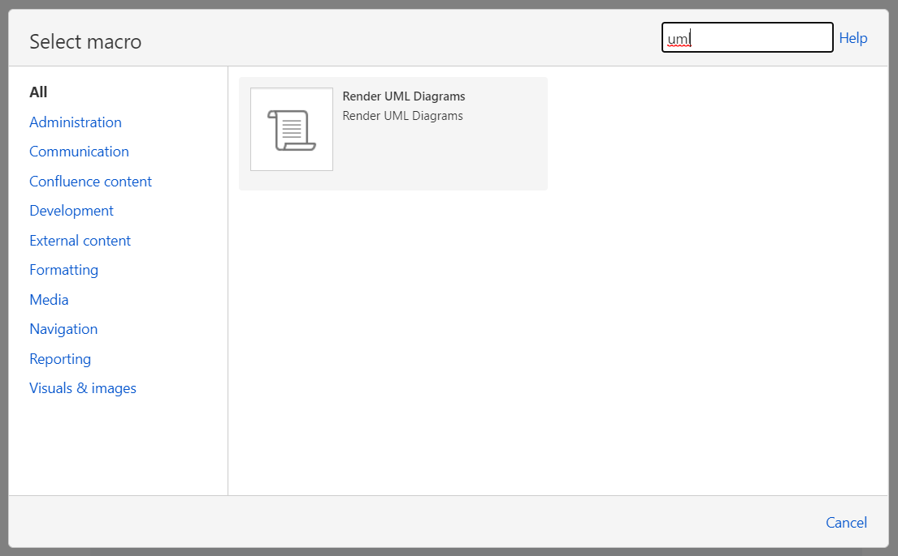
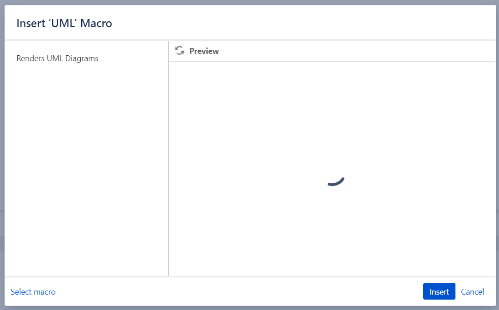
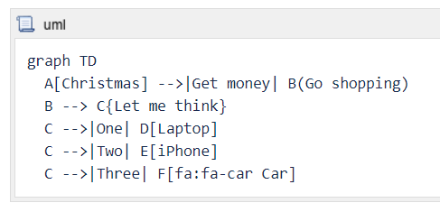
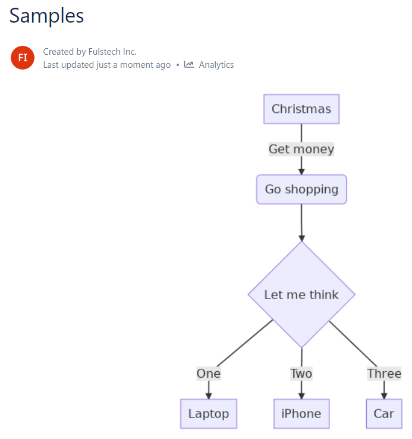
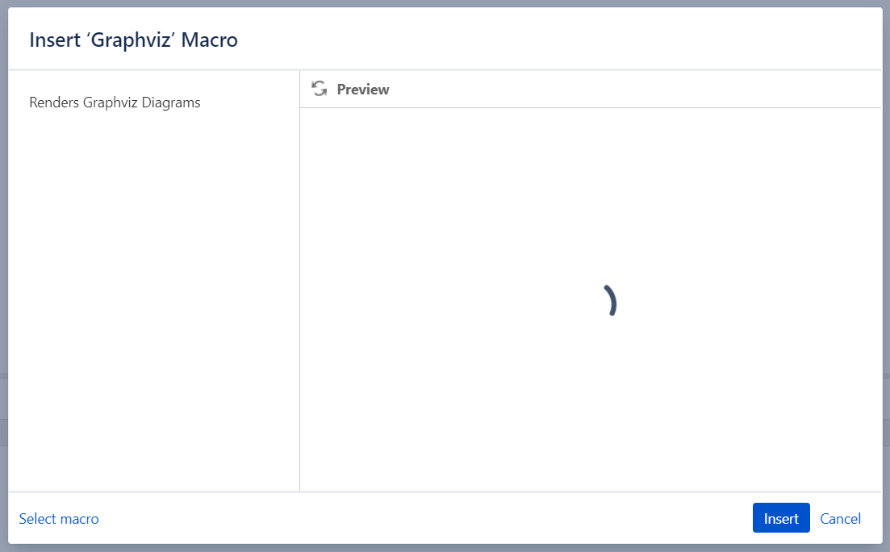

# Usage

> **Please make sure the Confluence Server can connect to** [**https://app-nwtmwlxsha-uk.a.run.app**](https://app-nwtmwlxsha-uk.a.run.app/). **We use this Web Service to render the diagrams. The content of the diagrams is not kept in our server.**

## Render UML Diagrams Macro

The **Render UML Diagrams** macro (<https://mermaid-js.github.io/mermaid/#/>) uses Mermaid to render UML diagrams. It allows you to define UML diagrams in plain-text format just like Markdown.

For a live editor to draft your diagrams, please try <https://mermaidjs.github.io/mermaid-live-editor>.

In the Confluence editor, open the **Select macro** dialog. The macro name is **Render UML Diagrams**.



Select the macro, then click **Insert**.



Type the content of the UML diagram into the macro editor. Here is an example:

```
sequenceDiagram
    participant Alice
    participant Bob
    Alice->>John: Hello John, how are you?
    loop Healthcheck
        John->>John: Fight against hypochondria
    end
    Note right of John: Rational thoughts <br/>prevail!
    John-->>Alice: Great!
    John->>Bob: How about you?
    Bob-->>John: Jolly good!
```



Save the page, and the UML diagram will be rendered.



## Render Graphviz Diagrams Macro

The Graphviz layout programs (<https://www.graphviz.org/>) take descriptions of graphs in a simple text language, and make diagrams in useful formats, such as images and SVG for web pages; PDF or Postscript for inclusion in other documents; or display in an interactive graph browser. Graphviz has many useful features for concrete diagrams, such as options for colors, fonts, tabular node layouts, line styles, hyperlinks, and custom shapes.

You can find more Graphviz examples [here](https://graphs.grevian.org/example).

In the Confluence editor, open the **Select macro** dialog. The macro name is **Render Graphviz Diagrams**.


Select the macro, then click **Insert**.



Type the content of the Graphviz diagram into the macro editor. Here is an example:

```
graph {
  a -- b;
  b -- c;
  a -- c;
  d -- c;
  e -- c;
  e -- a;
}
```


Save the page, and the Graphviz diagram will be rendered.


