# Usage

After installing and starting the trial period, the app will add a custom field name **UML text** to the Jira instance.

The first step is to add the custom field **UML text** to issue types and projects.

## For classic Jira projects

### Associate the UML field to issue screens

Navigate to the **Custom fields** page.


Search for the custom field **UML text** and add it to screens.


### Add the **UML** panel to the issue screen

On an issue view, click on the “three dots” icon and select **UML Diagrams**.

## **For Next-gen Jira project**

Click on **Project settings** on the left sidebar.


On the **Project settings** page, click on **Apps** on the left sidebar.


Click on **App fields** on the left sidebar and enable **Mermaid UML for Jira Cloud.**


Go back to the **Project settings** page, click on **Issue types** on the left sidebar.


Drag the **UML text** field from the right sidebar and drop it into the **Description fields** area.


## Add Mermaid UML graphs to an issue

Click on the **Edit** button.


**Please do not edit the custom field itself. Whenever you want to add or modify graphs, please use the app’s Edit button.**

The UML content is wrapped around by **{uml}…{uml}**. The diagram is defined using Mermaid. Mermaid (<https://mermaid-js.github.io/mermaid/#/>) allows you to define UML diagrams in plain-text format just like Markdown. For a live editor to draft your diagrams, please try <https://mermaidjs.github.io/mermaid-live-editor>.

Sample content:

```
{uml}
sequenceDiagram
    participant Alice
    participant Bob
    Alice->>John: Hello John, how are you?
    loop Healthcheck
        John->>John: Fight against hypochondria
    end
    Note right of John: Rational thoughts <br/>prevail!
    John-->>Alice: Great!
    John->>Bob: How about you?
    Bob-->>John: Jolly good!
{uml}

{uml}
gantt
dateFormat  YYYY-MM-DD
excludes weekdays 2014-01-10

section A section
Completed task            :done,    des1, 2014-01-06,2014-01-08
Active task               :active,  des2, 2014-01-09, 3d
Future task               :         des3, after des2, 5d
Future task2               :         des4, after des3, 5d
{uml}
```


After that, click **Save**.


## Examples

### Flowchart

Flowcharts can be rendered with Mermaid. See more <https://mermaid-js.github.io/mermaid/#/flowchart>.

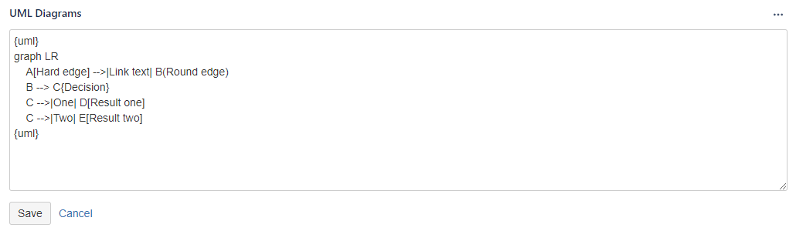

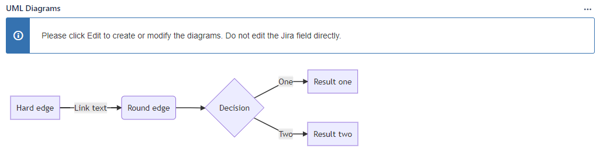

### Sequence diagram

Sequence diagrams can be rendered with Mermaid. See more <https://mermaid-js.github.io/mermaid/#/sequenceDiagram>.

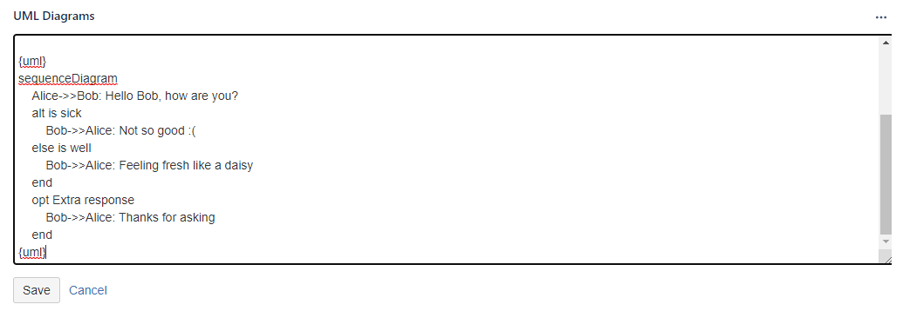

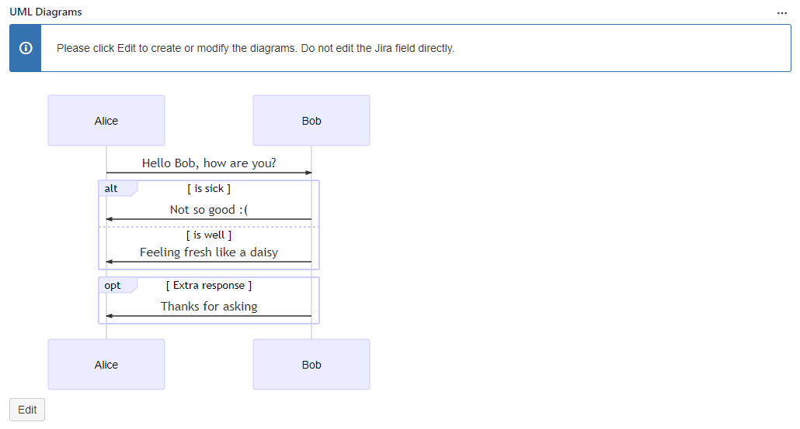

### Class diagram

Class diagrams can be rendered with Mermaid. See more <https://mermaid-js.github.io/mermaid/#/classDiagram>.

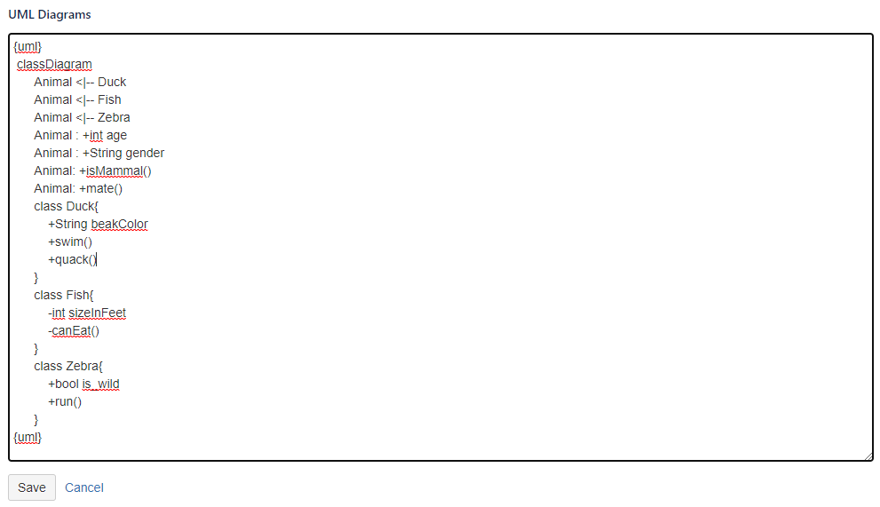

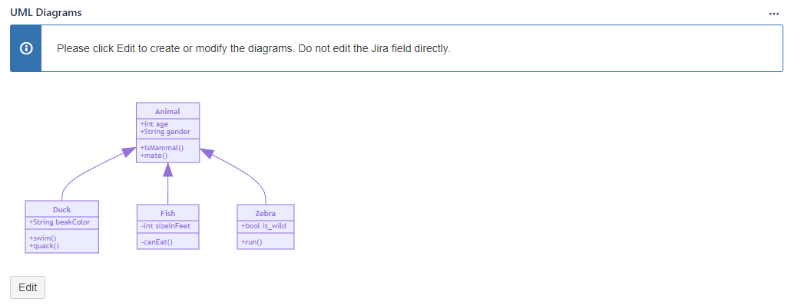

### State diagram

State diagrams can be rendered with Mermaid. See more <https://mermaid-js.github.io/mermaid/#/stateDiagram>.

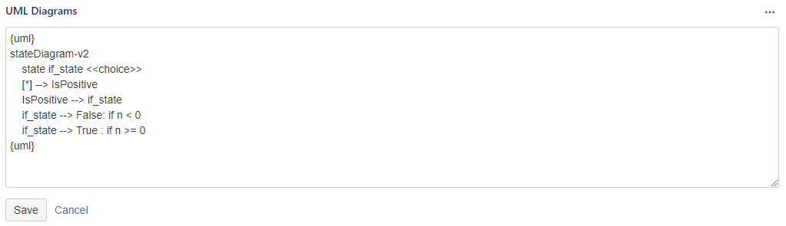

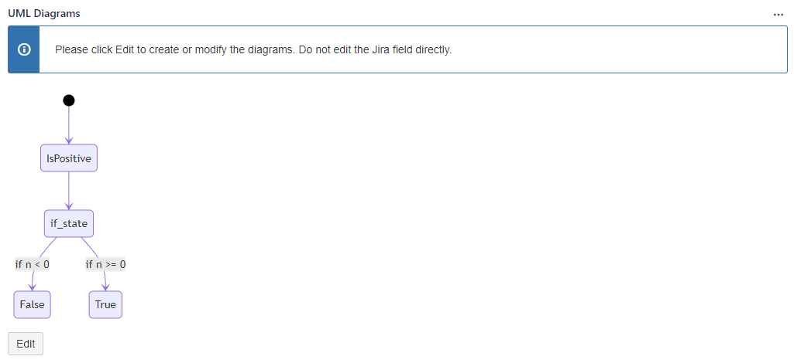

### User Journey

User Journey can be rendered with Mermaid. See more <https://mermaid-js.github.io/mermaid/#/user-journey>.

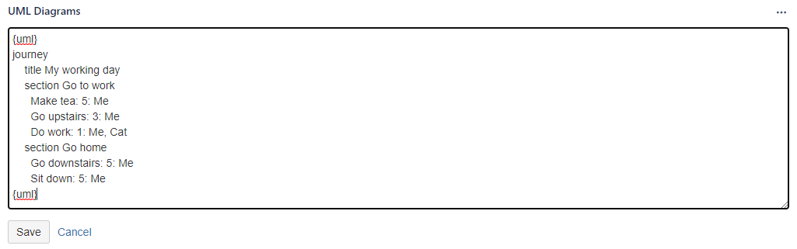

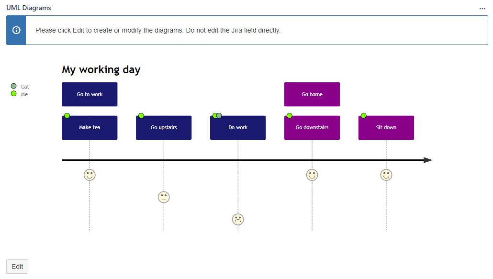

### Gantt chart

Gantt charts can be rendered with Mermaid. See more <https://mermaid-js.github.io/mermaid/#/gantt>.

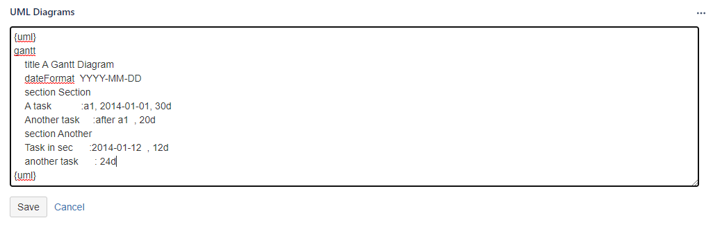

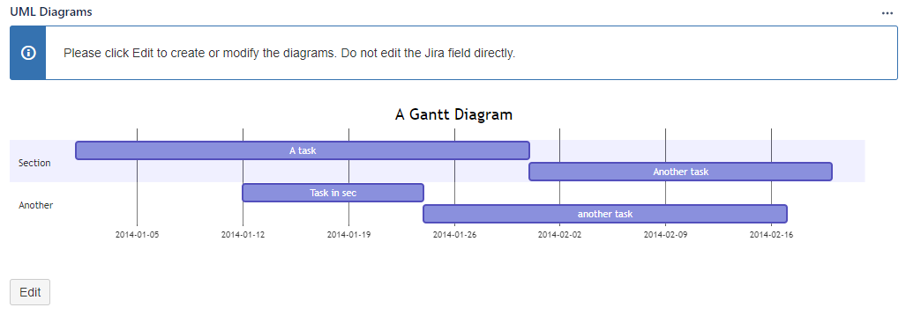

### Piechart

Pie charts can be rendered with Mermaid. See more <https://mermaid-js.github.io/mermaid/#/pie>.

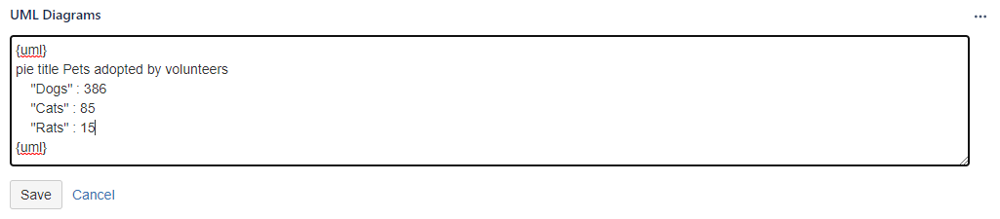

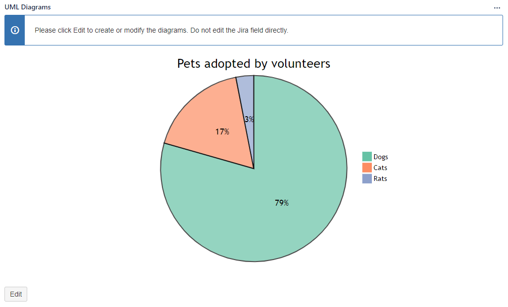
