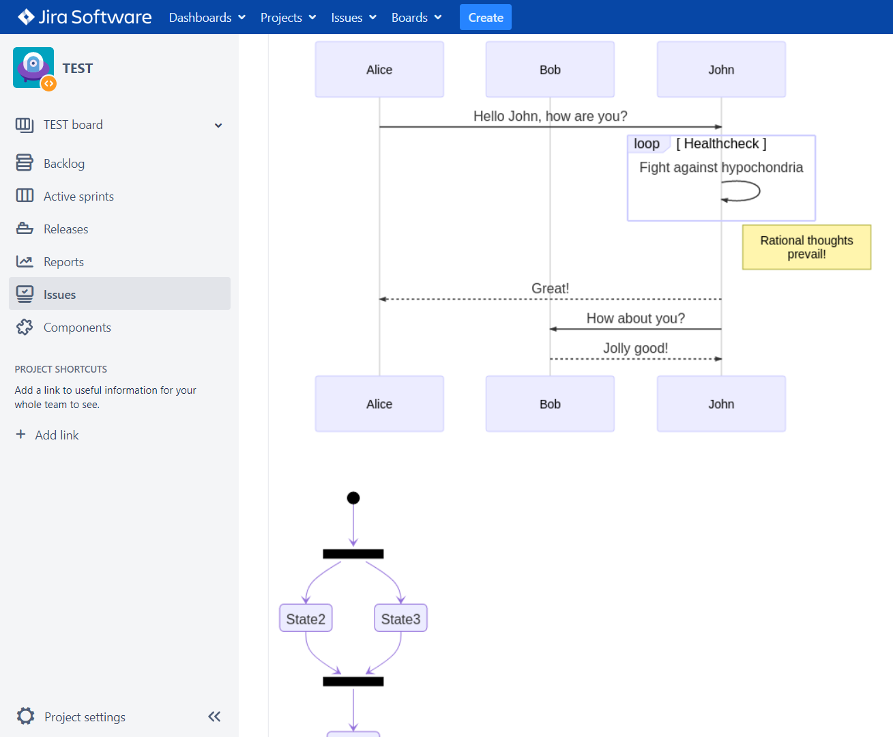

# Overview

> **If you are using Jira Cloud, please see** [**this page**](../../../latex/latex-for-jira/jira-cloud/overview.md)**.**

Graphviz Diagrams for Jira is the only app for rendering Mermaid UML diagrams and Graphviz diagrams inside Jira Data Center and Jira Server. Diagrams can be defined using the plain-text format, which simplifies editing, searching, and copying. Support multiple types of charts and diagrams:

* Graphviz
* Flowchart
* Sequence diagram
* Class diagram
* State diagram
* Entity Relationship diagram
* User Journey
* Gantt chart
* Pie char

You can install this app by following the instructions at [Atlassian Marketplace](https://marketplace.atlassian.com/plugins/com.fulstech.jira-graphviz).

