# Usage

## Mermaid UML Diagrams

> **Please make sure the Jira Server can connect to** [**https://app-nwtmwlxsha-uk.a.run.app**](https://app-nwtmwlxsha-uk.a.run.app/). **We use this Web Service to render the diagrams.**

This app renders Mermaid UML diagrams inside Jira Wiki Editor. The Mermaid UML content must be wrapped inside the **{uml}…{uml}** macro. **For Jira 7+, the macros have to be used in Text mode and not Visual mode**.

Mermaid (<https://mermaid-js.github.io/mermaid/#/>) allows you to define UML diagrams in plain-text format just like Markdown. For a live editor to draft your diagrams, please try <https://mermaidjs.github.io/mermaid-live-editor>.

As an example, after the app is installed, please paste the following text into Issue Description:

```
{uml}
sequenceDiagram
    participant Alice
    participant Bob
    Alice->>John: Hello John, how are you?
    loop Healthcheck
        John->>John: Fight against hypochondria
    end
    Note right of John: Rational thoughts <br />prevail!
    John-->>Alice: Great!
    John->>Bob: How about you?
    Bob-->>John: Jolly good!
{uml}
```

**For Jira 7+, the macros have to be used in Text mode and not Visual mode**.

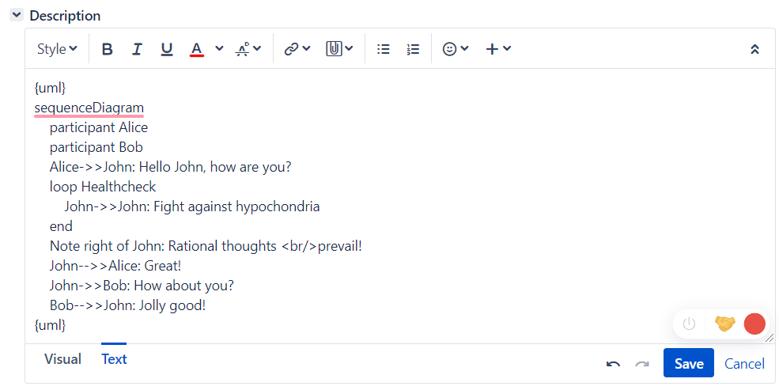

All Mermaid UML content will be rendered as below.

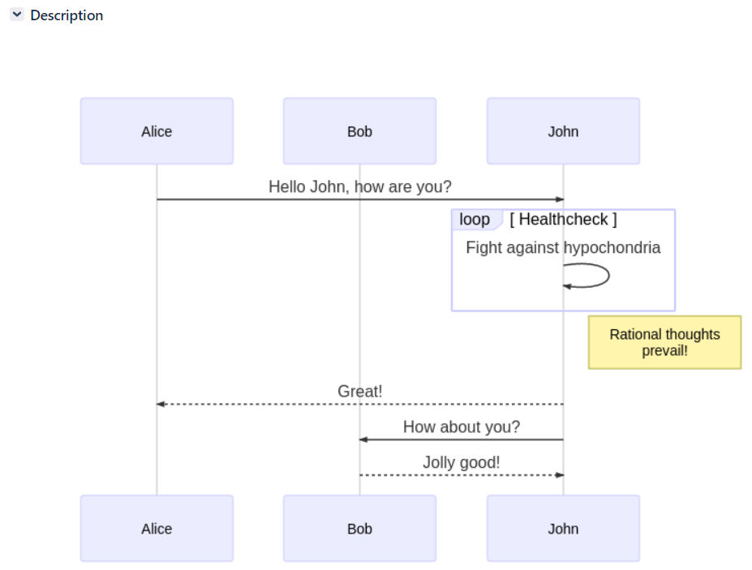

## Graphviz Diagrams

This app renders Graphviz diagrams inside Jira Wiki Editor. The Graphviz content must be wrapped inside the **{graphviz}…{graphviz}** macro. **For Jira 7+, the macros have to be used in Text mode and not Visual mode**.

As an example, after the app is installed, please paste the following text into Issue Description:

```
{graphviz}
graph {
  a -- b;
  b -- c;
  a -- c;
  d -- c;
  e -- c;
  e -- a;
}
{graphviz}
```

**For Jira 7+, the macros have to be used in Text mode and not Visual mode**.

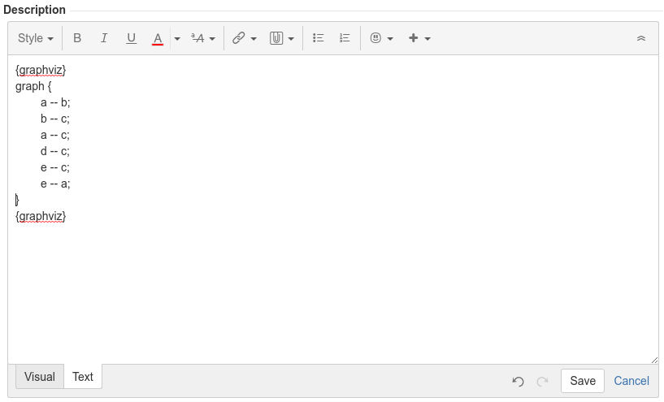

All Graphviz content will be rendered as below.

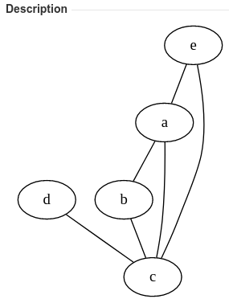

## Examples

### Flowchart

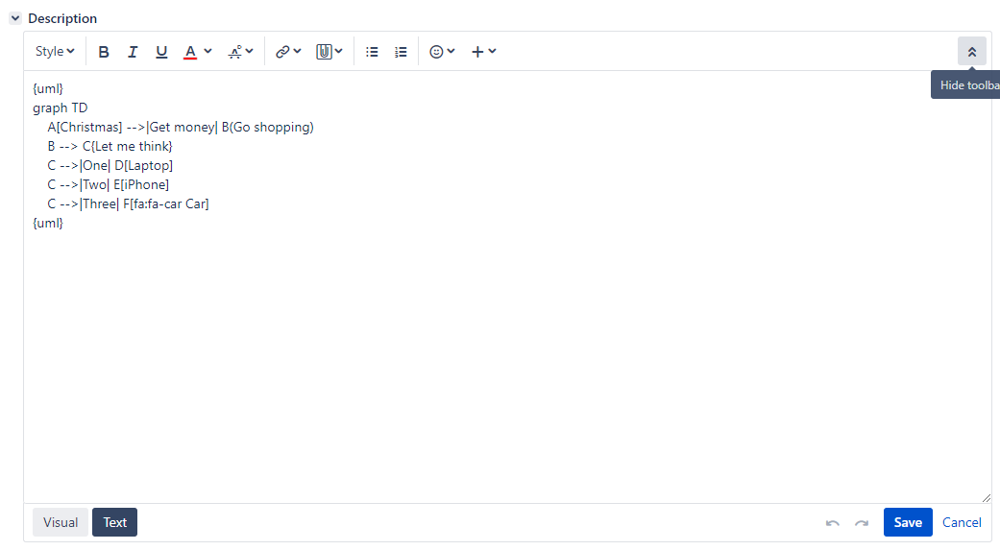

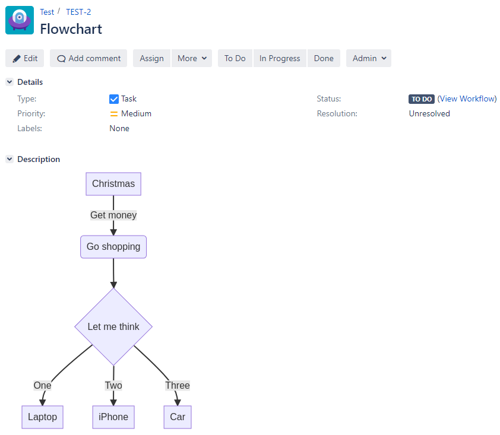

### Sequence diagram

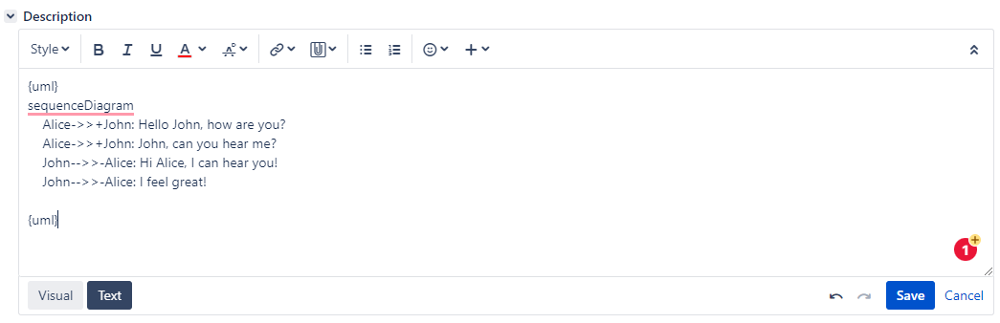

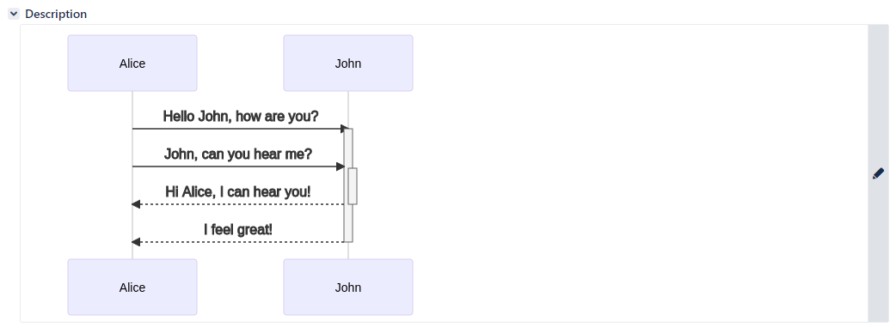

### Class diagram

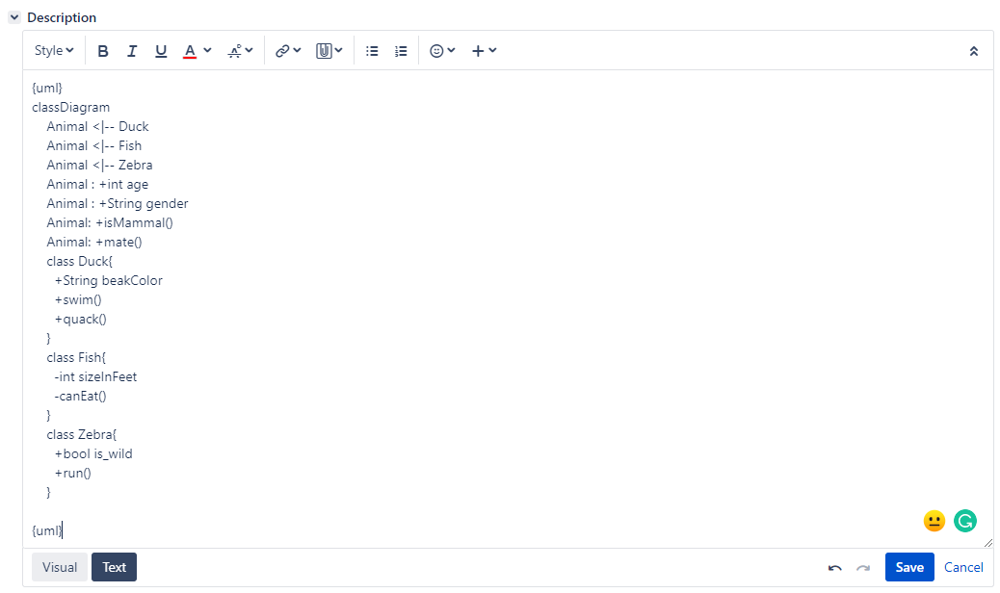

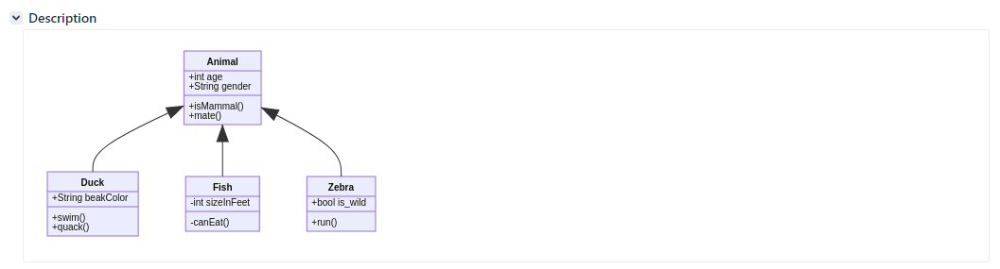

### State diagram

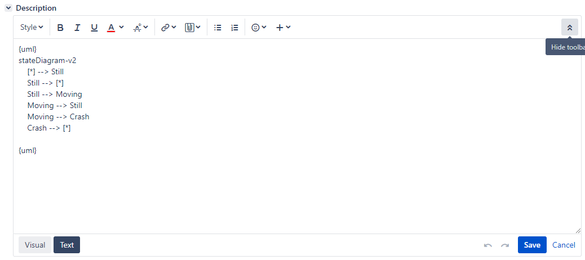

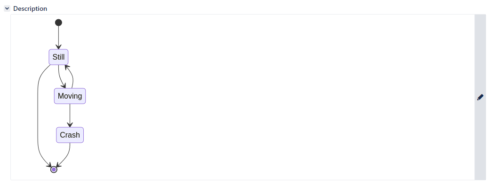

### Entity Relationship diagram

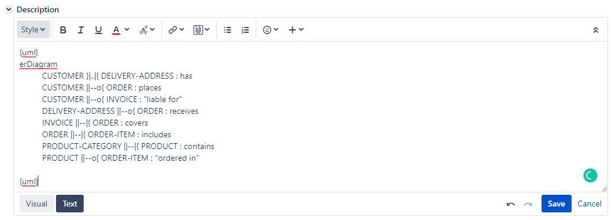

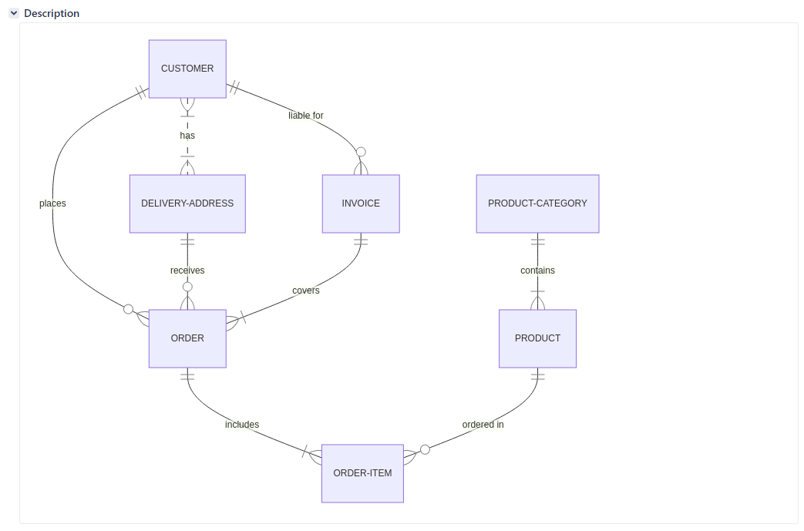

### User Journey

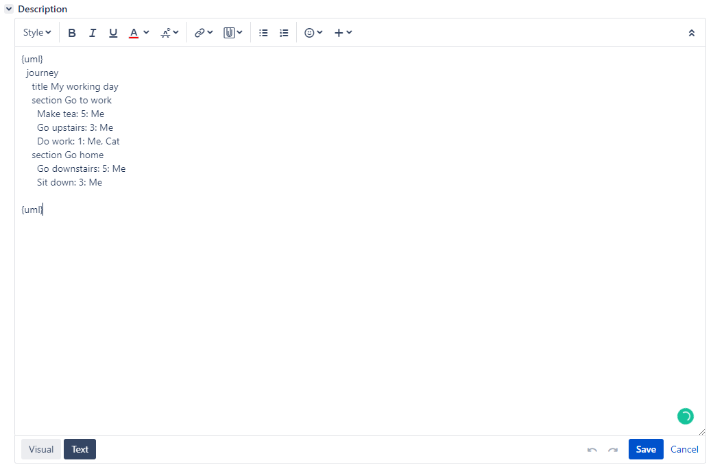

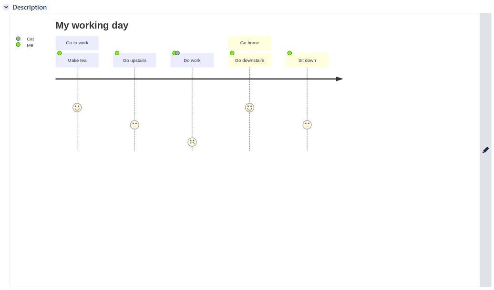

### Gantt chart

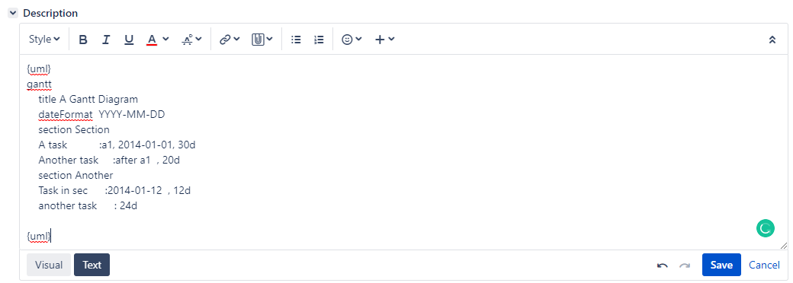

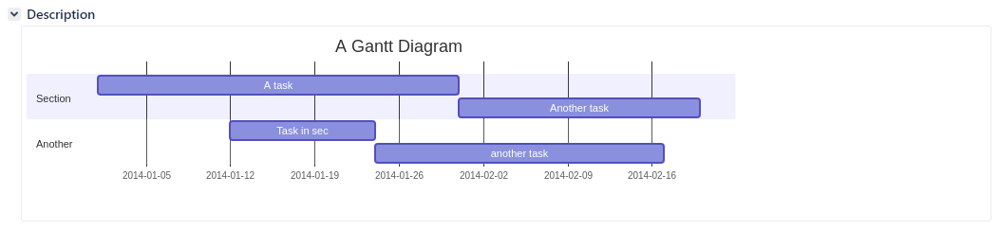

### Pie chart

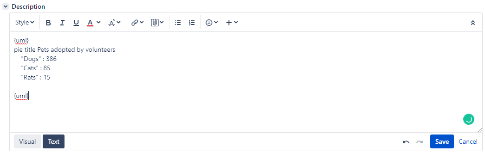

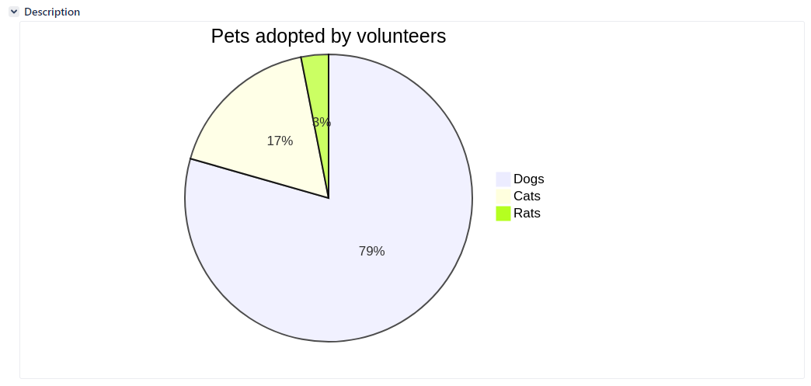

### Graphviz

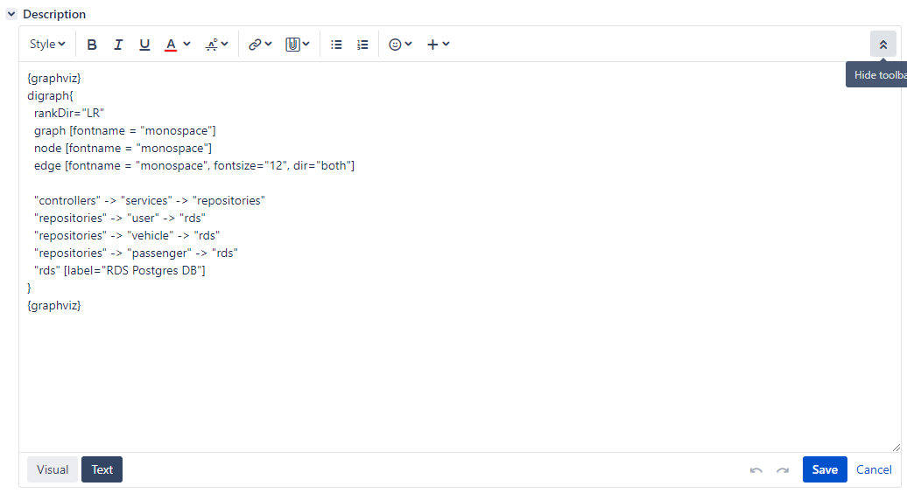

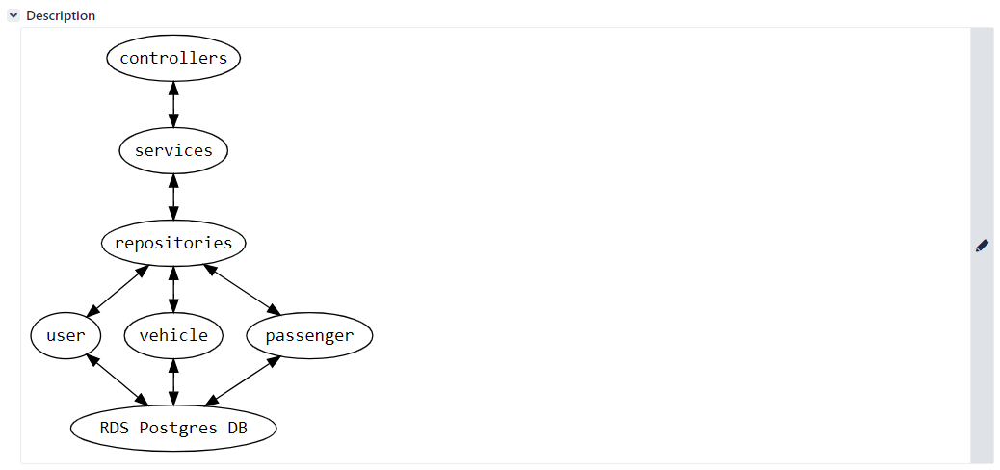
