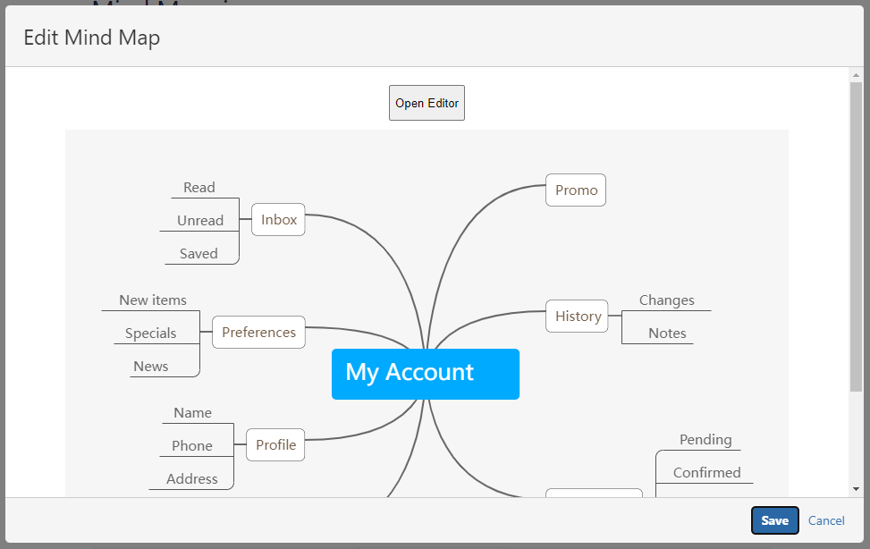
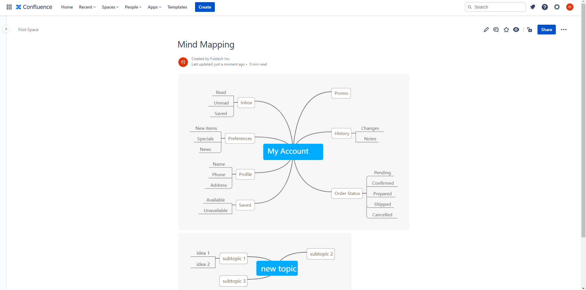

# Usage

Select the **Mind Map** macro from the macro list.

Click **Open Editor**.

The Mind Map Editor now opens and you can start brainstorming! To create a subtopic, use **Tab.** To create a sibling topic, use **Enter**.

Click **Save and Close**, and wait until the drawing shows up in the dialog. If you don't want to save the changes, click the **X** button on the top right corner.

Click **Insert** (for new macro contents) or **Save** (for existing macro content).

