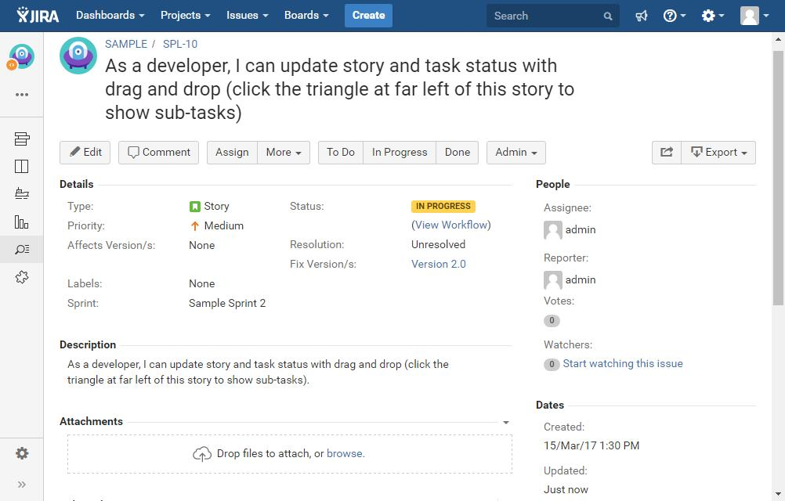

This app improves your experience and productivity by replacing Jira's default font with Google’s Roboto – the most popular font for web and mobile applications.

You can install the app by following the instructions at [Atlassian Marketplace](https://marketplace.atlassian.com/plugins/com.fulstech.jira-productivity-pack).

