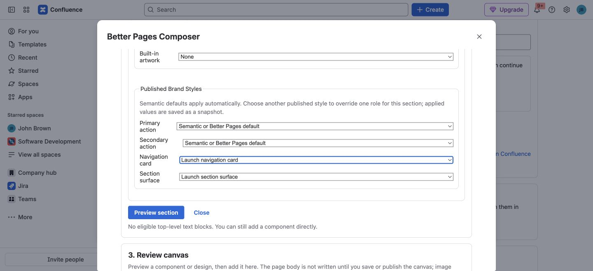
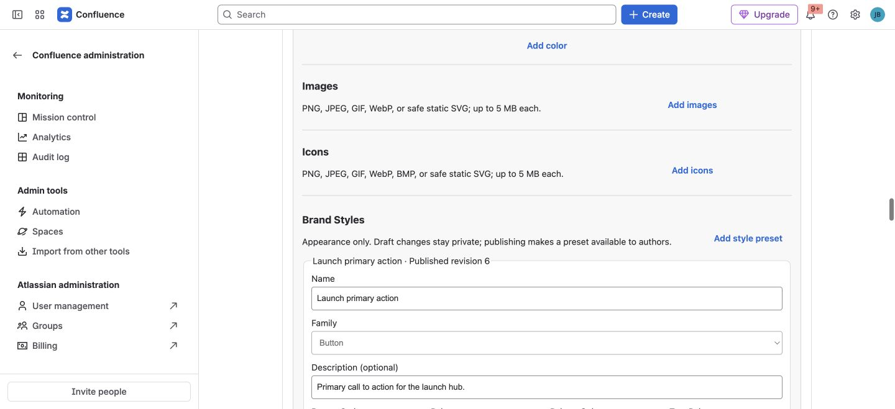

**Brand Kits** give authors approved colors, images, icons, and component
appearances. A **Brand Style** is a named appearance preset within a kit for
a supported component family, such as a primary Button, navigation card, or
section surface. It helps an author choose a visual role instead of repeating
individual color and layout settings.

Administrators manage and publish kits and styles. Authors use published
choices in [Composer](../smart-designer/) or supported individual macro
editors. You can build and publish a page without a custom kit; the kit is an
optional way to standardize appearance.

## For authors: choose a published look

1. In Composer, choose a published **Page brand kit** when one is available.
2. When composing a [Section Pattern](../section-patterns/), check the
   published style offered for each applicable semantic role. Use the
   suggested default or select another published style for that role.
3. Select **Preview section**, check the result, and add it to the canvas.
4. Review the canvas before **Save draft** or **Publish**. Reopen the page
   after writing to confirm the appearance and links.

*In this Better Pages 13.0 licensed-development example, the navigation-card
and section-surface roles use published styles. The primary-action role keeps
its default because the section has no standalone action button.*

Supported individual macro editors also offer a **Published Brand Style**
choice. Applying a kit or style copies its current supported values into the
saved content. A later preset edit, unpublish, or deletion does **not**
automatically change an already saved page. To adopt a revised look, edit the
content and apply the current published choice again.

## For administrators: publish a kit and styles

Open **Confluence administration → Apps → Better Pages administration → Brand
kits**, or use **Design system → Open Brand Kits administration** from Home
when you have access.

1. Create a clearly named kit and add approved colors, images, or icons.
2. Review the asset names and previews, then publish the kit. Set it as the
   default only if that is the intended author choice.
3. Under **Brand Styles**, add a style preset, choose its supported component
   family and appearance, then publish the style and save the kit. Publishing
   the kit alone does not publish each draft style.
4. Verify that the kit and style appear in the author picker and on a test
   page before recommending them to other authors.

*The test kit includes a published “Launch primary action” style. A style
names a reusable purpose and appearance; it is not a live rule attached to
every published page.*

Draft kit and style changes remain unavailable to authors until published.
Unpublishing removes them from future selection, but does not rewrite pages
that previously copied their appearance. Uploads are validated before a kit
can be saved; a batch can contain one to eight assets, each no larger than
5 MB. If an upload is rejected, correct the file rather than bypassing the
validation. See [Administration](../administration/) for broader site
controls.

## Shared colors are separate

Administrators can also create and publish named shared colors. Published
colors appear in supported macro color pickers alongside built-in, recent,
local-space, and custom choices. An author choosing a shared color copies its
current hex value into the content. Use human-readable names such as
`Primary action` and check contrast in the page's intended light and dark
themes.
