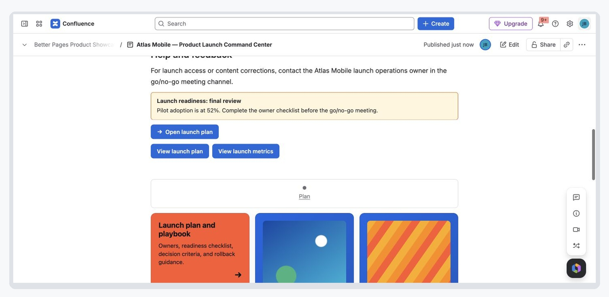

This guide takes you from an empty Confluence page to a small, useful landing
page. You do not need design or development experience.

## Before you begin

You need:

- A Confluence Cloud site with Better Pages installed.
- An active Marketplace evaluation or subscription.
- Permission to create or edit a page.
- A Confluence administrator only if the app still needs to be installed or
  site-wide settings must be changed.

If the app is not installed, a Confluence administrator opens the Better Pages
Marketplace listing, selects **Try it free**, chooses the destination site, and
reviews Atlassian's installation and permission screens. After installation,
Better Pages appears in the Confluence macro browser and under **Apps**.

## Find each Better Pages tool

| Location | What you can do there |
| --- | --- |
| Confluence page editor | Insert and configure the 19 reader-facing macros |
| **Apps → Better Pages** | Browse templates and start page-building journeys |
| Published page byline | Open Smart Designer for a reviewed page-level change |
| **Apps → Better Pages Space Manager** | Inventory pages and preview multi-page operations |
| Confluence administration | Manage Brand Kits, colors, templates, feature controls, external policy, and diagnostics |

## Add a macro

The same workflow applies to every Better Pages component:

1. Open a Confluence page and select **Edit**.
2. Put the cursor where the component should appear.
3. Type `/better pages`, or select **Insert elements** and search for
   `Better Pages`.
4. Choose a macro, such as **Better Pages Alert**.
5. Configure the component and review its preview.
6. Select **Save** in the macro configuration.
7. Publish or update the Confluence page.
8. Test the published interaction as a reader.

If a macro contains rich Confluence content, select its body on the page and
edit that content with the normal Confluence editor.

## Build a starter landing page

Use the following four components to create a compact project or team landing
page.

### 1. Lead with an Alert

Insert **Better Pages Alert** and choose **Message panel** for information that
should remain in the page flow. Add a short title and one actionable sentence.

Example:

> **Release readiness review** 
> Confirm owners and open risks before Friday at 15:00.

See the [Alert guide](../macros/alert/) for page-load alerts, images, colors,
and dismissal behavior.

### 2. Add the main destinations

Insert **Better Pages Advanced Cards**. Create one card for each important
destination, such as the product plan, release checklist, support guide, and
team directory. Use short descriptions so readers can choose without opening
every link.

See the [Advanced Cards guide](../macros/advanced-cards/) for images, layout,
color, reordering, and destinations.

### 3. Organize the details

Insert one **Better Pages Tabs** macro and create three tabs such as
**Overview**, **Readiness**, and **Decisions** in its group editor. After saving
the macro, put the detailed Confluence content inside the matching heading
section in the macro body.

See the [Tabs guide](../macros/tabs/) for styling, default tabs, shareable tab
links, and keyboard behavior.

### 4. End with one clear action

Insert **Better Pages Button**. Link it to the next action readers should take,
for example **Open the release checklist**. Choose a filled style for the
primary action and keep the label specific.

See the [Button guide](../macros/button/) for page search, safe destinations,
icons, colors, sizes, and new-tab behavior.

## Preview, publish, and verify

Before publishing, check that:

- Every title and link is meaningful without surrounding explanation.
- Images have useful alternative text, or are clearly decorative.
- Colors have enough contrast in both light and dark Confluence themes.
- The page has one obvious primary action rather than several competing ones.

After publishing, click every action and test Tabs, Alerts, and Cards with both
pointer and keyboard controls. Also narrow the browser window to confirm the
layout remains readable.

## Supported destinations

Buttons and linked components accept:

- A Confluence page selected with the built-in page search.
- A relative Confluence path beginning with `/`.
- A page anchor beginning with `#`.
- An `https://` web address without embedded credentials.
- A valid `mailto:` email address.

Unsafe or unsupported destinations such as `javascript:`, `file:`, malformed
email links, and protocol-relative URLs are rejected. The component remains on
the page but its navigation action is not enabled until the destination is
fixed.

## Where to go next

Use the [macro catalog](../macros/) to find the best component for your next
page. Continue with [Templates and Better Pages Home](../templates-and-home/)
for complete page starters. Site administrators can configure shared colors,
Brand Kits, feature controls, and other site-wide behavior in
[Better Pages administration](../administration/).
