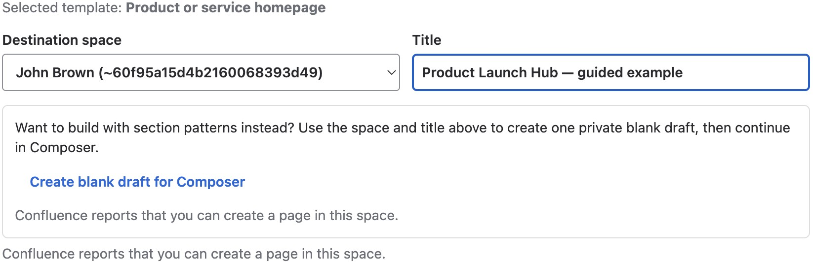
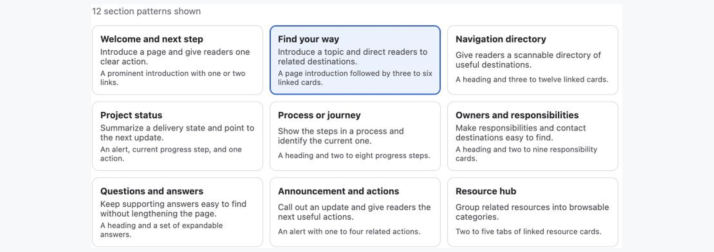

In this Better Pages Release 13 guide, you will make a small **Product Launch Hub**:
a private Confluence draft with a **Find your way** section linking readers to
the plan, launch status, and support. You will save and reopen the draft before
deciding whether to publish it. Nothing in the preview or staged canvas
publishes the page automatically.

## Before you begin

You need a Confluence Cloud site with Better Pages installed, an active
Marketplace evaluation or subscription, and permission to create and edit a
page in your chosen space. You do not need administrator access to use a
published Brand Kit or Brand Style. If the app has not been installed, ask a
Confluence administrator to install it from the Marketplace and review the
Atlassian permission screens.

The screenshots below show synthetic content on a licensed Better Pages Release 13
development installation. Your site's spaces, user names, and branding will
differ.

Select a screenshot to open its full-size image, especially on a small screen.

## 1. Start a private page from Home

1. In Confluence, open **Apps → Better Pages home**. In **Build**, select
   **Start with section patterns**. You can choose **Browse templates** instead
   if you want an existing structure.
2. Choose a destination space where you can create pages and enter a unique
   title, such as `Product Launch Hub`.
3. Select **Create blank draft for Composer**. Home creates one private draft;
   it does not publish it.
4. Select **Continue designing** to open that same draft in Composer.

*The **Build** choices on Better Pages Home.*

*Choose the right space and title before creating a draft. The screenshot also
shows the optional template path.*

## 2. Compose and review a section

1. In **Better Pages Composer**, choose **Compose a section**.
2. Select the **Find your way** Section Pattern. Replace its sample heading,
   introduction, and destinations with your own facts and real links. For a
   launch hub, use cards such as **Plan**, **Launch**, and **Support**.
3. If your administrator has published a suitable Brand Kit or Brand Style,
   select it for the supported role. This is optional; the section works
   without a custom style.
4. Select **Preview section**. Check the words, links, and appearance, then
   select **Add to canvas**.
5. In **Review canvas**, use **Edit section**, **Duplicate**, **Remove**, or
   the move controls if you need to change the staged result. Select **Apply
   to this page** as the output.

*Composer also supports formatting existing content, adding one component,
and editing supported native blocks. AI is disabled on this example site;
the non-AI workflow remains available.*

*Choose a pattern by the question your readers need answered. See the
[Section Patterns guide](../section-patterns/) for all 12.*

*Staging is a review step. The page has not changed until you choose **Save
draft** or **Publish**.*

## 3. Save, reopen, and publish when ready

1. Select **Save draft**. Wait for the saved-draft confirmation before leaving
   Composer.
2. Close Composer and open the private draft in Confluence. Close the editor,
   then reopen the draft to confirm the heading and cards are still there.
3. Replace any remaining example wording or links. Check the result in the
   normal Confluence editor. When it is ready for readers, **Publish** the
   draft and test its destinations in reader view.

*A save confirmation means the staged content was written to the private
draft, not published.*

*The same draft was closed and reopened after saving. Its heading and three
cards remain editable; Background and Advanced Cards labels identify the
generated macros in the editor.*

*After an explicit **Publish** in Confluence, the same example appears in
reader view. Its **Plan** card was checked and opens the synthetic team home.
Replace all example destinations with pages your audience can access.*

If you choose a template instead, **Preview template** creates nothing;
**Use template** creates a private single-page draft. Its **Continue
designing** action leads into Composer, while **Edit in Confluence** lets you
finish in the normal editor. Blog templates continue in the editor. A
**Delivery journey** is different: confirming it creates published linked
pages, so review the destination and hierarchy first. See
[Templates and Better Pages Home](../templates-and-home/) for these paths.

## After your first page

The generated section remains editable in Confluence. Edit its normal text
blocks and reopen supported Better Pages macro configuration when you need to
maintain cards or visual settings. See [Composer](../smart-designer/) for the
staged-writing lifecycle and [Brand Kits and Brand Styles](../brand-kits-and-colors/)
for shared appearance choices.

If you only need one element on an existing page, use the normal Confluence
editor: choose **Edit**, type `/better pages` or search **Insert elements**,
select a component, configure it, save its configuration, then publish or
update the page. The [Macro Catalog](../macros/) keeps the guides for all 19
components.

To adapt this first-page flow to a specific outcome, see the
[Page Recipes](../guides/), especially the
[Product launch page](../guides/product-launch-page/) recipe.
