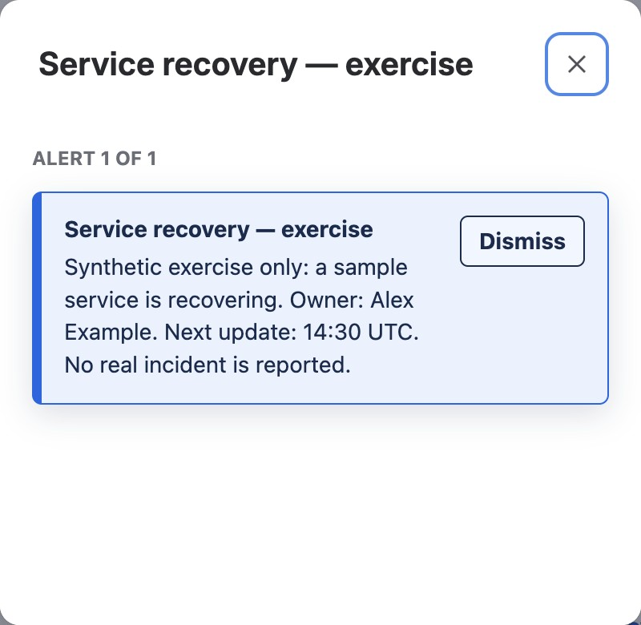

**Outcome:** Responders and stakeholders can find the current impact, owner,
next update, and recovery playbook from one page.

*A finished **Project status** section with an additional native-text summary,
on the development site. It is a synthetic exercise, not a real incident or
the complete Incident management template. Essential status remains visible
after closing the optional alert dialog.*

*The example's Alert is configured to appear in a reader dialog. Do not rely
on a dismissible dialog alone for information every responder must see.*

Start with the shipped **Incident management** template. Its sections include
impact and status, timeline, response roles, communications, and follow-up.
**Project status** or **Announcement and actions** [Section Patterns](../../section-patterns/)
can make a current update prominent; **Owners and responsibilities** can link
to response contacts. Better Pages is a page-authoring tool here, not an
incident-alerting or automatic status-sync system.

1. Create a private draft from **Incident management** in **Better Pages
   home**. Choose a space appropriate for the incident audience.
2. Fill in the verified impact, time of the update, incident owner, and where
   the authoritative live response happens. Do not publish speculative status.
3. In [Composer](../../smart-designer/), preview a status or action section
   with links to the runbook and communications channel. Review before writing.
4. Save and reopen the draft. Publish once the audience and information are
   correct; assign someone to keep the status and links current.

**Finished-page check:** Put impact and next update in text, not color alone.
Test the playbook and contact links with keyboard and on a narrow screen. For
multiple-page housekeeping, see [Space Manager](../../space-manager/), which
previews permission-checked operations rather than automating response.
