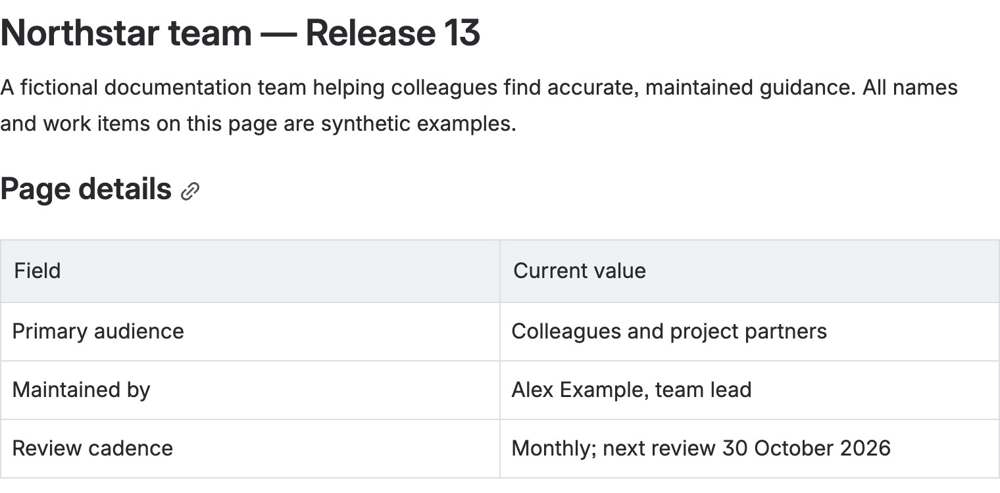
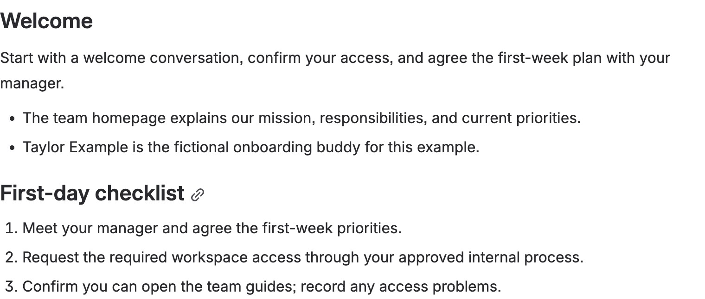
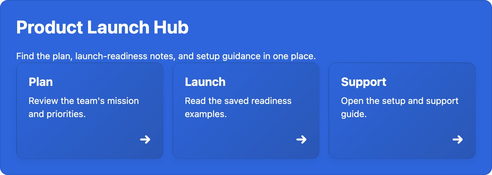
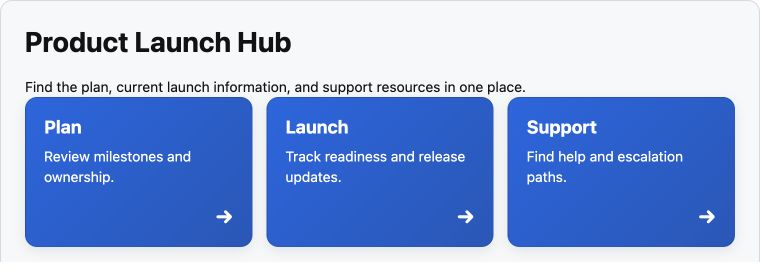
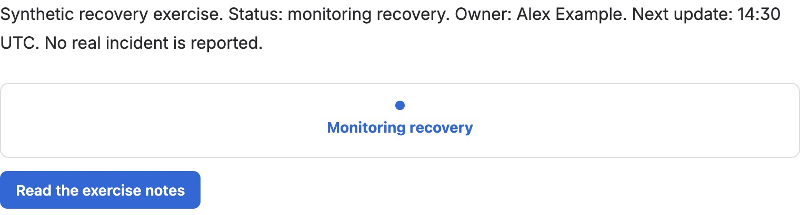
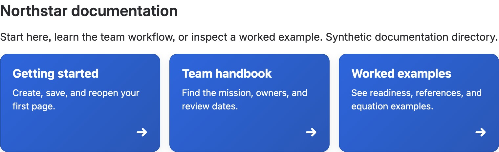
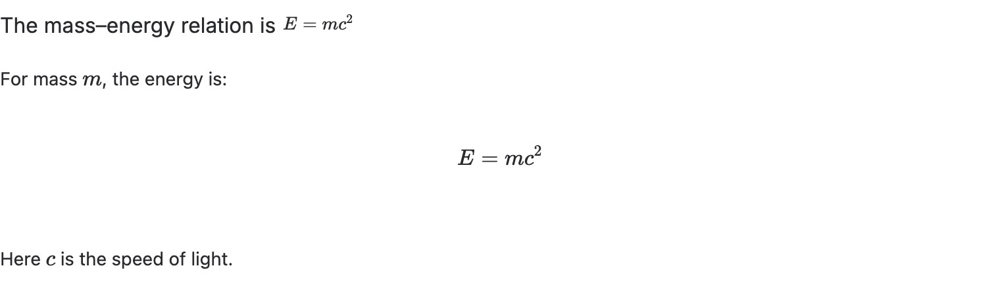

These recipes combine shipped Better Pages templates, Section Patterns, and
macros into useful Confluence Cloud pages. You need an active Better Pages
evaluation or subscription and permission to create a page in the destination
space. Start with a private draft unless a recipe explicitly says otherwise.

| You want to build… | Start with… |
| --- | --- |
| A clear entry point for a team | [Team homepage](./team-homepage/) |
| A first-days path for a new colleague | [Employee onboarding hub](./employee-onboarding-hub/) |
| A maintained product or project entry point | [Product or project homepage](./product-or-project-homepage/) |
| One place for launch readiness and next actions | [Product launch page](./product-launch-page/) |
| An incident status and response hub | [Incident or operations hub](./incident-operations-hub/) |
| A browsable collection of documentation | [Documentation landing page](./documentation-landing-page/) |
| Research findings or technical guidance | [Research or technical page](./research-technical-page/) |

## Preview the outcomes

These actual development-site screenshots use synthetic content. Some show a
completed template's first section; others show a completed section you can
add to a larger page. Each recipe explains exactly what its example depicts.

Select a preview to open the full-size image.

### Team homepage

Purpose, audience, and a maintenance owner. [Build a team homepage](./team-homepage/).

### Employee onboarding hub

A welcome and first-day actions. [Build an onboarding hub](./employee-onboarding-hub/).

### Product or project homepage

Three clear destinations. [Build a product or project homepage](./product-or-project-homepage/).

### Product launch page

Readiness and next actions. [Build a launch page](./product-launch-page/).

### Incident or operations hub

Written status and a next update. [Build an operations hub](./incident-operations-hub/).

### Documentation landing page

Start-here and guide paths. [Build a documentation landing page](./documentation-landing-page/).

### Research or technical page

Equations in context. [Build a research or technical page](./research-technical-page/).

Every recipe is a starting structure, not a page generated in one click. Replace
sample prompts, links, owners, and status with current information. Preview in
[Composer](../smart-designer/), save a draft, then inspect the page in
Confluence before publishing. The [Getting Started guide](../getting-started/)
walks through that save-and-reopen flow.
