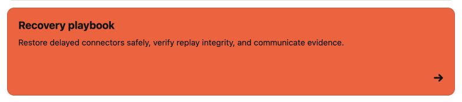

Use **Better Pages Advanced Cards** to help readers choose among several related
destinations. Each card combines a title, short description, color, optional
image, and optional link in one accessible action.

## When Advanced Cards are a good fit

Advanced Cards work well for:

- A space home with links to key areas.
- A product or service catalog.
- Team roles, owners, and contact destinations.
- Playbooks, learning paths, or support choices.
- A small set of visually distinct next steps.

Use a simple link list when descriptions and visual grouping do not help the
reader make a choice.

## Create a card group

1. Edit a page and insert **Better Pages Advanced Cards**.
2. In **Card grid**, select a card or choose **Add card**.
3. In **Card details**, enter the title and description.
4. Choose a background and text color.
5. Add an optional image and destination.
6. Return to **Card grid** to add, copy, delete, or reorder cards.
7. Choose the number of columns and image placement, then save and publish.

The editor preview is interactive. Select a preview card to edit it, drag cards
to reorder them with a pointer, or use **Move up** and **Move down** for touch
and keyboard workflows.

## Group settings

| Setting | What it changes |
| --- | --- |
| Section label | An accessible name for the card collection |
| Columns | One to five cards per row when space allows |
| Text alignment | Left, center, or right alignment across the group |
| Image placement | No image, above, left, right, or behind the content |

The published grid adapts to the available width. A configured five-column
layout uses fewer columns when the page or device is narrow.

## Card settings

| Setting | What it changes |
| --- | --- |
| Title and description | The card's visible purpose and supporting context |
| Background and text color | Built-in, Brand Kit, shared palette, recent, or custom colors |
| Image source | Built-in artwork, Brand Kit image, upload, page attachment, or licensed stock image |
| Alternative text | Describes a meaningful image for assistive technology |
| Crop and reposition | Changes zoom and focal point without editing the source image |
| Image fit and height | Controls how the image fills its available area |
| Destination | A Confluence page or supported URL |
| Open in a new tab | Keeps the current page open when readers follow the card |

Uploaded images support PNG, JPEG, GIF, ICO, BMP, and WebP files up to 15 MB.
The stock image search uses Wikimedia Commons and keeps the selected image's
creator, source, and license information.

## Reader interaction

When a destination is configured, the complete published card is one accessible
action. Readers can activate it with a pointer or keyboard. A card without a
destination remains a static information card.

If a destination is unsafe or malformed, the card remains visible but does not
navigate until an author fixes the link.

## Example card set

For a product launch home, create four cards:

| Card | Description | Destination |
| --- | --- | --- |
| Product plan | Outcome, scope, and success measures | Product plan page |
| Release readiness | Milestones, owners, and open risks | Readiness page |
| Enablement | Training and communication resources | Enablement page |
| Support | Known issues and escalation path | Support page |

## Good practice

- Keep titles short and start descriptions with the value readers will find.
- Use a consistent image placement and crop across one group.
- Describe informative images; use decorative artwork only when it adds useful
  visual grouping.
- Avoid making every section a card. Reserve cards for real choices or clearly
  grouped information.
- Test every destination after publishing.

In PDF and Word export, card titles, descriptions, and valid destinations remain
available as readable static content.
