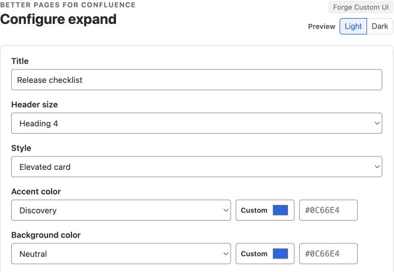
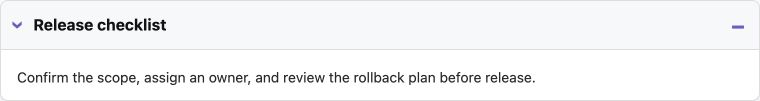

Use **Better Pages Advanced Expand** for optional detail that readers can reveal
without leaving the page. Its body supports rich Confluence content.

## Add an Advanced Expand

1. Insert **Better Pages Advanced Expand**.
2. Enter a descriptive title and choose its heading level.
3. Choose Filled, Card, or Underline styling and set the accent colors.
4. Select a built-in, custom, or Brand Kit icon.
5. Decide whether the section starts open.
6. Save, add content to the macro body, and publish.

*Choose the title, heading size, and appearance before adding the supporting
content in the Confluence editor.*

## Reader interaction

Readers activate the heading with a pointer, Enter, or Space. The expanded
state is announced to assistive technology. The content opens in place, so the
reader keeps their position on the page.

*The same saved section before and after activation. Opening it reveals the
authored content in place.*

## Example

On an onboarding page, use the title `VPN setup for remote access` and place the
detailed steps and troubleshooting notes inside. Leave it closed by default if
only remote employees need it.

## Good practice

- Write a title that tells readers exactly what will open.
- Keep critical warnings and mandatory steps outside a closed section.
- Match the heading level to the page outline.
- Do not nest several disclosure layers; use a child page for large topics.
