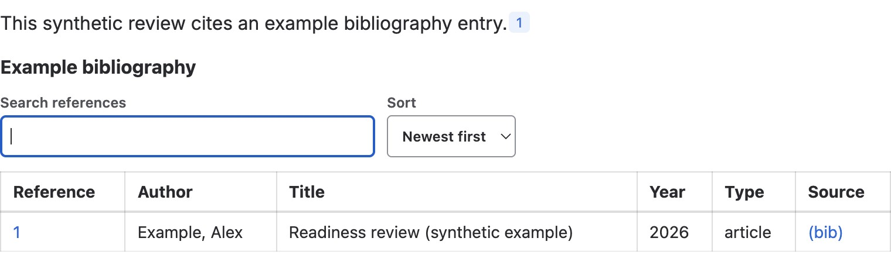

Use **Better Pages BibTeX Reference** for an academic or technical citation
stored as one complete BibTeX entry.

## Add a reference

1. Insert **Better Pages BibTeX Reference** after the statement it supports.
2. Paste one complete supported BibTeX entry.
3. Choose a numbered marker or an author marker.
4. If needed, customize the displayed author marker.
5. Resolve validation messages, save, and add a
   [BibTeX Summary](../bibtex-summary/).

The entry must include an author and the fields required by its reference type.
The preview shows the reader marker before you save.

This synthetic citation appears as marker **1** and as a row in the following
bibliography. It demonstrates the relationship between the two macros, not a
reference to a real publication.

## Good practice

- Keep one reference per macro.
- Preserve stable identifiers such as DOI or ISBN when available.
- Use one marker style consistently on a page.
- Recheck markers and the summary after reordering references.
