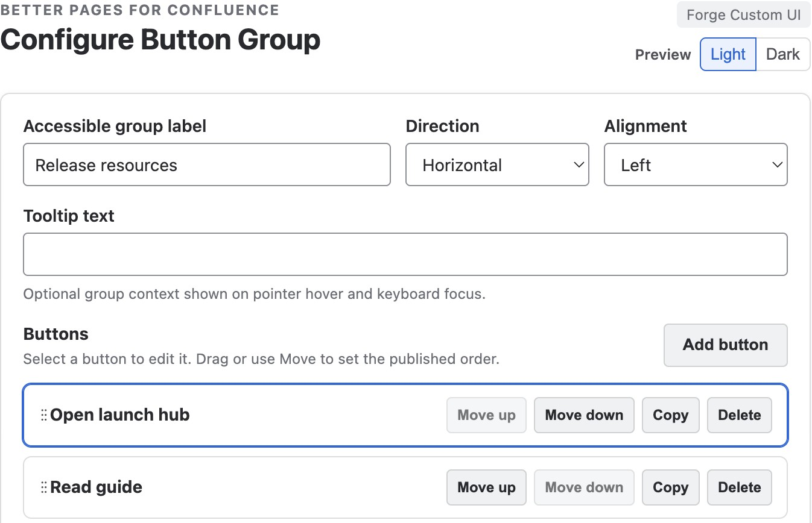
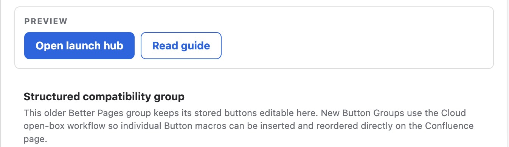

Use **Better Pages Button Group** when several related actions belong together,
such as download choices or previous and next steps.

## Build a group

1. Insert **Better Pages Button Group**.
2. Add an accessible group label.
3. Choose horizontal or vertical direction and an alignment.
4. Save the group.
5. Insert individual [Better Pages Buttons](../button/) in its rich body.
6. Move the Button macro blocks into the reader order, then publish.

Each button keeps its own text, destination, icon, style, and new-tab setting.
The order of the Button macros in the body is the published order.

## Edit a stored-button group

Groups generated by Composer can use the stored-button compatibility editor.
Open the group's configuration to edit its buttons and use **Move up** or
**Move down** to change their order. This differs from inserting individual
Button macros in the rich body of a new open-box group.

*This Composer-generated group stores its buttons in the group configuration.
The notice identifies the workflow; do not use these controls as instructions
for reordering individual Button macros in a new open-box group.*

*The saved example keeps the filled primary action first and the bordered
alternative second.*

## Example

For a report, group `View dashboard`, `Download source data`, and `Contact the
owner`. Use one filled primary action and quieter styles for the alternatives.

## Good practice

- Group actions only when they serve the same decision.
- Use a vertical layout when labels are long or the page is narrow.
- Keep every label unique and action-oriented.
- Test each destination after publishing, including keyboard activation.
