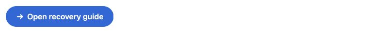

Use **Better Pages Button** for a clear next action: open a checklist, visit a
dashboard, contact an owner, or jump to another section of the page.

## When a Button is a good fit

A Button is most useful when one action deserves more emphasis than an inline
link. If several actions belong together, use Button Group. If the description
of each destination helps readers choose, use [Advanced Cards](../advanced-cards/).

## Add a Button

1. Edit a page and insert **Better Pages Button**.
2. Choose a quick start, or configure the appearance manually.
3. Enter concise **Button text**.
4. Select a Confluence page or enter a supported destination.
5. Review the live preview, save the macro, and publish the page.
6. Activate the published button and confirm it opens the intended destination.

## Destination options

Choose **Confluence page** to search for a page without copying its URL. Search
runs with your Confluence permissions and can be limited to the current space.

Choose **Web address, relative path, anchor, or email** for:

- An `https://` address.
- An existing relative Confluence path beginning with `/`.
- An anchor on the current page beginning with `#`.
- A valid `mailto:` email address.

Better Pages rejects active-content and local-file schemes. An invalid
destination cannot become an active button.

## Appearance settings

| Setting | Options |
| --- | --- |
| Quick start | Primary, secondary, confirm, attention, explore, compact, icon-only, or wide action |
| Style | Filled, bordered, subtle, or link |
| Color | Built-in, Brand Kit, shared palette, recent, or custom color |
| Alignment | Left, center, or right |
| Shape | Square, rounded, or pill |
| Size | Small, medium, or large |
| Width | Content width or full width |
| Icon | Built-in icon, Brand Kit icon, or up to four Unicode characters |
| Icon position | Before text, after text, or icon only |
| Open in a new tab | Opens the destination without replacing the current page |

Quick starts are editable starting points. Selecting one never locks the
remaining controls.

## Reader interaction

The published Button is a standard keyboard-accessible action. If **Open in a
new tab** is selected, the button communicates that behavior to the reader.
Icon-only buttons receive an accessible name from the configured icon; use a
familiar icon and avoid an ambiguous action.

## Example

For a release page:

- Text: `Open the release checklist`
- Destination type: **Confluence page**
- Style: **Filled**
- Shape: **Rounded**
- Icon: **Arrow**, after text
- Open in a new tab: Off

## Good practice

- Write labels as actions: **View the roadmap**, **Report an issue**, or
  **Contact the owner**.
- Keep one primary button in a section. Use a quieter style for secondary
  actions.
- Do not repeat the destination URL as the label.
- Use icon-only buttons only when the meaning is familiar and the surrounding
  context is clear.
- Test anchors, email links, and restricted Confluence pages as the intended
  audience.
