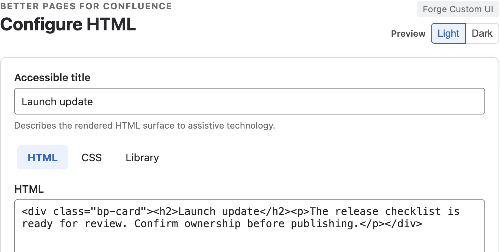
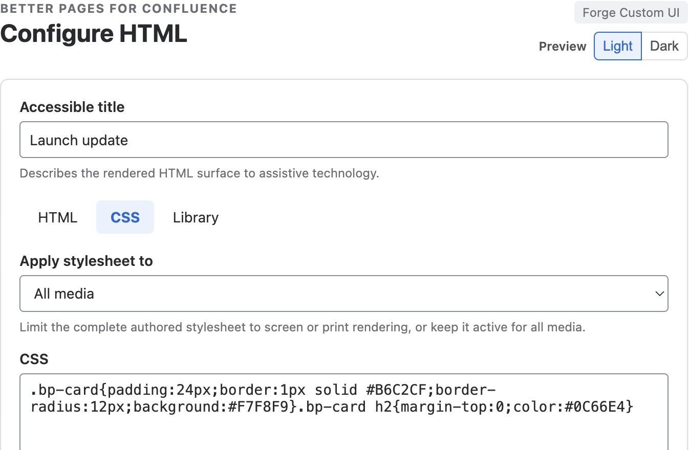
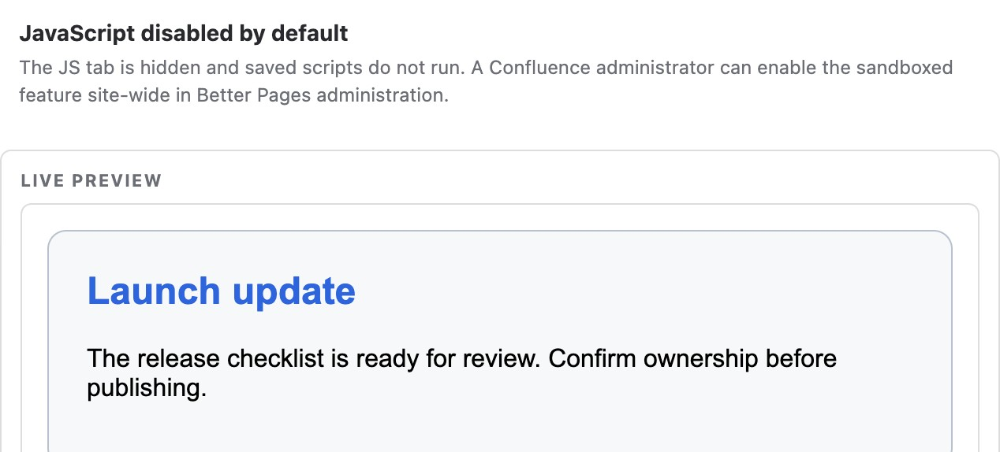
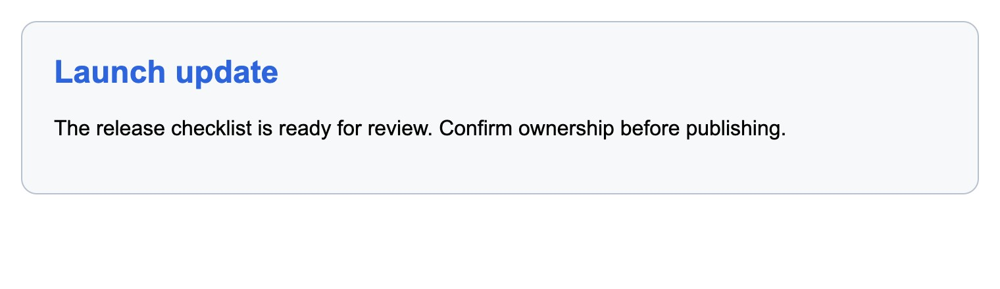

Use **Better Pages HTML** for a self-contained visual or local interaction that
cannot be expressed with native Confluence content or another Better Pages
macro. It is not a way to change the surrounding Confluence page.

## Create an HTML surface

1. Insert **Better Pages HTML** and enter an accessible title.
2. Add HTML and CSS, or start from the built-in template and snippet library.
3. Optionally import one combined HTML file or separate HTML, CSS, and JavaScript
   files. Each file can be up to 256 KB.
4. Choose whether the whole stylesheet applies to all, screen, or print media.
5. Resolve validation issues, review the live isolated preview, and publish.

HTML is sanitised before save. CSS is scoped to the isolated frame; imports,
remote URLs, and unsafe properties are blocked.

*Use the HTML and CSS tabs for the content and its local appearance. This
example styles a readiness card without requiring JavaScript.*

## JavaScript policy

JavaScript is disabled by default. When an administrator enables it, authored
code runs in an opaque-origin nested sandbox. Network requests, form submission,
downloads, pop-ups, and host navigation are blocked. If the administrator turns
JavaScript off later, saved HTML and CSS keep rendering but JavaScript does not
run.

*The editor preview renders the HTML/CSS card while retaining the
JavaScript-disabled notice. This is an authoring preview, not evidence that
scripts are enabled or that the macro can change the host page.*

*The same saved HTML and CSS render on the published Release 13 example page.
No JavaScript is required or enabled for this card.*

## Good practice

- Prefer native Confluence or a purpose-built macro when it meets the need.
- Give the surface an accessible title and responsive layout.
- Do not paste third-party code you have not reviewed.
- Test screen, narrow, print, and JavaScript-disabled behavior before publishing.
