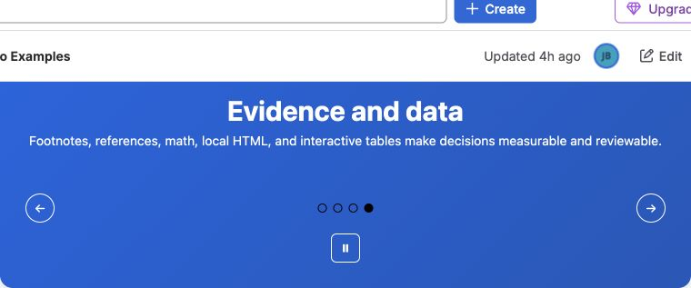

Use **Better Pages Interactive Banner** for a small set of prominent messages,
campaigns, or featured destinations. A banner can contain up to 25 slides.

## Build a banner

1. Insert **Better Pages Interactive Banner** and enter an accessible label.
2. Add, copy, remove, and reorder slides in the slide editor.
3. For each slide, choose whether to show its title, body, and button.
4. Add built-in artwork, a Brand Kit image, a verified upload, a page
   attachment, or licensed stock artwork.
5. Configure fit, position, overlay, and opacity.
6. Set the button destination and optional new-tab behavior.
7. Optionally enable auto-scroll from 3 to 30 seconds, then publish.

## Reader interaction

Readers can use previous, next, and direct slide controls. Keyboard users can
move among slide selectors with Arrow keys, Home, and End. Auto-scroll can be
paused and does not remove manual navigation.

If an administrator enables **AI in macros**, an author may use AI Quick Start
for a slide. The submitted goal and prompt go to an Atlassian-hosted Forge LLM.
The Linked content goal can also send a bounded excerpt from an accessible
Confluence page; external web pages are not fetched.

## Good practice

- Prefer one strong slide; add more only when each has equal audience value.
- Keep titles and calls to action visible over every image crop.
- Do not rely on auto-scroll for required information.
- Verify controls, links, attribution, pause behavior, and narrow layout.
