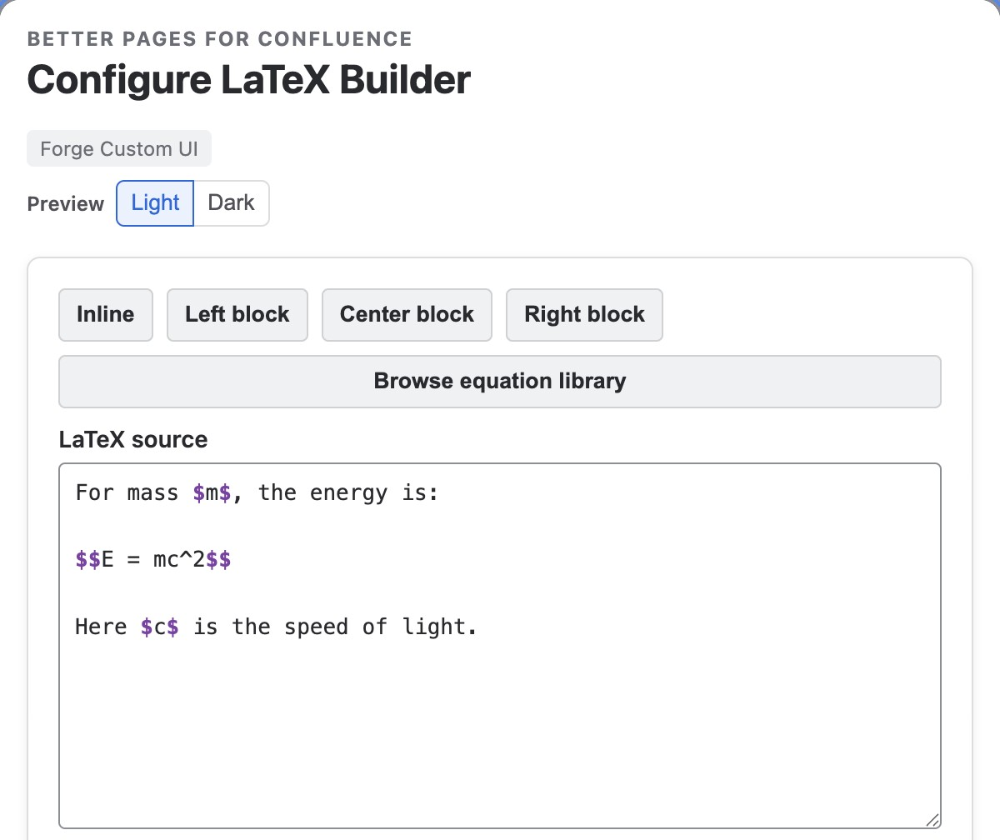
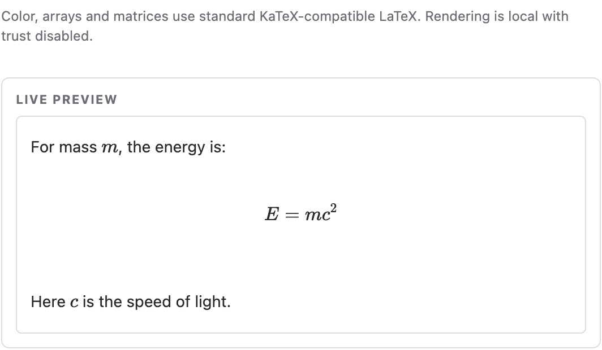

Use **Better Pages LaTeX Builder** for technical content that contains one or
more equations. Rendering uses KaTeX inside the app; readers do not need a
browser extension.

## Create equations

1. Insert **Better Pages LaTeX Builder**.
2. Write inline expressions with `$...$` and display expressions with
   `$$...$$`.
3. If needed, use the searchable equation library to insert a starting formula.
4. Choose inline, left, center, or right display alignment.
5. Resolve validation messages, review the live preview, and publish.

Command suggestions appear while typing. Use Arrow keys to move through them,
Enter to insert, and Escape to close the suggestions.

The source mixes prose, inline variables, and the centered `$$E = mc^2$$`
expression. Use the formatting controls or **Browse equation library** to build
on your source.

Review the rendered content before saving; this is the editor's live preview.

## Example

Use `$$E = mc^2$$` for a centered display equation. Include definitions and units
in the source or surrounding Confluence text so the equation has enough context.

The published Builder result below the inline example retains the explanatory
text and renders the display equation in the center.

## Good practice

- Explain variables in prose and include units where they matter.
- Use [LaTeX Inline](../latex-inline/) for one compact expression in a sentence.
- Treat validation as a publishing check, not only an editor hint.
- Verify the accessible reading order on the published page.
