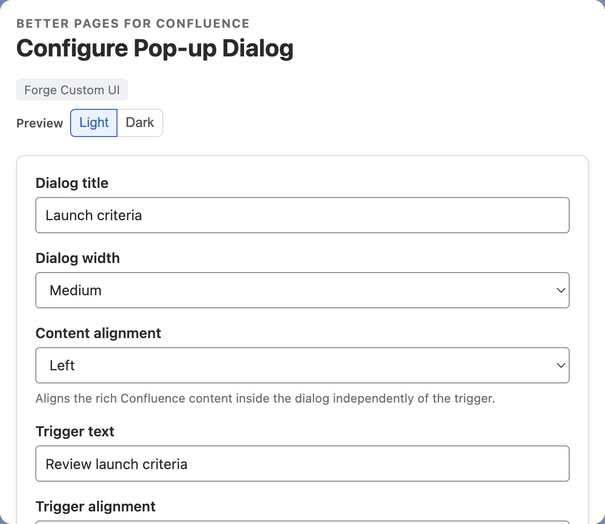
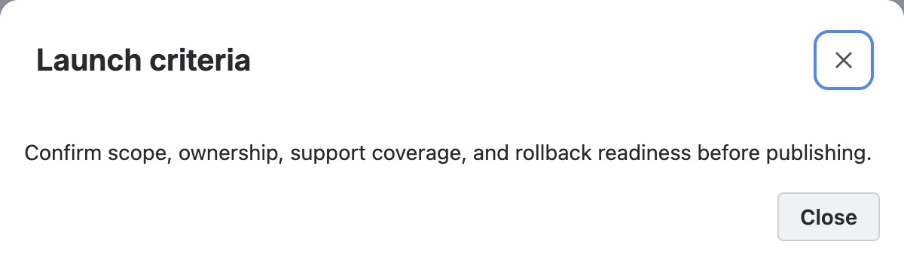

Use **Better Pages Pop-up Dialog** for supporting content that should stay out of
the initial reading flow but needs more space than a tooltip.

## Add a dialog

1. Insert **Better Pages Pop-up Dialog**.
2. Enter the dialog title and trigger text.
3. Choose small, medium, large, or extra-large width.
4. Set trigger and content alignment.
5. Optionally add up to 12 labelled destination choices.
6. Save, add rich content to the macro body, and publish.

*The trigger tells readers what will open; the title names the resulting
dialog. Add the supporting content in the macro body, not in the trigger.*

## Reader interaction

The trigger opens a modal hosted by Confluence. Readers can close it with the
Close action, Escape, or the overlay. Focus is contained while the dialog is
open and returns to the trigger afterward.

Each optional choice accepts a Confluence page or supported safe destination
and may open in a new tab.

*Activating **Review launch criteria** opens the saved rich body in a
Confluence-hosted dialog. This example does not configure destination choices.*

## Example

Use `Review launch criteria` as the trigger. Put the checklist in the body and
add choices for `Open readiness page` and `Contact release owner`.

## Good practice

- Use a dialog for a focused task, not a replacement for a long child page.
- Make the trigger and title describe the content clearly.
- Keep the primary reading path available without opening the dialog.
- Test touch, keyboard, Escape, overlay close, and focus return after publishing.
