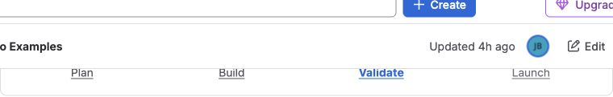

Use **Better Pages Progress Bar** to show where a reader is in a journey. Each
macro represents one step; Better Pages combines the steps on the published
page into one ordered progress experience.

## Build a progress journey

1. Insert one **Better Pages Progress Bar** macro for each step.
2. Enter a step title and optionally an explicit step number.
3. Mark the step that represents the current page or stage.
4. Select a Confluence page or enter a safe destination.
5. Place the step macros in order and publish the page.

The first macro renders the complete progress bar. Step numbers can make an
order explicit; otherwise the page order is used.

## Reader interaction

Completed, current, and upcoming steps are visually distinct and have readable
state labels. A step with a valid destination is a keyboard-accessible link.

## Example

Create four steps: `Plan`, `Build`, `Validate`, and `Launch`. Mark `Validate` as
current and link each step to its page in the delivery space.

## Good practice

- Use progress for a real sequence, not a decorative list.
- Keep titles short and use one current step.
- Check the order and every destination after publishing.
- On a long journey, consider child pages or a shorter phase-level progress bar.
