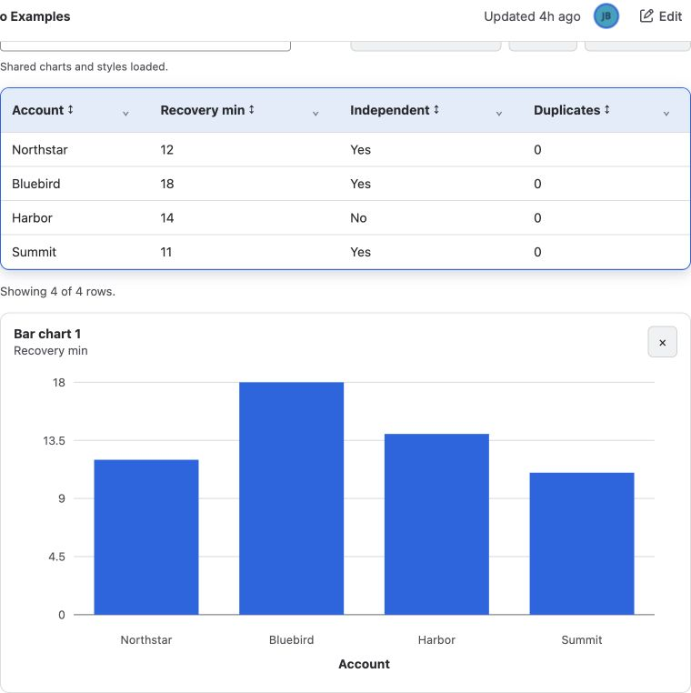

Use **Better Pages Table** when readers need to explore structured data rather
than only read a small static table. The source remains a rich Confluence table
inside the macro body.

## Build an interactive table

1. Insert **Better Pages Table** and add an accessible title.
2. Create or paste a Confluence table directly in the macro body.
3. Configure search, sorting, compact per-column filters, and column visibility.
4. Add optional charts and select the X axis and numeric series.
5. Choose palette, border, shadow, and corner styling.
6. Save, publish, and exercise every enabled reader control.

## Charts

You can add, remove, and reorder several charts. Available views include common
bar, line, area, pie, doughnut, and radar presentations. Pie, Doughnut, and Radar
use the first column as their category labels. Choose a chart only when it makes
a pattern easier to understand than the table alone.

## Reader interaction

Readers can search, filter several columns, change sort order, and show or hide
columns. The table and charts keep independent horizontal scrolling on narrow
screens, and charts include accessible text.

## Good practice

- Use a real header row and short, unique column names.
- Keep numbers as numbers and use consistent units.
- Do not use color as the only signal in a chart.
- Verify empty results, combined filters, hidden columns, charts, and mobile width.
