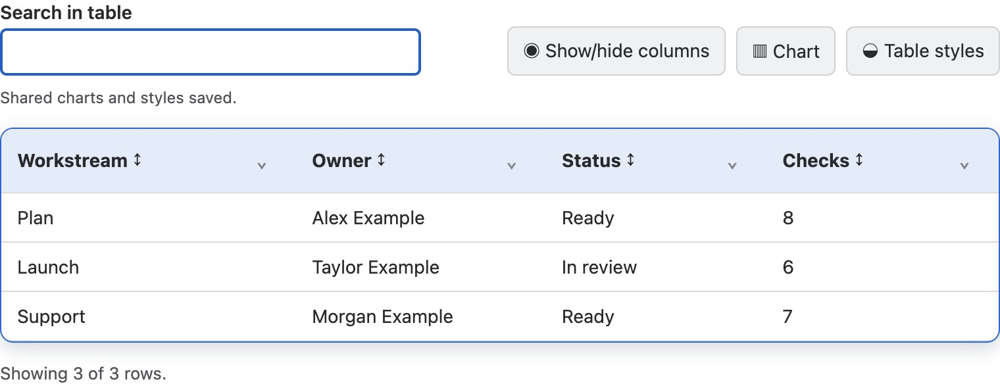
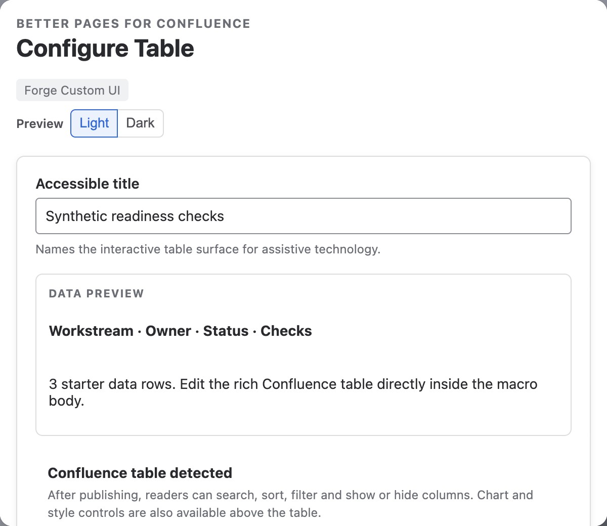
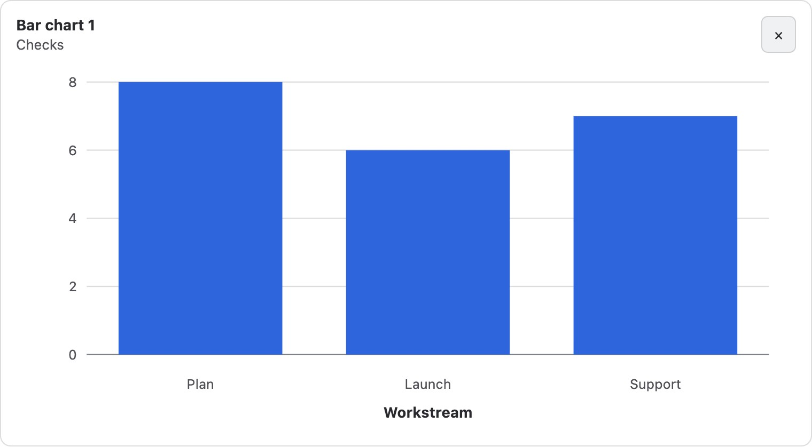

Use **Better Pages Table** when readers need to explore structured data rather
than only read a small static table. The source remains a rich Confluence table
inside the macro body.

Release 13 example: the table contains fictional owners and readiness checks.
Searching for `Launch` returns one of the three rows; clearing the search
restores all three.

## Build an interactive table

1. Insert **Better Pages Table** and add an accessible title.
2. Create or paste a Confluence table directly in the macro body.
3. Review the detected table and save the macro, then publish the page.
4. Use the published search, sortable headers, per-column filters, and
   **Show/hide columns** controls to explore the data.
5. Open **Chart**, select a chart type, X-axis column, and numeric columns,
   then select **Add chart**.
6. Open **Table styles** to adjust the shared appearance. Verify the saved
   table and charts as the intended reader.

The macro configuration contains the source table; chart and shared styling
controls are available in the published reader.

## Charts

You can add, remove, and reorder several charts. Available views include common
bar, line, area, pie, doughnut, and radar presentations. Pie, Doughnut, and Radar
use the first column as their category labels. Choose a chart only when it makes
a pattern easier to understand than the table alone.

The synthetic example uses **Bar**, **Workstream** for the X-axis, and **Checks**
as its numeric series. Reopening the published page retained the shared chart.

## Reader interaction

Readers can search, filter several columns, change sort order, and show or hide
columns. The table and charts keep independent horizontal scrolling on narrow
screens, and charts include accessible text.

## Good practice

- Use a real header row and short, unique column names.
- Keep numbers as numbers and use consistent units.
- Do not use color as the only signal in a chart.
- Verify empty results, combined filters, hidden columns, charts, and mobile width.
