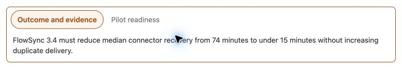

Use **Better Pages Tabs** when a page contains several substantial, related
sections and readers usually need one section at a time. Each tab keeps a rich
Confluence body, so it can contain headings, lists, tables, media, and supported
macros.

## When Tabs are a good fit

Tabs work well for:

- Overview, setup, usage, and troubleshooting sections in product docs.
- Different audiences, regions, or environments that share one page.
- A plan with separate outcome, readiness, and decision sections.
- A compact comparison where every section has meaningful content.

Use normal headings instead when readers need to scan or compare every section
at once.

## Add a tab group

Each new Tabs macro represents one tab and owns that tab's rich content.

1. Edit a page and insert **Better Pages Tabs**.
2. Enter the **Tab name** and choose its icon and content alignment.
3. Configure the shared appearance, then select **Save**.
4. Edit the macro body directly on the Confluence page.
5. Insert another **Better Pages Tabs** macro immediately before or after the
   first one.
6. Repeat for every tab, then publish the page.

Adjacent Tabs macros form one group. Moving a tab away from the group starts a
new group. Reorder tabs by moving their complete macro blocks in the Confluence
editor.

## Configuration

| Setting | What it changes |
| --- | --- |
| Tab name | The visible label in the tab list |
| Icon | A built-in or published Brand Kit icon shown with the label |
| Content alignment | Left, center, or right alignment for this tab's body |
| Open this tab by default | Selects the panel readers see first |
| Hover text | Optional short context for pointer users |
| Header style | Basic, filled, or rounded tab headings |
| Accent color | A built-in, Brand Kit, shared palette, recent, or custom color |
| Direction | Horizontal tabs or a vertical tab list |
| Content border | Adds an accent border around the active panel |
| Sticky headings | Keeps the tab controls available while reading long content |
| Share links | Lets readers copy a URL that opens an individual tab |

The latest saved presentation settings from a tab in the group apply to the
whole group. Give every tab a unique name and choose only one default tab.

## Reader interaction

Readers can select a tab with a pointer or keyboard. Horizontal groups use the
Left and Right arrow keys; vertical groups use Up and Down. Home selects the
first tab and End selects the last.

On a narrow screen, a vertical group changes to a horizontally scrollable tab
list so labels and content remain usable. A copied tab link opens the page with
that tab selected when share links are enabled.

## Example structure

For a release plan, create three adjacent Tabs macros:

| Tab | Suggested content |
| --- | --- |
| Outcome and evidence | Goal, baseline, target, and customer evidence |
| Pilot readiness | Entry criteria, open risks, and responsible owners |
| Decisions | Accepted decisions, alternatives, and follow-up dates |

## Good practice

- Use two to seven short tab labels. If the list becomes difficult to scan,
  split the content into child pages.
- Put the most useful or most frequently visited content in the default tab.
- Do not hide mandatory instructions or critical warnings in a non-default tab.
- Test the group with a keyboard and at a narrow browser width after publishing.

In PDF and Word export, Better Pages outputs every tab section in reading order
so content from inactive tabs is not lost.
