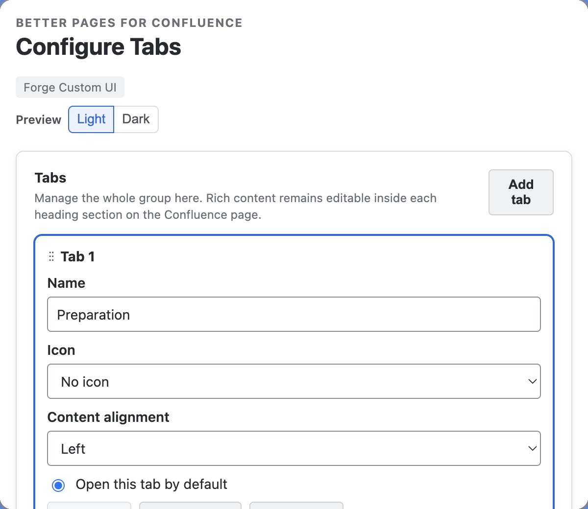

Use **Better Pages Tabs** when a page contains several substantial, related
sections and readers usually need one section at a time. Each tab keeps a rich
Confluence body, so it can contain headings, lists, tables, media, and supported
macros.

This Release 13 capture shows the new-group authoring controls before saving,
not a verified published multi-tab result. Always inspect the saved page and
reopen its configuration before relying on a new group.

## Current Release 13 limitation

A newly authored tab group can lose its separate-tab structure after saving
and publishing. In the verified Release 13 example, **Preparation** and
**Launch** reopened as one **Overview** tab containing both sections. The
interactive editor preview is not proof that the group will survive a save,
publish, and reopen cycle.

Until this is corrected, use ordinary Confluence headings when readers need
reliable access to separate sections. If you try a new group, check both the
published reader view and the reopened configuration before relying on it.
Do not repeatedly resave or delete sections to repair the grouping. See
[Known Limitations](../../known-limitations/#new-tabs-groups-can-reopen-as-one-overview-tab).

## When Tabs are a good fit

Tabs work well for:

- Overview, setup, usage, and troubleshooting sections in product docs.
- Different audiences, regions, or environments that share one page.
- A plan with separate outcome, readiness, and decision sections.
- A compact comparison where every section has meaningful content.

Use normal headings instead when readers need to scan or compare every section
at once.

## Add a tab group

One new Tabs macro owns the complete group and its rich heading sections.

1. Edit a page and insert **Better Pages Tabs**.
2. In the group editor, rename the first tab and choose its icon and content
   alignment.
3. Select **Add tab** for each additional section. One group supports up to 20
   tabs.
4. Drag tabs to reorder them, or use **Move up** and **Move down**. Choose one
   default tab.
5. Configure the shared appearance and review the interactive preview.
6. Select **Save**.
7. In the Confluence editor, add rich content under each generated heading
   section inside the macro body, then publish the page.

Deleting a tab in the group editor also deletes that tab's owned rich-content
section. Review its content before confirming the macro update. Existing legacy
adjacent-tab content can continue to render; new single-macro groups are subject
to the Release 13 limitation above.

## Configuration

| Setting | What it changes |
| --- | --- |
| Tab name | The visible label in the tab list and its owned heading section |
| Icon | A built-in or published Brand Kit icon shown with the label |
| Content alignment | Left, center, or right alignment for this tab's body |
| Open this tab by default | Selects the panel readers see first |
| Header style | Basic, filled, or rounded tab headings |
| Accent color | A built-in, Brand Kit, shared palette, recent, or custom color |
| Direction | Horizontal tabs or a vertical tab list |
| Content border | Adds an accent border around the active panel |
| Sticky headings | Keeps the tab controls available while reading long content |
| Share links | Lets readers copy a URL that opens an individual tab |

Presentation settings apply to the whole group. Give every tab a unique name
and choose only one default tab.

## Reader interaction

Readers can select a tab with a pointer or keyboard. Horizontal groups use the
Left and Right arrow keys; vertical groups use Up and Down. Home selects the
first tab and End selects the last.

On a narrow screen, a vertical group changes to a horizontally scrollable tab
list so labels and content remain usable. A copied tab link opens the page with
that tab selected when share links are enabled.

## Example structure

For a release plan, create one Tabs group with three sections:

| Tab | Suggested content |
| --- | --- |
| Outcome and evidence | Goal, baseline, target, and customer evidence |
| Pilot readiness | Entry criteria, open risks, and responsible owners |
| Decisions | Accepted decisions, alternatives, and follow-up dates |

## Good practice

- Use two to seven short tab labels. If the list becomes difficult to scan,
  split the content into child pages.
- Put the most useful or most frequently visited content in the default tab.
- Do not hide mandatory instructions or critical warnings in a non-default tab.
- Test the group with a keyboard and at a narrow browser width after publishing.
