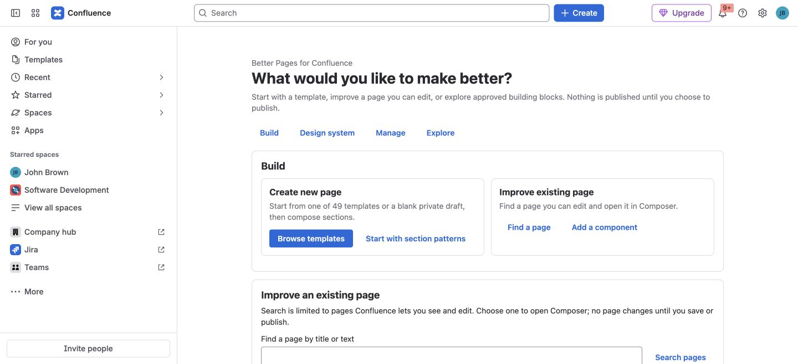

Better Pages 13.0 helps you build a complete Confluence Cloud page without
assembling every element by hand. Start from **Better Pages Home**, choose a
template or a private blank draft, and use **Composer** to arrange sections.
Review the result before writing it, then **Save draft** or **Publish** when
the page is ready for readers.

You can also improve a page you already have permission to edit. The familiar
collection of 19 reader-facing Better Pages macros remains available when you
only need one component.

*Better Pages 13.0 Home on a licensed development installation. The example
screenshots in these guides use test content; your site's spaces and branding
will differ.*

## A page-building workflow

| Stage | What you do | Result |
| --- | --- | --- |
| **Build** | Choose a template, start a private blank draft, or find a page you can edit in [Better Pages Home](../templates-and-home/) | A page and destination for your work |
| **Design** | Use [Composer](../smart-designer/) and [Section Patterns](../section-patterns/) to configure, preview, and stage content | A canvas you can review before any page write |
| **Standardize** | Apply administrator-published [Brand Kits and Brand Styles](../brand-kits-and-colors/) | Consistent appearance copied into supported components |
| **Manage** | Use [Space Manager](../space-manager/) for reviewed multi-page operations | A clearer space structure |

For a first useful result, follow [Getting Started](../getting-started/): create
a private draft, add a **Find your way** section with links to the pages your
team needs, save it, reopen it in Confluence, and publish only after checking
the links. A template can provide the initial structure if you prefer not to
start blank.

## Choose the right entry point

| Your job | Start here |
| --- | --- |
| Create a project home, resource hub, or status page | [Better Pages Home](../templates-and-home/) → **Continue designing** → [Composer](../smart-designer/) |
| Improve an existing page | Find a page you can edit from Home, or open Composer from its published-page Better Pages byline |
| Add one visual or interactive element | Insert a component from the [Macro Catalog](../macros/) in the normal Confluence editor |
| Apply approved visual choices | Ask an administrator to publish a [Brand Kit or Brand Style](../brand-kits-and-colors/), then choose it while authoring |
| Review changes across several pages | Use [Space Manager](../space-manager/) and confirm its plan |
| Number a page outline | Use [Numbered Headings](../numbered-headings/) |

Composer offers 12 guided Section Patterns, direct components, formatting for
selected content, and supported native-block editing. Staging or previewing
does not write the page. After you save or publish, generated content is still
ordinary editable Confluence content and supported Better Pages macros—not a
locked page image. Edit the page or reopen a macro's configuration as your
content changes.

## The 19 building blocks are still here

Better Pages includes 19 reader-facing macros for layout, navigation, actions,
messages, and technical content. For example, use **Advanced Cards** for a
directory, **Tabs** for related detail, **Alert** for an important update, or
**LaTeX Builder** for equations. Browse the [Macro Catalog](../macros/) for all
19 and their individual guides. Existing macros remain editable in Confluence
after upgrading to 13.0; you do not have to rebuild pages in Composer.

Better Pages follows the signed-in user's Confluence page and space
permissions. Rich-body macros use the Confluence editor for their content,
while visual settings are configured in Better Pages. See
[Administration](../administration/) for site controls and
[Security and Privacy](../security-and-privacy/) for the product-specific data
explanation.

## Availability and migration

Better Pages is a paid Marketplace app for Confluence Cloud. Installation,
evaluation, subscription, and billing are managed through the
[Better Pages Marketplace listing](https://marketplace.atlassian.com/apps/157694075/better-pages-tabs-formatting-macros-for-confluence).
It does not automatically read or convert content owned by third-party Data
Center apps; Data Center migration is not part of the current app experience.

For help or policy details, use the [Fulstech support portal](https://fulstech.atlassian.net/servicedesk/customer/portals),
the [Better Pages Privacy Policy](../privacy-policy/), and the
[End User License Agreement](/end-user-license-agreement/).
