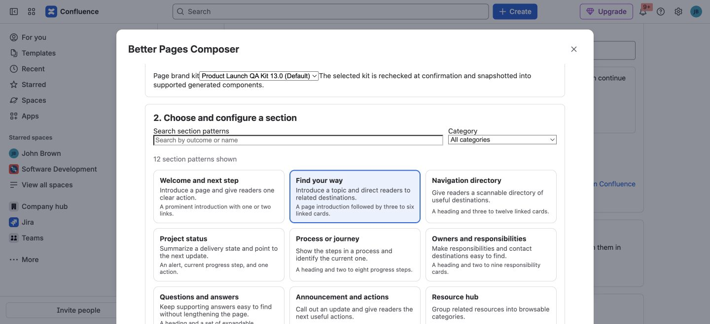

**Section Patterns** are guided starting points for a complete page section.
Use them when readers need an answer or action—such as finding related pages,
understanding status, or reviewing a decision—without assembling every block
and macro separately. In Better Pages 13.0, the [Composer](../smart-designer/)
includes 12 patterns.

*A licensed-development capture of the pattern picker. Search by outcome or
name, or filter by category; your page content and destinations will differ.*

## Choose a pattern by reader need

| Reader needs to… | Pattern |
| --- | --- |
| Understand the page and take one clear action | **Welcome and next step** |
| Find a few related destinations | **Find your way** |
| Scan a larger collection of links | **Navigation directory** |
| See current delivery state and the next update | **Project status** |
| Follow stages in a process | **Process or journey** |
| Find the right owner or contact | **Owners and responsibilities** |
| Expand supporting answers | **Questions and answers** |
| Notice an update and act on it | **Announcement and actions** |
| Browse grouped resources | **Resource hub** |
| Review measurements or evidence | **Metrics and evidence** |
| Understand a decision and next steps | **Decision and next steps** |
| Read detailed technical guidance | **Technical reference** |

For a first project home, **Find your way** is a useful choice: write one
short introduction and cards for the plan, current launch status, and support.
Use real Confluence or safe external destinations rather than leaving example
links in the published page.

## Build and review a section

1. Open Composer for a private draft or a page you can edit, then choose
   **Compose a section**.
2. Search or filter the catalog. Select a pattern to read its description and
   inspect its fields.
3. Replace the sample text and destinations with your own content. Some
   patterns have bounded lists or required fields; resolve validation messages
   before continuing.
4. If published [Brand Styles](../brand-kits-and-colors/) are available, use
   the semantic default or choose another published style for a supported
   role. This affects appearance, not the section's purpose.
5. Select **Preview section**. Check the wording, links, and generated
   components, then **Add to canvas**.
6. Use **Edit section**, **Duplicate**, **Remove**, or the move controls in
   **Review canvas**. Confirm the output page, then choose **Save draft** or
   **Publish** when ready.

The canvas is a proposal: previewing and staging do not write to Confluence.
Patterns generate normal Confluence content and supported Better Pages macros,
not a locked wrapper. After writing, you can edit the native blocks and
reopen supported macros in the normal Confluence editor. The [Macro Catalog](../macros/)
explains those individual building blocks. For the full save/reopen flow,
follow [Getting Started](../getting-started/).
