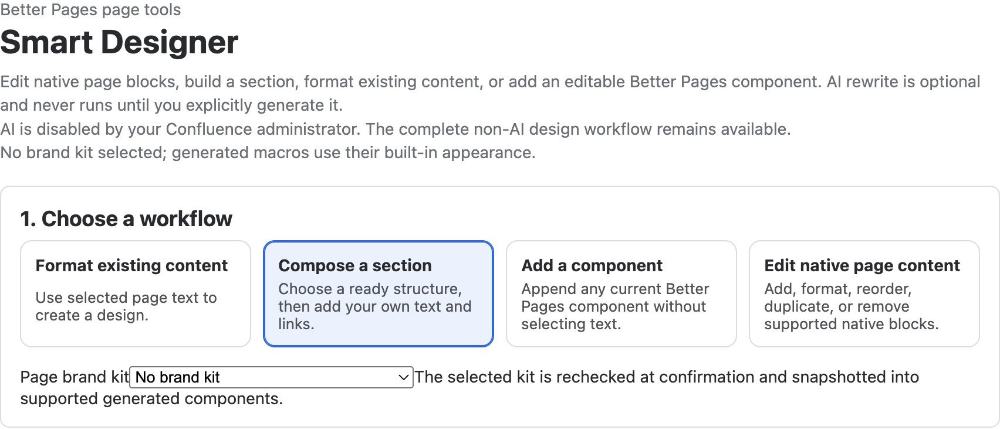
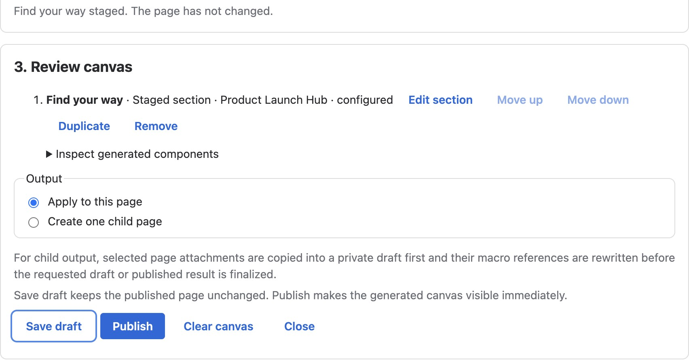
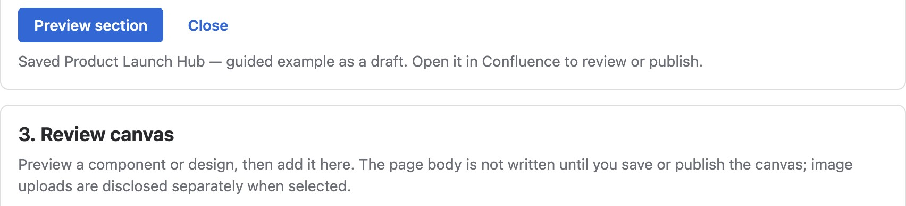
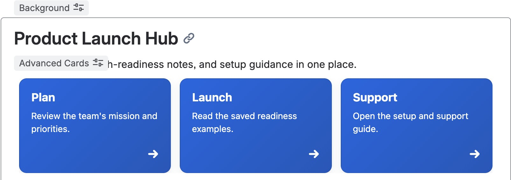
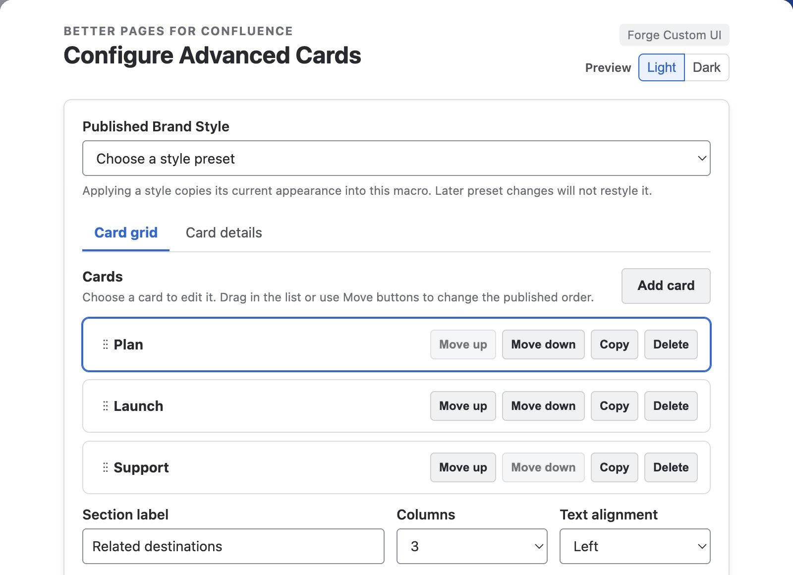

**Better Pages Composer** is the Smart Designer page-building workflow in
Better Pages Release 13. Open it with **Continue designing** after creating a
private page from [Better Pages Home](../templates-and-home/), choose **Open
in Composer** for an editable existing page on Home, or use the Better Pages
byline on a published page. You need permission to edit the target page.

Composer separates *configuration and staging* from the final page write.
You can preview sections, change their order, and inspect generated content
before selecting **Save draft** or **Publish**. Merely opening Composer or
adding something to its canvas does not change a Confluence page.

*Better Pages Release 13 Composer on a licensed development installation.
No Brand Kit is selected, and the site's administrator has disabled AI; the
non-AI workflows remain available.*

## Choose an authoring path

| Workflow | Use it when |
| --- | --- |
| **Compose a section** | A page needs a guided welcome, navigation, status, FAQ, or another [Section Pattern](../section-patterns/) |
| **Add a component** | You want one of the 19 Better Pages building blocks without selecting text |
| **Format existing content** | You want to turn selected page text into a design and review whether to keep or replace the source blocks |
| **Edit native page content** | You need to add, format, move, duplicate, or remove supported headings, paragraphs, lists, quotes, code, panels, dividers, or simple tables |

Existing macros, complex tables, and media are protected rather than silently
rewritten. An administrator may also enable optional AI rewriting for selected
text; the non-AI paths above remain usable without it. Review any generated
wording before staging it.

## Review a section before writing

1. Choose a workflow. For **Compose a section**, select a pattern, fill in its
   required text and destinations, then select **Preview section**.
2. If published [Brand Kits or Brand Styles](../brand-kits-and-colors/) are
   available, choose the appropriate kit or semantic style for supported
   components. Preview the appearance.
3. Select **Add to canvas**. Repeat if the page needs more sections.
4. In **Review canvas**, use **Edit section**, **Duplicate**, **Remove**, or
   the move controls to refine the staged result. Expand **Inspect generated
   components** when you need to see what will be written.
5. Choose **Apply to this page** or **Create one child page**. Confirm the
   destination before the final action.

*The page has not changed at this point. The canvas is a proposal until you
choose a final write action.*

## Save draft, close, reopen, or publish

Select **Save draft** when the content still needs review. For a new private
page, the page remains a draft. For an existing published page, the currently
published version remains what readers see until you publish the changes.
Wait for the save confirmation, close Composer, and reopen the page in
Confluence to check that the generated blocks are present. The normal editor
can be used to finish wording and links before publication.

Select **Publish** only when the reviewed result is ready for readers.
After publishing, open reader view and test important links and interactions.
If Composer reports that the source page changed while you were working,
reload it and rebuild the staged canvas before saving or publishing.

*The licensed-development example received a save confirmation before
Composer was closed.*

*The same private draft still had its heading and navigation cards after a
full close and reopen.*

The in-editor Smart Designer launcher can preview the current editor draft,
but it does not apply changes over unsaved editor work. Update or close the
Confluence editor, then reopen Composer from the published page's byline to
write a reviewed page-level change.

## Maintain the page after creation

Composer writes normal Confluence blocks and supported Better Pages macros,
not a locked screenshot or proprietary page wrapper. You can edit ordinary
text in Confluence and reopen a generated macro's configuration to update
its content or appearance. A published Brand Style copies its current values
when applied; later changes to the preset do not silently restyle the page.

*A separate synthetic development page shows generated Advanced Cards
reopened in the normal Confluence editor. Its native configuration is distinct
from the Composer pattern form.*

For a first page, follow [Getting Started](../getting-started/). For the full
set of guided sections, see [Section Patterns](../section-patterns/). For
single building blocks, see the [Macro Catalog](../macros/).
