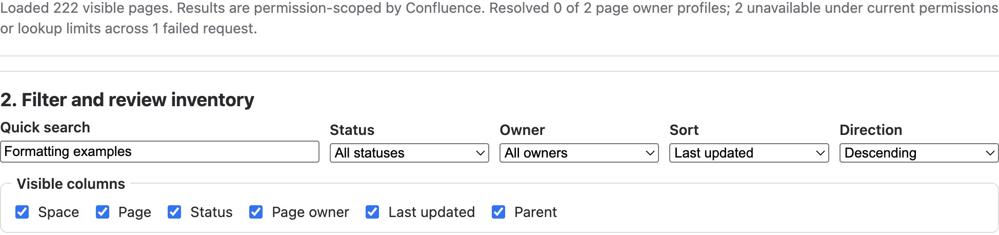
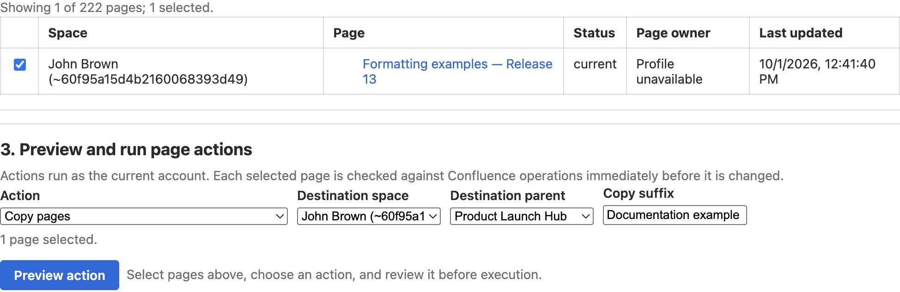
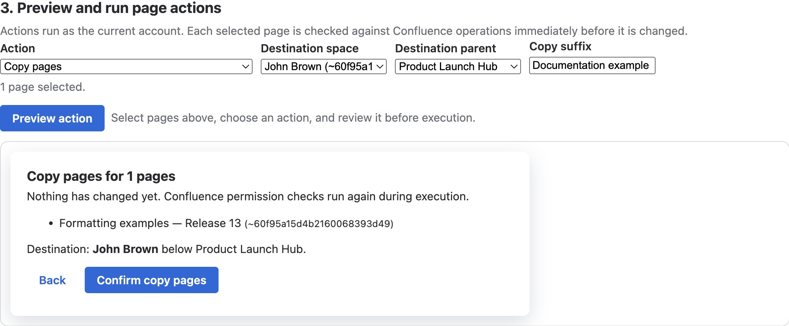
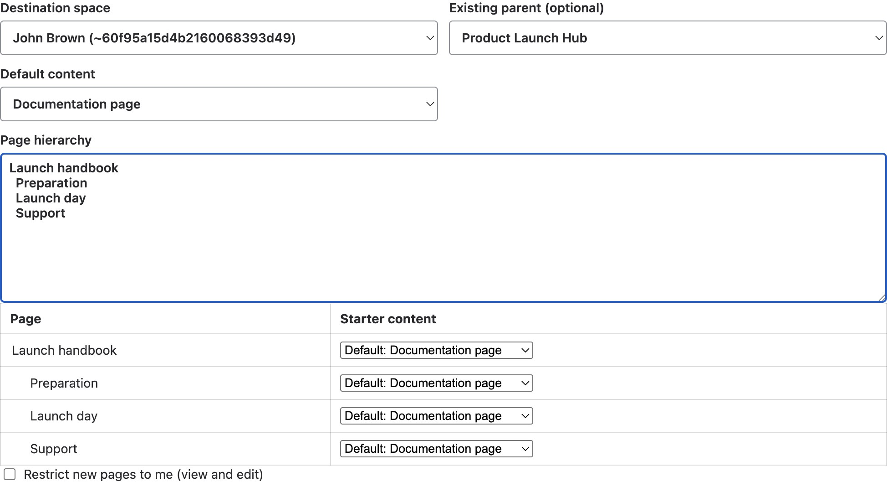
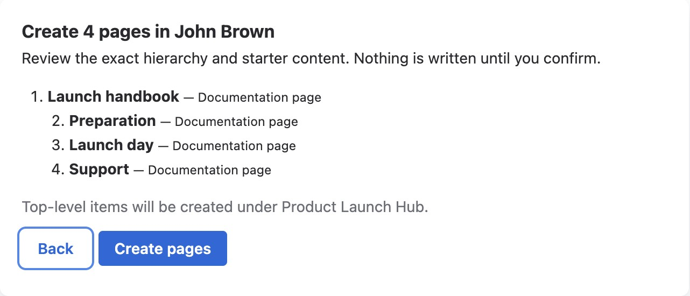

Open **Apps → Better Pages Space Manager** to review content across the spaces
you can access. Every operation runs as your current Confluence account and is
checked again immediately before a change.

Select a screenshot to inspect its full-size controls and exact plan.

## Review an inventory

1. Select one or more spaces and the Published, Draft, or Archived states.
2. Select **Refresh inventory**.
3. Filter by text, status, owner, order, or effective access.
4. Choose visible columns and select published pages for an action.

Draft and archived rows are available for review but are not selectable for
page actions.

[](/assets/better-pages/release-13/space-manager-filter-columns.jpg)

*Quick search narrows the loaded inventory; visible-column choices control
the table. This development example could not resolve its owner profiles.
Do not treat an unavailable profile as an absent page owner.*

[](/assets/better-pages/release-13/space-manager-inventory.jpg)

*The selected page is **Formatting examples — Release 13**. Parent is hidden
in this table view to keep the row readable; the copy destination below uses
**Product Launch Hub** as its parent.*

## Preview and run page actions

Select pages, choose an action, and review the exact plan before confirming.
Available actions include copy, move, add or remove a label, set or clear a
content status, add or remove your restriction, archive, and move to trash.

Copy and move require a destination space and optional parent. Actions may stop
partway if Confluence permissions or page state change; completed operations are
listed so you can review and recover them.

[](/assets/better-pages/release-13/space-manager-copy-preview.jpg)

*The plan says **Nothing has changed yet** and permissions are rechecked
during execution. This screenshot was captured before confirmation; **Back**
was used afterward. No copy was performed to obtain the image.*

## Create a hierarchy

Enter a line-based outline, choose a destination and optional existing parent,
then select blank content or any Better Pages page starter. Indentation defines
the hierarchy. You can override the starter for individual pages and optionally
restrict new pages to yourself when Confluence allows it.

For example, enter a top-level handbook and indent its children by two spaces:

```text
Launch handbook
  Preparation
  Launch day
  Support
```

[](/assets/better-pages/release-13/space-manager-hierarchy-config.jpg)

*Check the destination and existing parent before previewing. The per-page
starter choices are shown below the outline; **Restrict new pages to me**
is not selected in this example.*

[](/assets/better-pages/release-13/space-manager-hierarchy-preview.jpg)

*The exact plan places the top-level handbook under **Product Launch Hub**.
**Back** returns to configuration; **Create pages** is the write action.
This capture is preview-only—none of these four pages was created.*

## Good practice

- Start with a narrow inventory and confirm page titles and spaces.
- Preview every write operation; pay special attention to move, archive, and
  trash actions.
- Use a private test hierarchy before creating a large live structure.
- Refresh after completion and verify the resulting hierarchy and restrictions.
