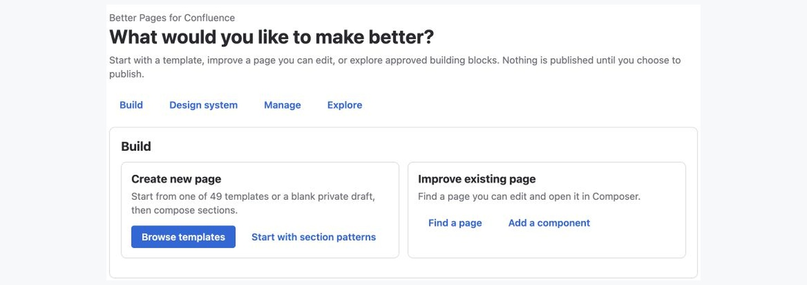
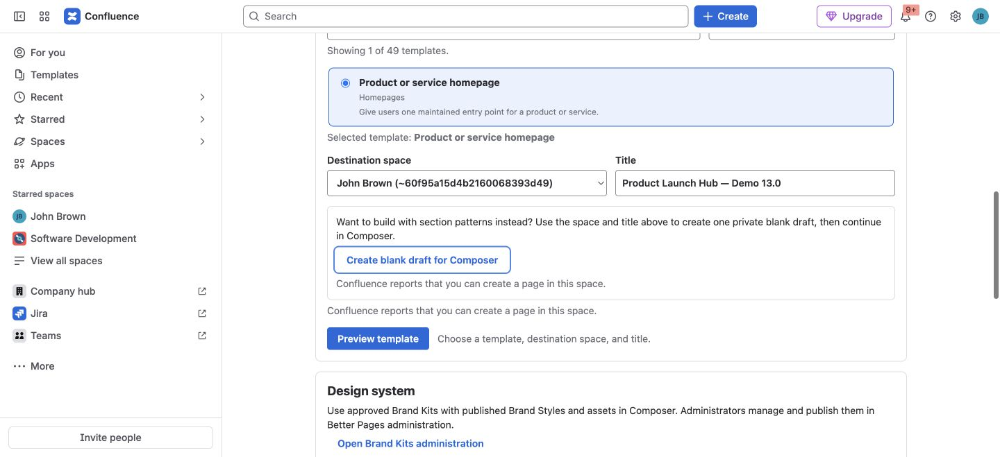
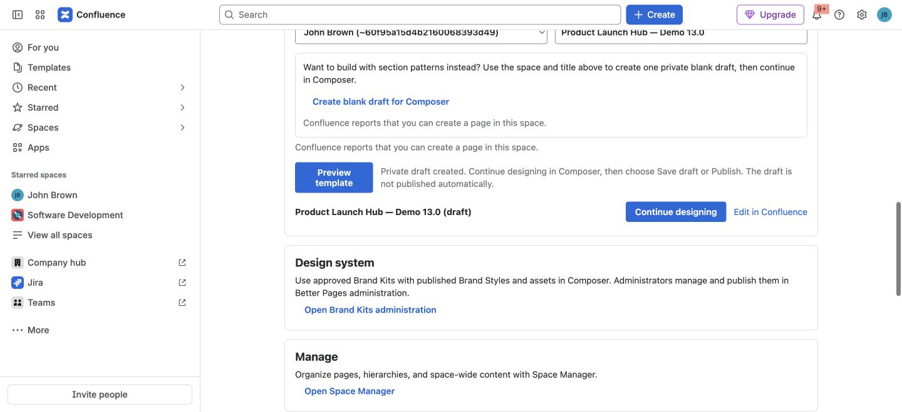

**Better Pages Home** is the starting point for building a new page or
improving one you can edit. Open **Apps → Better Pages home** in Confluence.
The **Build** area offers templates, a blank private draft for Section
Patterns, and a search for editable pages. **Design system** introduces
published Brand Kits and Brand Styles; **Manage** opens Space Manager; and
**Explore** lists the available components. You do not need to use every area
to make a page.

*Better Pages Release 13 on a licensed development installation with synthetic
example content.*

## Start from a template

Home offers 49 editable starters across uses such as project work, reports,
research, homepages, documentation, meetings, decisions, and operations.

1. Select **Browse templates**. Search by purpose or choose a category.
2. Select a template, destination space, and unique title. Check that you can
   create a page in that space.
3. Select **Preview template** to inspect its proposed sections and prompts.
   Preview creates nothing in Confluence.
4. If it fits, select **Use template**. A single-page template creates a
   private draft; it does not publish it.
5. Choose **Continue designing** to open the same draft in
   [Composer](../smart-designer/), or **Edit in Confluence** to work directly
   in the normal editor. Replace sample prompts before publishing.

*The space and title determine where the draft is created. The blank-draft
action is separate from the selected template.*

*A template-created page remains private until you publish it. This image is
from a separate licensed-development draft from the blank-draft save/reopen
example in [Getting Started](../getting-started/).*

## Start without a template

Select **Start with section patterns**, choose a destination space and title,
then **Create blank draft for Composer**. Select **Continue designing** to
add a guided [Section Pattern](../section-patterns/) or an individual
component. The blank page remains a private draft until you publish it.
This is the path used in the [first-page guide](../getting-started/).

## Improve an existing page

Select **Find a page** and search for a page Confluence lets you see and edit.
Choose **Open in Composer** for the result you intend to change. Opening or
previewing does not write the page; review the canvas and choose **Save
draft** or **Publish** when ready. If you do not have edit permission, choose
another page or ask its space administrator.

You can also open Composer from a published page's Better Pages byline. If
someone changes the source page while Composer is open, reload and rebuild
your staged canvas before writing.

## Other template outcomes

- A blog template creates a private blog draft and continues in the
  Confluence editor.
- **Delivery journey** is a multi-page operation. After you review the
  destination and stage names, **Create linked pages** explicitly creates a
  published landing page and linked child pages. It is not the same private
  single-page-draft flow; review the hierarchy before confirming.
- A Confluence administrator can separately synchronize eligible page
  starters into Confluence's native template catalog. Blog and Delivery
  journey starters remain Home workflows. See [Administration](../administration/).

After you create a page, continue with [Composer](../smart-designer/) for
staged review and [Brand Kits and Brand Styles](../brand-kits-and-colors/)
for approved appearance choices.
