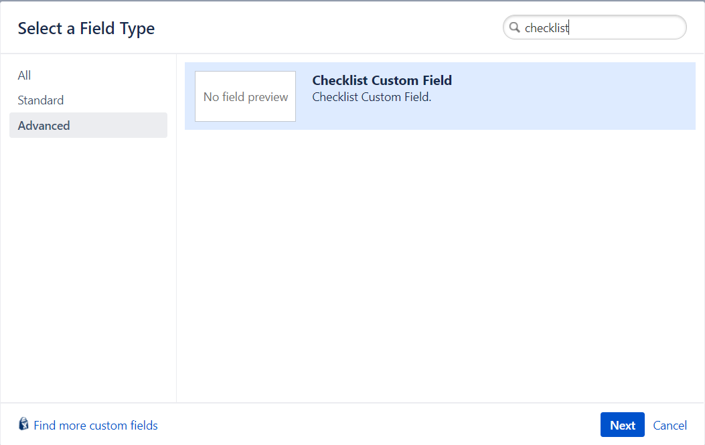
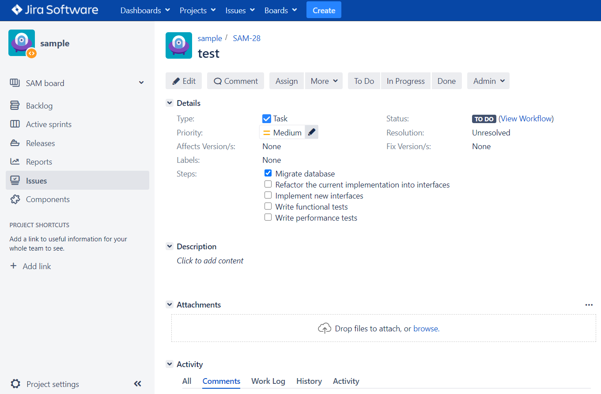
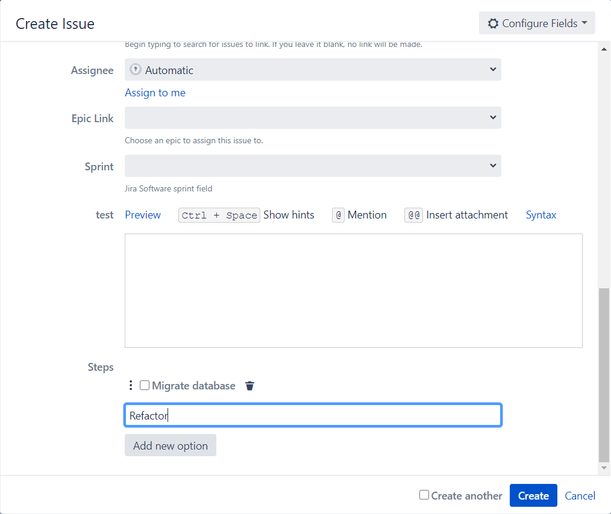
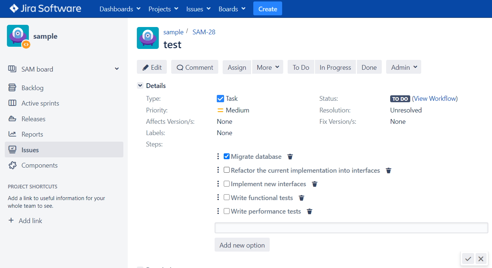
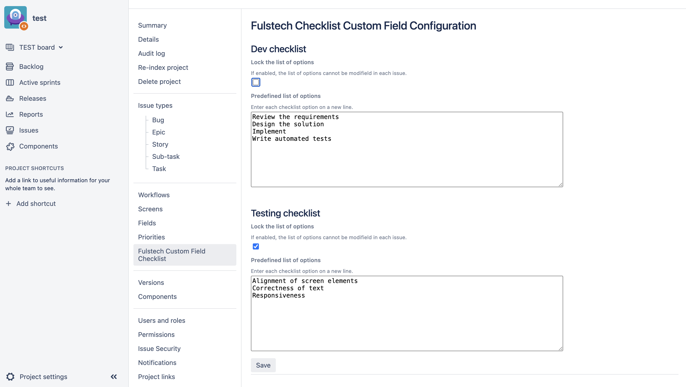
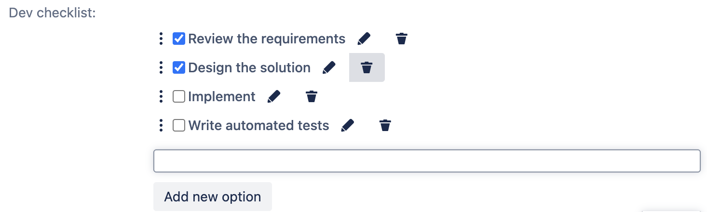

## Create a Checklist custom field

To use Markin for custom fields, follow the instruction at <https://confluence.atlassian.com/jira/adding-a-custom-field-185729521.html>. The custom field type is **Checklist Custom Field**.

## Configure options of a checklist

You can create or edit the checklist on the **Create Issue** form or on the **Issue** page.

To add new options, click on the field value to change to the **Edit mode**, provide the description in the input box, and click **Add new option.**

To delete existing options, click on the **Trash** icon.

To edit existing options, click on the **Edit** icon.

To reorder existing options, drag the **Three-dots** icon and drop the option into the new place.

Do not forget to click the **Jira's Check** icon to apply all the changes.

## Predefine a checklist

The list of options can be predefined so that all issues in a project share the same checklist. Optionally, the list can be open for changes per issues or locked so that issue creator and editor can only check or uncheck the options.

To config the checklist, go to **Project Settings**, then select **Fulstech Custom Field Checklist** in the secondary sidebar.

When the list of options is locked, Jira users are not able to change the options. 

When the list of options is not locked, Jira users have full control of the options.

