> **This app only works with Company-managed (formerly Classic) project.**

## Creating a new custom field

Please follow the instructions by Atlassian <https://support.atlassian.com/jira-cloud-administration/docs/create-a-custom-field/> to create a custom field of the type **Table Custom Field**. The following screenshots summarize key steps. There might be differences between Jira instances and Jira Cloud versions.

Navigate to the **Settings** screen.

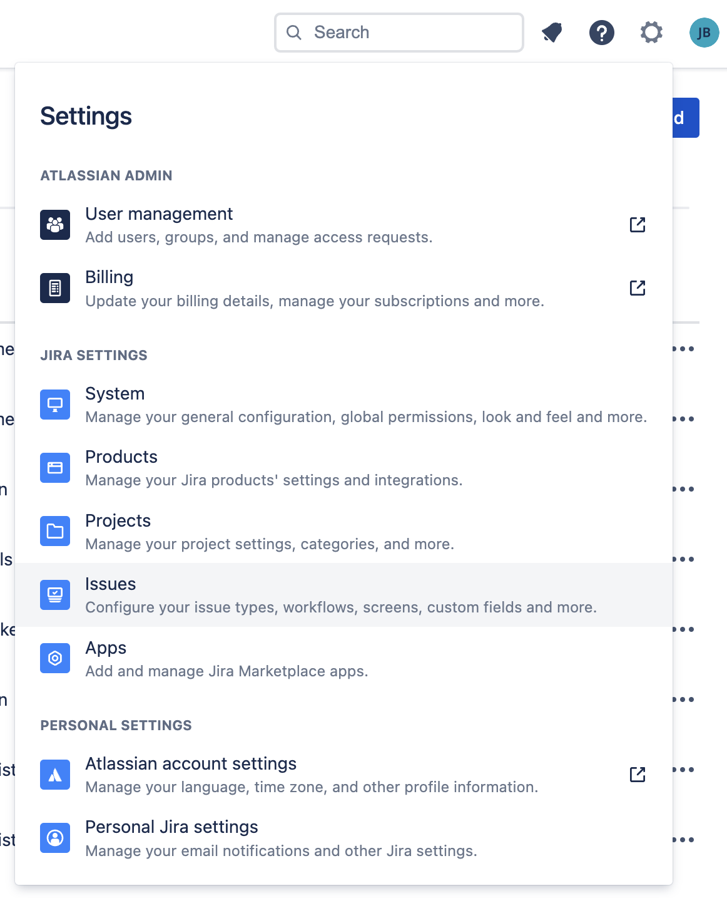

Select the **Custom fields** page.

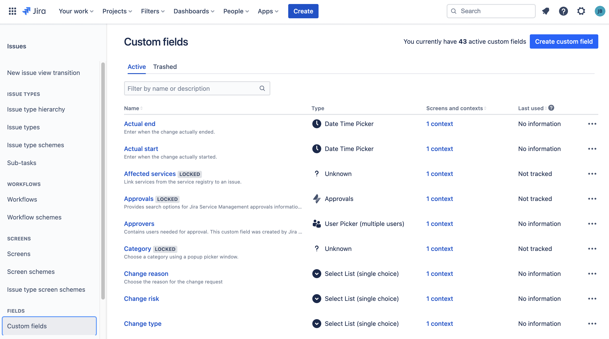

Click **Create custom field.** Select the **All** menu. Search for the type **Table Custom Field.** Select and click **Next**.

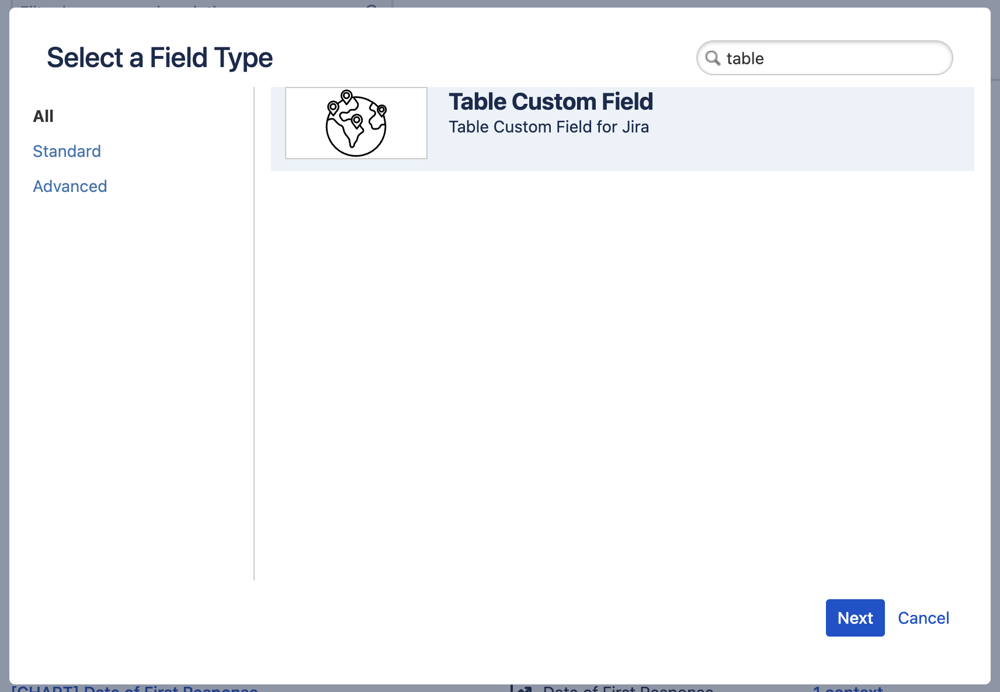

The custom field will be created.

## Configuring table columns

Please follow the instructions by Atlassian <https://support.atlassian.com/jira-cloud-administration/docs/configure-custom-field-context/> to edit a custom field's context. The following screenshots summarize key steps. There might be differences between Jira instances and Jira Cloud versions.

Click on the **1 context** link.

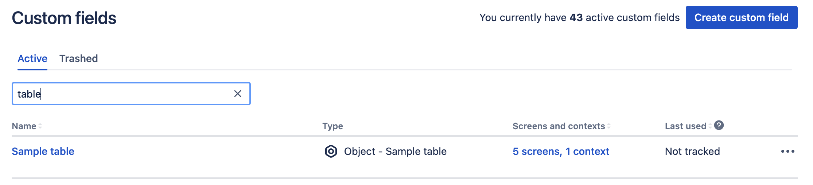

Click **Create, edit or delete contexts**.

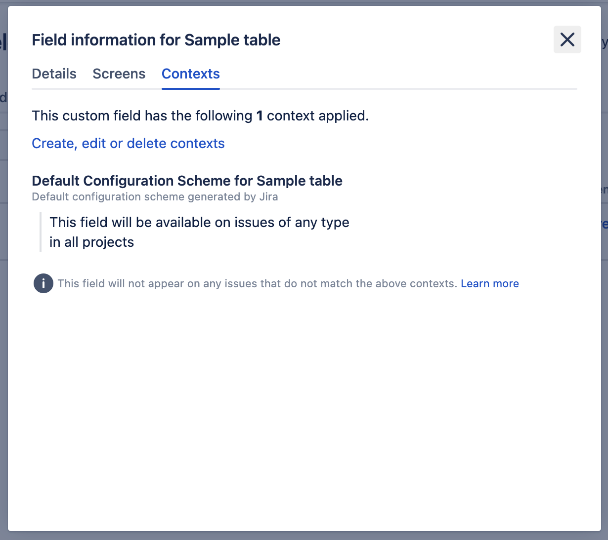

Click on **Edit custom field config**.

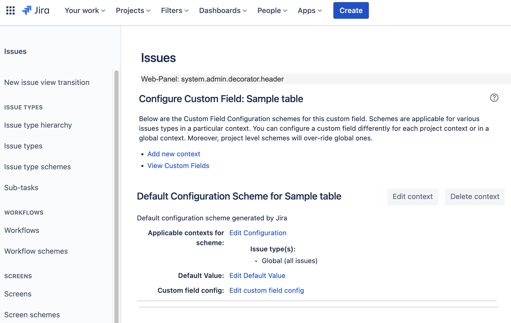

Provide the configuration of columns in the table.

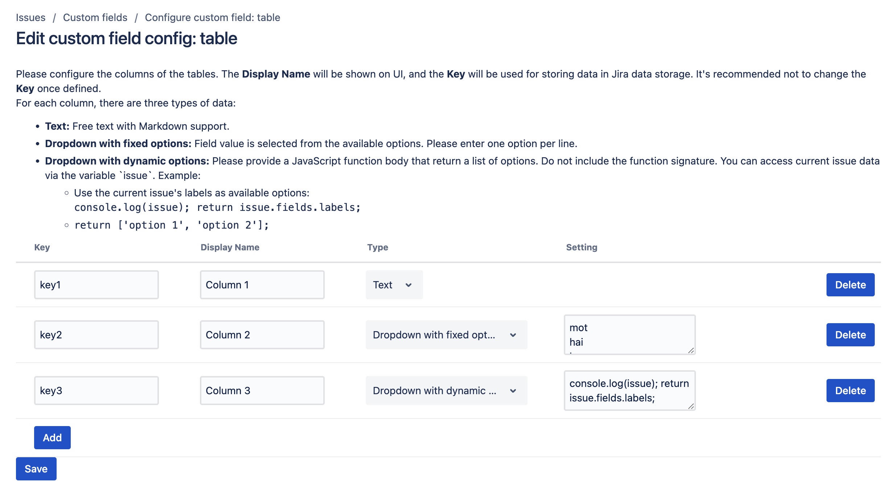

## Enabling the table custom field on the issue page

Click on the **Tables** button on the toolbar.

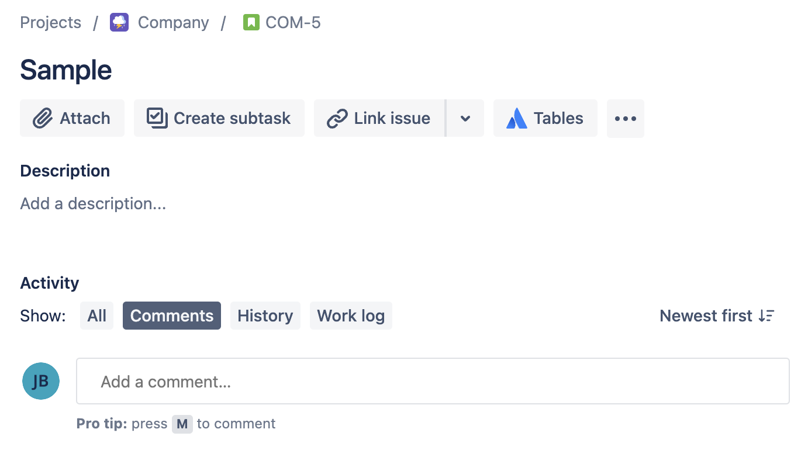

Click on the **Allow access** button.

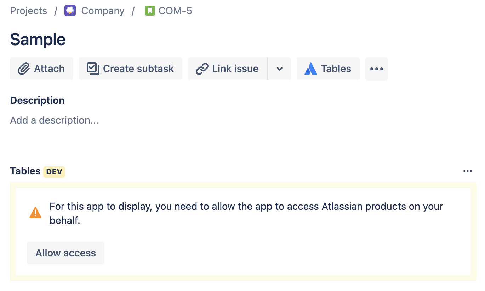

Click on the **Accept** button.

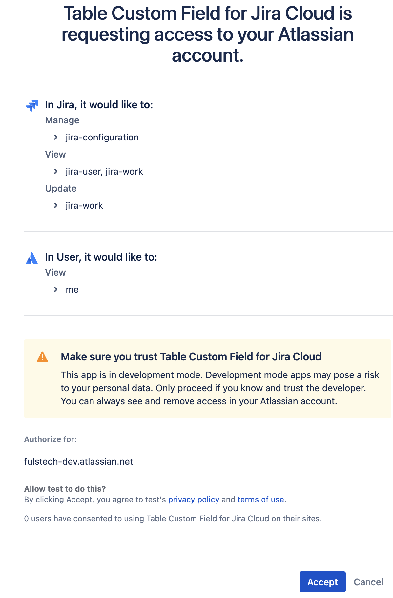

The table is shown.

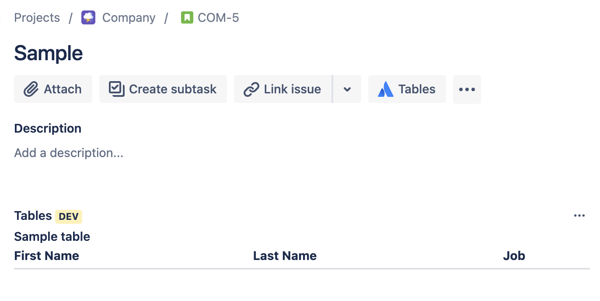

## Working with tables

Hover on the table and click on the **Edit** button. The table will switch to the edit mode.

To add a row, click on the **Add** ("plus" icon) button.

To edit a cell, hover on it and click the **Edit** ("pencil" icon) button. Use Markdown format for the content.

To remove a row, select the row by clicking on the checkbox, and click on the **Remove** ("recycle bin icon").

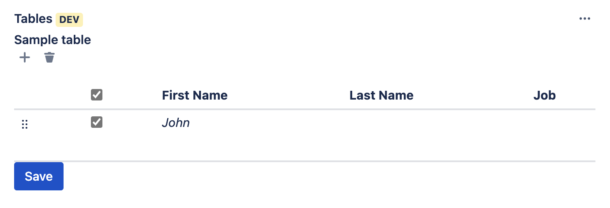

To reorder rows, drag and drop rows with the "six dots" icon.

After editing, click the **Save** button.
