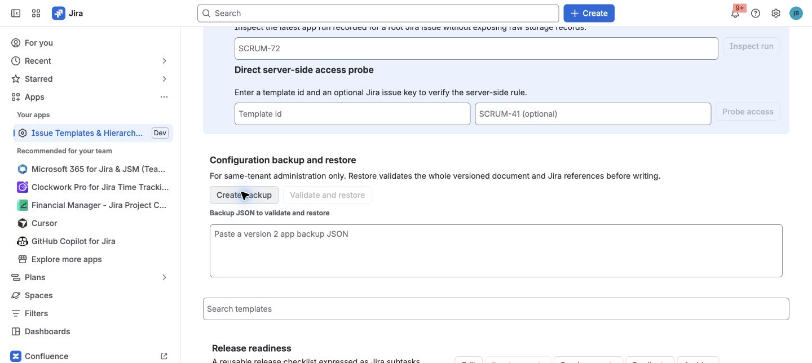

Backup and restore protects app-owned configuration before significant
administration work. It is designed for the same Jira tenant.

## What the backup contains

A version 2 backup contains:

- Template definitions and revisions.
- Field schema snapshots and values.
- Variables and child definitions.
- Availability rules.
- App defaults.

It does not export Jira issue data as a document and is not a Data Center
migration package.

## Create a backup

1. Open Jira administration and the app's administration page.
2. Select **Create backup**.
3. Copy or download the generated JSON.
4. Store it according to your organization's configuration-backup policy.

## Validate before restoring

Paste a version 2 document into the restore validator. The app validates the
whole document and its live Jira references before writing any configuration.

Review warnings for projects, issue types, fields, options, users, groups, and
defaults. A deleted or invisible reference remains fail-closed; it cannot grant
broader access.

## Restore deliberately

Restore only after validation succeeds and you have reviewed the complete
change. Keep the original backup until the library, availability, and defaults
have been verified in the UI.

Cross-site transfer requires explicit mapping of Jira IDs and is not supported
by this same-tenant contract.

