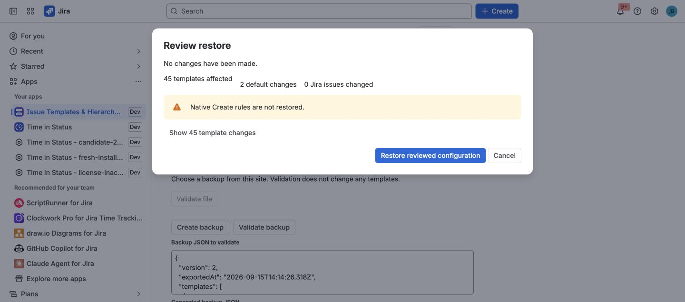

Backup and restore protects app-owned configuration before significant
administration work. It is designed for the same Jira tenant.

## What the backup contains

A version 2 backup contains:

- Active and archived template definitions with their current revision number.
- Field schema snapshots and values.
- Variables and child definitions.
- Availability rules.
- App defaults.

It does not contain Jira issues, attachment files, operation history, or native
Create rules. It is not a Data Center migration package.

## Create a backup

1. Open Jira administration and the app's administration page.
2. Open **Administration → Data management → Backup & restore**.
3. Select **Download backup file** to save a JSON file. You can also select
   **Create backup** when you need to inspect or copy the generated JSON in the
   page.
4. Store it according to your organization's configuration-backup policy.

## Validate before restoring

Choose a version 2 JSON file and select **Validate file**, or paste its contents
and select **Validate backup**. Validation does not change configuration.

The app checks the whole document, template structure, defaults, destination
projects, work types, fields, and hierarchy compatibility before writing. An
availability rule that refers to a deleted or invisible project, group, or
account remains fail-closed; it cannot grant broader access.

## Restore deliberately

Restore only after validation succeeds and you have reviewed the complete
change. The review states which templates will be created or replaced and how
many defaults will change. Existing Jira issues are not changed. Select
**Restore reviewed configuration** only when that result is correct.

Keep the original backup until the library, availability, and defaults have
been verified in the UI. Reconfigure native Create rules separately because
they are intentionally not restored.

Cross-site transfer requires explicit mapping of Jira IDs and is not supported
by this same-tenant contract.
