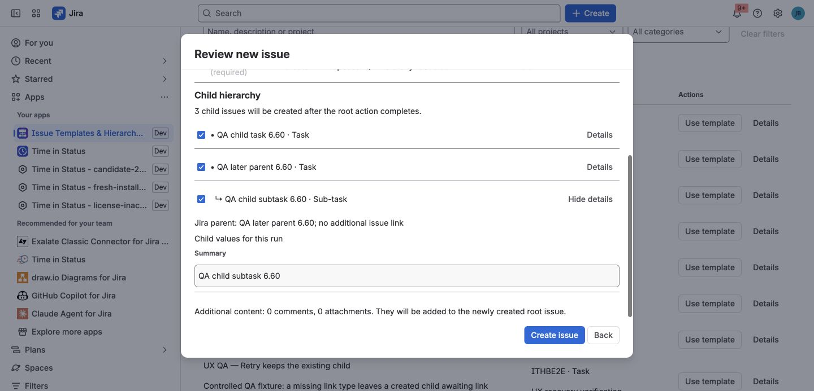
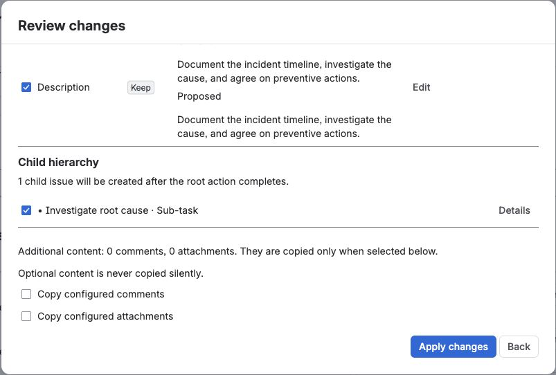
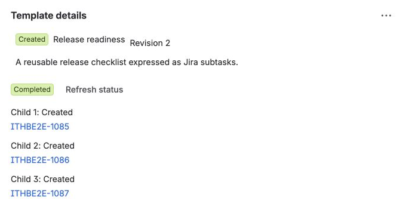

Create, Apply, and Recreate are the three explicit user journeys. Each presents
a preview before Jira is changed.

## Choose the right workflow

| Your goal | Use |
| --- | --- |
| Start a new governed process from a saved template | **Create** |
| Standardize fields or add follow-up work to an existing issue | **Apply** |
| Reproduce useful live work once without saving a governed template | **Recreate** |

Use [Native Jira Create Prefill](../native-create-prefill/) when you specifically
need values inside Jira's standard Create dialog. Use
[JSM customer portal templates](../jsm-customer-portal/) or
[Workflow Create](../workflow-create/) only when the action should happen from
those automatic entry points.

## Create new work from a template

Use **Use template → Create new** when the process should begin with a new root
issue.

### Before you begin

You need permission to create the selected root and child work in the target
Jira project.

### Steps

1. Choose a template from the library.
2. Select **Use template**, keep **Create new** selected, and answer its runtime
   inputs.
3. Select **Preview new issue**.
4. Review and adjust the root values.
5. Select the child work needed for this run.
6. Open **Details** on child work to confirm its Jira parent and any additional
   issue-link direction.
7. Select **Create issue**.

Jira receives a normal root issue followed by the selected hierarchy. Parent
work is created before its children. The run keeps an immutable plan, so retry
can skip children and links that already succeeded.

### Verify the result

Open the new root and confirm the selected child hierarchy matches Preview.
**Template details** should show the template revision, run ID, status, and child
outcomes.

## Apply a template to an existing issue

Use **Apply template** when the root already exists but needs standard fields or
follow-up work.

### Steps

1. Open the issue and choose **Apply template**.
2. Select an available template.
3. Answer any runtime inputs and select **Preview changes**.
4. Compare **Current** and **Proposed** values.
5. Review the decision beside each field: **Keep**, **Fill**, **Replace**, or
   **Skip**.
6. Select only the root fields and child work you want.
7. Include configured comments or attachments only when needed.
8. Select **Apply changes**.

*This pictured state is a second preview after an earlier Apply completed. No
second Apply was submitted.*

The default **Only fill empty fields** rule preserves a populated Jira field.
Every selected overwrite is visible before the final action.

### Verify the result

Reopen the root issue and confirm skipped/current values were preserved.
**Template details** records the Apply run and any selected child work.

## Recreate live work once

Use **Recreate issue and selected work** when useful live Jira work should be
copied without adding a governed template to the library.

1. Open the source issue and choose **Recreate issue and selected work**.
2. Choose the destination project and issue type.
3. Select the supported root fields, nested child work, and links to reproduce.
4. Review the one-time creation plan.
5. Confirm the operation.

Recreate preserves selected parent relationships and keeps one copy when the
same issue is both a child and linked to the source root. Before Jira is changed,
the app validates compatible destination hierarchy levels. The resulting issue
is marked **Recreated once** in its provenance.

## Understand the result

The **Template details** issue panel shows:

- Operation type, template name, and template revision.
- Root and source issue.
- Durable run ID and current status.
- One outcome for each child node.
- The latest actionable error for a partial run.

*The pictured run is a Create example. Apply, Recreate, Portal, and Workflow
origins appear for their corresponding runs.*

Retry is available only for failed or partial work. Completed nodes are not
replayed.

## Troubleshooting

### A field is not changed

Check the preview decision first. **Keep** and **Skip** intentionally preserve
the current value. If a selected field is reported as unavailable, Jira may
have removed it from the destination project/work-type context.

### Preview says the hierarchy is incompatible

Confirm the selected destination work types have compatible Jira hierarchy
levels. The app stops before mutation rather than guessing a parent mapping.

### A hierarchy finishes partially

Open **Template details**, fix the reported Jira permission, field, work-type, or
link problem, then retry the same run. Do not start another Create or Apply just
to replay completed children.

For additional symptoms, see
[Troubleshooting and Support](../troubleshooting-and-support/).

## Related tasks

- [Build or capture a reusable template](../templates-and-fields/).
- [Add variables and Smart Values](../variables-and-smart-values/).
- [Configure availability and defaults](../administration/).
- [Review current product boundaries](../known-limitations/).
